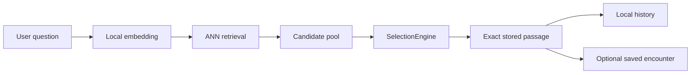

# Sibyl

Sibyl is an offline-first literary discovery application. A user asks a question or describes a state, and Sibyl returns a short **verbatim stored passage** whose meaning may resonate with that question. The core mode does not generate quotations or imitate an author's or character's voice.

Android is the product target for the current phase. A JVM Compose Desktop application is included as a development harness so the shared UI and runtime flow can be exercised quickly on a workstation without an emulator or device. iOS remains deferred.

## Start here

Unless a command explicitly changes directory, commands in this README are run from the repository root.

If this is your first checkout, use this order:

| Goal | First step |
|---|---|
| Understand the project | Read this README, then [`docs/ARCHITECTURE.md`](docs/ARCHITECTURE.md) and [`docs/ROADMAP.md`](docs/ROADMAP.md). |
| Verify the checkout | Run `make check`. It does not download models, corpora, or require the Android toolchain. |
| Run the interactive development app | Run `make run-desktop` to open Sibyl as a local JVM desktop window. |
| Run the full current test suite | Run `make check-all` after configuring JDK and the Android SDK. |
| Exercise the build-time pipeline | Run `make smoke-corpus` to build and validate the synthetic fixture corpus. |
| Validate Android integration | Open `mobile/` in Android Studio or build `:androidApp:assembleDebug`. |
| Add literature | Start in [`corpus-sources/README.md`](corpus-sources/README.md) and [`docs/SOURCES.md`](docs/SOURCES.md). |
| Change the persisted corpus contract | Read [`docs/CORPUS_FORMAT.md`](docs/CORPUS_FORMAT.md) before editing `corpus-format/`. |

Testing is described in one place: [`docs/TESTS.md`](docs/TESTS.md).

## Repository structure

- [`mobile/`](mobile/) — Kotlin Multiplatform runtime/UI, Android product entry point, JVM Desktop development app, retrieval contracts, selection logic, history, and saved encounters.
- [`corpus-builder/`](corpus-builder/) — local Python preprocessing and corpus artifact generation.
- [`corpus-format/`](corpus-format/) — versioned persisted contract between builder and the shared runtime.
- [`corpus-sources/`](corpus-sources/) — source/provenance/rights registry. It contains metadata, not downloaded production books.
- [`test-corpus/`](test-corpus/) — tiny synthetic fixtures for deterministic tests and smoke builds.
- [`docs/`](docs/) — the only detailed documentation directory for the repository.

Each subproject keeps a local `README.md` for quick usage and a local `AGENTS.md` for protected development rules. Detailed architecture, testing, sourcing, configuration, roadmap, and format documentation live only under root `docs/`.

## Core flow



Retrieval returns **multiple sufficiently related candidates**. `SelectionEngine` then applies semantic relevance, quality/diversity/history weights, response-length preference, and controlled randomness. Sibyl intentionally does not behave like a top-1 semantic search engine.

## Quick verification

Requirements for the lightweight repository checks:

- Python 3.11+;
- corpus-builder development dependencies.

One-time setup:

```bash
python -m venv .venv
source .venv/bin/activate
python -m pip install -e 'corpus-builder[dev]'
```

Then:

```bash
make check
```

This currently runs:

- Python corpus-builder tests;
- corpus-format validation;
- corpus-source registry validation.

It intentionally excludes Gradle/KMP tests so a documentation/corpus contributor can verify a checkout without installing the Android SDK. To include the current Android and desktop shared tests:

```bash
make check-all
```

See [`docs/TESTS.md`](docs/TESTS.md) for prerequisites and focused commands.

## Interactive desktop development

For the fastest manual development loop, run the same shared Compose UI as a local JVM desktop application:

```bash
make run-desktop
```

This opens `Sibyl Dev` directly on the workstation. It uses the same `SibylApp()` and shared retrieval/selection code as Android, with no REST server and no backend. The current app still uses synthetic demo retrieval data, so no ONNX model or production literary corpus is required yet.

The first Gradle invocation may need network access when the configured Gradle distribution or dependencies are not cached. Compose Desktop is a development harness in the current phase, not a product distribution target.

## Android validation

Requirements:

- JDK 17+;
- Android Studio;
- Android SDK 36.

```bash
cd /path/to/sibyl/mobile
./gradlew :androidApp:assembleDebug
```

Open `mobile/` in Android Studio and run the `androidApp` configuration when Android-specific integration needs verification.

See [`mobile/README.md`](mobile/README.md).

## Corpus builder smoke run

```bash
make smoke-corpus
```

This builds a temporary development corpus from `test-corpus/`, validates it, and removes the temporary output. For interactive builder development:

```bash
cd /path/to/sibyl/corpus-builder
python -m venv .venv
source .venv/bin/activate
python -m pip install -e '.[dev]'

sibyl-corpus build \
  --config config/example.toml \
  --source ../test-corpus/sources \
  --output data/output/demo
```

See [`corpus-builder/README.md`](corpus-builder/README.md).

## Literary sources

`corpus-sources/` currently contains **40 seed source candidates**:

- 24 Russian classics, primarily starting from Russian Wikisource candidate pages;
- 12 English-language classics from Project Gutenberg, intended for original-text ingestion and explicitly labelled build-time Russian machine translation if no approved Russian human translation is selected;
- 4 philosophy/sacred-text candidates.

These records are deliberately `candidate`/`review_required` and disabled. They are a starting queue, **not a claim that every listed digital edition is already approved for product distribution**.

To add another work:

1. add `corpus-sources/works/<work-id>.toml` with source, language, text role, provenance, and rights-review fields;
2. add the work ID to at least one collection in `corpus-sources/collections/`;
3. from the repository root, run `make validate-sources`;
4. before setting `enabled = true`, pin a concrete source artifact/edition/revision and complete the rights review;
5. once source downloaders are implemented, fetch/import the approved text explicitly and build it through `corpus-builder/`.

Detailed policy: [`docs/SOURCES.md`](docs/SOURCES.md).

## Configuration

Runtime selection settings belong to the mobile project. Corpus preparation settings belong to `corpus-builder/config/*.toml`. Persisted artifact semantics belong to `corpus-format/`.

Important rules:

- response length selects prepared `short` / `standard` / `extended` variants; literary text is never arbitrarily truncated at runtime;
- original, human translation, and machine translation are separate text roles;
- machine translation must remain explicitly labelled in persisted metadata and UI;
- sacred texts are a normal content category/filter, not a separate retrieval engine.

See [`docs/CONFIGURATION.md`](docs/CONFIGURATION.md).

## Privacy and content integrity

The core application requires no backend. User questions, local embeddings, ANN search, selection, history, and saved encounters are intended to stay on-device.

Displayed literary answers must resolve to exact stored passage text. Generated semantic hints are internal metadata and must never be presented as quotations.

See [`docs/SECURITY_AND_PRIVACY.md`](docs/SECURITY_AND_PRIVACY.md).

## Documentation

- [`docs/ARCHITECTURE.md`](docs/ARCHITECTURE.md) — system boundaries and data flow.
- [`docs/INSTALLATION.md`](docs/INSTALLATION.md) — toolchains and setup.
- [`docs/TESTS.md`](docs/TESTS.md) — test matrix and first-checkout verification.
- [`docs/USAGE.md`](docs/USAGE.md) — runtime and corpus workflows.
- [`docs/CONFIGURATION.md`](docs/CONFIGURATION.md) — configuration ownership and current settings.
- [`docs/SOURCES.md`](docs/SOURCES.md) — source registry, provenance, copyright review, and normalization.
- [`docs/CORPUS_FORMAT.md`](docs/CORPUS_FORMAT.md) — format v2 semantics, validation, and versioning.
- [`docs/DEVELOPMENT.md`](docs/DEVELOPMENT.md) — contribution workflow.
- [`docs/SECURITY_AND_PRIVACY.md`](docs/SECURITY_AND_PRIVACY.md) — local privacy and content integrity.
- [`docs/ROADMAP.md`](docs/ROADMAP.md) — prioritized work with `todo` / `in_progress` / `done` status.
- [`docs/CHANGELOG.md`](docs/CHANGELOG.md) — completed repository changes.
- [`AGENTS.md`](AGENTS.md) — repository-wide development rules.

## Project status

The repository is an architecture/vertical-slice foundation. The next P0 runtime milestone is real on-device query embedding + ANN retrieval while preserving the existing `EmbeddingEngine`, `VectorIndex`, and `SelectionEngine` boundaries. In parallel, source candidates must be pinned/reviewed before they become an approved development corpus.

## License

No project license has been selected yet. See [`LICENSE.md`](LICENSE.md).
