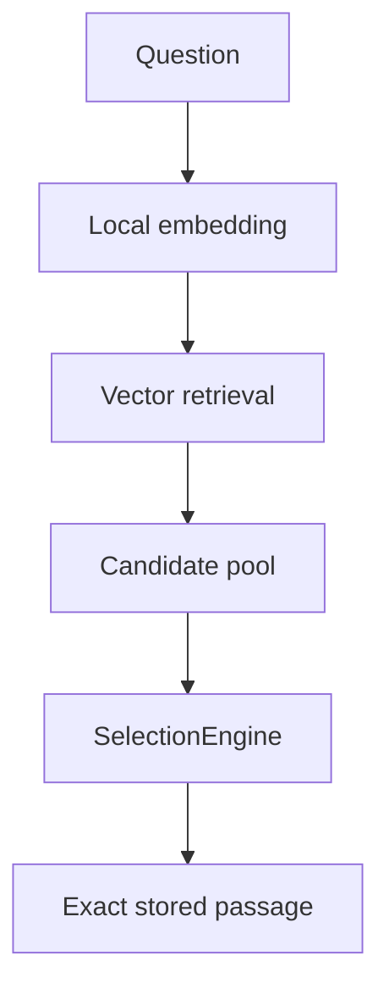

# Sibyl

Sibyl is an offline-first literary discovery application. A user asks a question or describes a state, and Sibyl retrieves several semantically related passages from a local corpus before selecting one **verbatim stored passage** with controlled randomness. For product intent and behavior in more detail, see [`docs/CONCEPT.md`](docs/CONCEPT.md).

The application uses machine learning to find where to look; it does not generate literary quotations.



Android is the current product target. A JVM Compose Desktop host is included for rapid development and real-corpus testing. iOS remains deferred.

## Start here

Commands in this README run from the repository root unless the command explicitly changes directory.

| Goal | Read / run |
|---|---|
| Know where to start and what to run next | [`docs/WORKFLOW.md`](docs/WORKFLOW.md) |
| Understand what Sibyl is | [`docs/CONCEPT.md`](docs/CONCEPT.md) |
| Understand system boundaries | [`docs/ARCHITECTURE.md`](docs/ARCHITECTURE.md) |
| Understand the current code and libraries | [`docs/IMPLEMENTATION.md`](docs/IMPLEMENTATION.md) |
| Set up a workstation | [`docs/INSTALLATION.md`](docs/INSTALLATION.md) |
| Run Desktop or prepare a corpus | [`docs/USAGE.md`](docs/USAGE.md) |
| Understand source/provenance rules | [`docs/SOURCES.md`](docs/SOURCES.md) |
| Change persisted corpus semantics | [`docs/CORPUS_FORMAT.md`](docs/CORPUS_FORMAT.md) |
| See planned work | [`docs/ROADMAP.md`](docs/ROADMAP.md) |
| Review requirements/design for active significant changes | [`docs/specs/README.md`](docs/specs/README.md) |

## Repository structure

- [`mobile/`](mobile/) — Kotlin Multiplatform domain/runtime/UI, Android host, and JVM Desktop development host.
- [`corpus-core/`](corpus-core/) — shared feature-neutral Python canonical-source contracts/primitives.
- [`corpus-builder/`](corpus-builder/) — Python source ingestion, automatic corpus build, and large-LLM curation tooling.
- [`corpus-format/`](corpus-format/) — versioned persisted contract shared by builder and runtime.
- [`corpus-sources/`](corpus-sources/) — Git-tracked source/provenance/rights registry.
- [`corpus-curation/`](corpus-curation/) — guided-question catalog and Git-safe LLM curation metadata.
- [`test-corpus/`](test-corpus/) — small synthetic fixtures for deterministic tests.
- [`docs/`](docs/) — cross-project product, architecture, workflow, and policy documentation.

Each code subproject has a local `README.md`, `AGENTS.md`, and `IMPLEMENTATION.md`. The local implementation guide maps concrete files/classes in that subproject without redefining the root architecture.

## Quick verification

Core repository checks require Python 3.11+ and the corpus-builder development dependencies:

```bash
python -m venv .venv
source .venv/bin/activate
python -m pip install -e ./corpus-core -e './corpus-builder[dev]'

make check
```

`make check` runs model-free/network-free Python builder tests plus corpus-format and source-registry validation.

When the JDK and Android toolchain are available:

```bash
make check-all
```

See [`docs/TESTS.md`](docs/TESTS.md).

## Desktop development

Synthetic demo mode:

```bash
make run-desktop
```

Real local corpus mode uses a generated corpus plus a matching local runtime model bundle:

```bash
make download-runtime-model
make run-desktop-real
```

Default development paths are:

```text
corpus-builder/data/output/dostoevsky
corpus-builder/data/runtime-models/multilingual-e5-small
```

Override them with `CORPUS_DIR=... MODEL_DIR=...`.

The current Desktop real-corpus implementation supports two local modes from the same published corpus. **Own question** embeds text locally with ONNX Runtime and performs exhaustive cosine search for the small development corpus. **Guided question** (format v4 with mappings) lists only prompts that have curated candidates and reads those candidates directly from SQLite without query embedding. Both paths resolve exact stored `passage_text` and delegate final choice to the shared `SelectionEngine`. Existing v3 development corpora remain free-form-only.

Intel macOS currently needs additional native-tokenizer setup for DJL; see [`docs/INSTALLATION.md`](docs/INSTALLATION.md) and [`mobile/IMPLEMENTATION.md`](mobile/IMPLEMENTATION.md).

## Corpus preparation

A current Lib.ru author starts with:

```text
discover -> review selection -> acquire -> prepare-selection
```

From the prepared canonical directory, optionally run the LLM-curation path, then build a format-v4 runtime corpus. The build always keeps the automatic splitter/E5 free-form path and can additionally materialize validated `--curation` mappings into the same `corpus.db`.

Start with [`docs/WORKFLOW.md`](docs/WORKFLOW.md) to choose the end-to-end path, then use [`corpus-builder/README.md`](corpus-builder/README.md) or [`docs/USAGE.md`](docs/USAGE.md) for command details.

Generated/downloaded artifacts live under `corpus-builder/data/` and are intentionally excluded from Git and repository archives.

## Android

Android still uses demo retrieval while the real runtime is being validated through Desktop. Build the current Android host from `mobile/`:

```bash
cd mobile
./gradlew :androidApp:assembleDebug
```

See [`mobile/README.md`](mobile/README.md).

## Documentation map

- [`docs/WORKFLOW.md`](docs/WORKFLOW.md) — primary start/continue guide for source preparation, LLM curation, generic corpus builds, and Desktop runtime.
- [`docs/CONCEPT.md`](docs/CONCEPT.md) — product idea, user promise, invariants, and non-goals.
- [`docs/ARCHITECTURE.md`](docs/ARCHITECTURE.md) — stable boundaries and data flows.
- [`docs/IMPLEMENTATION.md`](docs/IMPLEMENTATION.md) — current technical implementation map.
- [`docs/INSTALLATION.md`](docs/INSTALLATION.md) — toolchains and local setup.
- [`docs/USAGE.md`](docs/USAGE.md) — command-oriented runtime and corpus reference.
- [`docs/CONFIGURATION.md`](docs/CONFIGURATION.md) — configuration ownership and current settings.
- [`docs/SOURCES.md`](docs/SOURCES.md) — provenance, rights review, and normalization policy.
- [`docs/CORPUS_FORMAT.md`](docs/CORPUS_FORMAT.md) — format semantics and versioning.
- [`docs/TESTS.md`](docs/TESTS.md) — test matrix and commands.
- [`docs/SECURITY_AND_PRIVACY.md`](docs/SECURITY_AND_PRIVACY.md) — local privacy and content integrity.
- [`docs/ROADMAP.md`](docs/ROADMAP.md) — prioritized planned work; active cross-cutting items link to detailed change specs instead of duplicating requirements.
- [`docs/specs/README.md`](docs/specs/README.md) — lifecycle and index for change specifications; active specs describe intended deltas, archived specs retain historical design intent.
- [`docs/CHANGELOG.md`](docs/CHANGELOG.md) — concise history of meaningful product, architecture, data-contract, and capability evolution.
- [`docs/WORKLOG.md`](docs/WORKLOG.md) — detailed engineering and maintenance history; consult when historical implementation context is needed.

## Repository helpers

`archive.sh` creates a shareable `FULL` ZIP while excluding generated corpus/model data, caches, build outputs, environments, and local IDE files.

`concat_sibyl.sh` creates a source-only text snapshot through `~/work/python/concat_files_to_txt.py` by default, applies the same generated-data exclusions, and omits the detailed `docs/WORKLOG.md` plus archived change specs so normal LLM context stays focused. Active specs remain in the snapshot.

## License

No project license has been selected yet. See [`LICENSE.md`](LICENSE.md).
