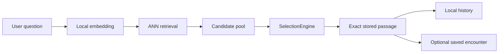

# Sibyl

Sibyl is an offline-first literary discovery application. A user asks a question or describes a state, and Sibyl returns a short **verbatim stored passage** whose meaning may resonate with that question. The core mode does not generate quotations or imitate an author's or character's voice.

Android is the product target for the current phase. A JVM Compose Desktop application is included as a development harness so the shared UI and runtime flow can be exercised quickly on a workstation without an emulator or device. iOS remains deferred.

## Start here

Unless a command explicitly changes directory, commands in this README are run from the repository root.

If this is your first checkout, use this order:

| Goal | First step |
|---|---|
| Understand the project | Read this README, then [`docs/ARCHITECTURE.md`](docs/ARCHITECTURE.md) and [`docs/ROADMAP.md`](docs/ROADMAP.md). |
| Verify the checkout | Run `make check`. It does not download models, corpora, or require the Android toolchain. |
| Run the interactive development app | Run `make run-desktop` to open Sibyl as a local JVM desktop window. |
| Run the full current test suite | Run `make check-all` after configuring JDK and the Android SDK. |
| Exercise the build-time pipeline | Run `make smoke-corpus` to build and validate the synthetic fixture corpus. |
| Validate Android integration | Open `mobile/` in Android Studio or build `:androidApp:assembleDebug`. |
| Prepare real texts | Start with catalog discovery in [`docs/USAGE.md`](docs/USAGE.md) or the focused [`corpus-builder/README.md`](corpus-builder/README.md). |
| Add/review literature | Use [`corpus-sources/README.md`](corpus-sources/README.md) and [`docs/SOURCES.md`](docs/SOURCES.md). |
| Change the persisted corpus contract | Read [`docs/CORPUS_FORMAT.md`](docs/CORPUS_FORMAT.md) before editing `corpus-format/`. |

Testing is described in one place: [`docs/TESTS.md`](docs/TESTS.md).

## Repository structure

- [`mobile/`](mobile/) — Kotlin Multiplatform runtime/UI, Android product entry point, JVM Desktop development app, retrieval contracts, selection logic, history, and saved encounters.
- [`corpus-builder/`](corpus-builder/) — local Python preprocessing and corpus artifact generation.
- [`corpus-format/`](corpus-format/) — versioned persisted contract between builder and the shared runtime.
- [`corpus-sources/`](corpus-sources/) — source/provenance/rights registry. It contains metadata, not downloaded production books.
- [`test-corpus/`](test-corpus/) — tiny synthetic fixtures for deterministic tests and smoke builds.
- [`docs/`](docs/) — the only detailed documentation directory for the repository.

Each subproject keeps a local `README.md` for quick usage and a local `AGENTS.md` for protected development rules. Detailed architecture, testing, sourcing, configuration, roadmap, and format documentation live only under root `docs/`.

## Core flow



Retrieval returns **multiple sufficiently related candidates**. `SelectionEngine` then applies semantic relevance, quality/diversity/history weights, response-length preference, and controlled randomness. Sibyl intentionally does not behave like a top-1 semantic search engine.

## Quick verification

Requirements for the lightweight repository checks:

- Python 3.11+ for the core corpus-builder;
- Python 3.11 or 3.12 for the optional ML embedding environment;
- corpus-builder development dependencies.

One-time setup:

```bash
python -m venv .venv
source .venv/bin/activate
python -m pip install -e 'corpus-builder[dev]'
```

Then:

```bash
make check
```

This currently runs:

- Python corpus-builder tests;
- corpus-format validation;
- corpus-source registry validation.

It intentionally excludes Gradle/KMP tests so a documentation/corpus contributor can verify a checkout without installing the Android SDK. To include the current Android and desktop shared tests:

```bash
make check-all
```

See [`docs/TESTS.md`](docs/TESTS.md) for prerequisites and focused commands.

## Interactive desktop development

For the fastest manual development loop, run the same shared Compose UI as a local JVM desktop application:

```bash
make run-desktop
```

This opens `Sibyl Dev` directly on the workstation in synthetic demo mode. It uses the same `SibylApp()` and shared retrieval/selection code as Android, with no REST server and no backend.

After building a real corpus and downloading the matching runtime model bundle, run real local retrieval with:

```bash
make download-runtime-model
make run-desktop-real
```

The default real-development paths are `corpus-builder/data/output/dostoevsky` and `corpus-builder/data/runtime-models/multilingual-e5-small`. Override them with `CORPUS_DIR=... MODEL_DIR=...`. The Desktop path reads `manifest.json`, `corpus.db`, and `vectors.json` directly, embeds the question locally with ONNX Runtime, performs brute-force cosine search for the current small development corpus, and then reuses the shared `SelectionEngine`.

The first Gradle invocation may need network access when the configured Gradle distribution or dependencies are not cached. Compose Desktop is a development harness in the current phase, not a product distribution target.

## Android validation

Requirements:

- JDK 17+;
- Android Studio;
- Android SDK 36.

```bash
cd /path/to/sibyl/mobile
./gradlew :androidApp:assembleDebug
```

Open `mobile/` in Android Studio and run the `androidApp` configuration when Android-specific integration needs verification.

See [`mobile/README.md`](mobile/README.md).

## Corpus builder smoke run

```bash
make smoke-corpus
```

This builds a temporary development corpus from `test-corpus/`, validates it, and removes the temporary output. For interactive builder development:

```bash
cd /path/to/sibyl/corpus-builder
python -m venv .venv
source .venv/bin/activate
python -m pip install -e '.[dev]'

sibyl-corpus build \
  --config config/example.toml \
  --source ../test-corpus/sources \
  --output data/output/demo
```

See [`corpus-builder/README.md`](corpus-builder/README.md).

## Real-text preparation

The fastest current workflow for Russian classics starts from a Lib.ru/Классика author page and generates a developer-editable selection before any book is downloaded:

```bash
cd /path/to/sibyl/corpus-builder

sibyl-corpus discover \
  --url "http://az.lib.ru/d/dostoewskij_f_m" \
  --output data/work/dostoevsky-selection.toml
```

Review the generated `include` / `exclude` / `review` decisions, then acquire only the included works with `sibyl-corpus acquire`. Lib.ru acquisition prefers a TXT artifact, falls back to extracting the literary body from the work HTML page, and uses FB2 only as a final fallback. Each work is isolated: successful artifacts stay cached even if another work fails, and a TOML acquisition report records `acquired` / `failed` / `skipped` results. Correspondence is excluded by default during discovery.

Project Gutenberg single-work fetch and reviewed local UTF-8 import remain available. See [`docs/USAGE.md`](docs/USAGE.md) for the complete `discover → review → acquire → prepare-selection → inspect → build` workflow. Generated source/cache/output data remains local under `corpus-builder/data/`.

## Literary sources

`corpus-sources/` contains the permanent source/provenance/rights registry. The existing 40 seed records remain a review queue, not automatic publication approval.

Catalog discovery is intentionally separate from that registry: a developer may discover and process many works locally first, then use `sibyl-corpus register` to persist only the reviewed concrete versions with hashes. Registration never approves/enables a source and never overwrites an existing work.

Detailed policy: [`docs/SOURCES.md`](docs/SOURCES.md).

## Configuration

Runtime selection settings belong to the mobile project. Corpus preparation settings belong to `corpus-builder/config/*.toml`. Persisted artifact semantics belong to `corpus-format/`.

Important rules:

- response length selects prepared `short` / `standard` / `extended` variants; literary text is never arbitrarily truncated at runtime;
- original, human translation, and machine translation are separate text roles;
- machine translation must remain explicitly labelled in persisted metadata and UI;
- sacred texts are a normal content category/filter, not a separate retrieval engine.

See [`docs/CONFIGURATION.md`](docs/CONFIGURATION.md).

## Privacy and content integrity

The core application requires no backend. User questions, local embeddings, ANN search, selection, history, and saved encounters are intended to stay on-device.

Displayed literary answers must resolve to exact stored passage text. Generated semantic hints are internal metadata and must never be presented as quotations.

See [`docs/SECURITY_AND_PRIVACY.md`](docs/SECURITY_AND_PRIVACY.md).

## Repository helper scripts

`archive.sh` creates a shareable `FULL` ZIP with the `sibyl/` root and excludes downloaded corpus data, generated corpus outputs, embedding caches, local model caches, virtual environments, IDE/build caches, and existing archives.

`concat_sibyl.sh` creates a source-only project snapshot using `~/work/python/concat_files_to_txt.py` by default. The output defaults to `../sibyl_files.txt`, outside the repository. Override the helper location with `SIBYL_CONCAT_TOOL=/path/to/concat_files_to_txt.py` or pass an explicit output path as the first argument. Generated/downloaded data and local caches are excluded from the snapshot.

## Documentation

- [`docs/ARCHITECTURE.md`](docs/ARCHITECTURE.md) — system boundaries and data flow.
- [`docs/INSTALLATION.md`](docs/INSTALLATION.md) — toolchains and setup.
- [`docs/TESTS.md`](docs/TESTS.md) — test matrix and first-checkout verification.
- [`docs/USAGE.md`](docs/USAGE.md) — runtime and corpus workflows.
- [`docs/CONFIGURATION.md`](docs/CONFIGURATION.md) — configuration ownership and current settings.
- [`docs/SOURCES.md`](docs/SOURCES.md) — source registry, provenance, copyright review, and normalization.
- [`docs/CORPUS_FORMAT.md`](docs/CORPUS_FORMAT.md) — format v3 semantics, validation, and versioning.
- [`docs/DEVELOPMENT.md`](docs/DEVELOPMENT.md) — contribution workflow.
- [`docs/SECURITY_AND_PRIVACY.md`](docs/SECURITY_AND_PRIVACY.md) — local privacy and content integrity.
- [`docs/ROADMAP.md`](docs/ROADMAP.md) — prioritized work with `todo` / `in_progress` / `done` status.
- [`docs/CHANGELOG.md`](docs/CHANGELOG.md) — completed repository changes.
- [`AGENTS.md`](AGENTS.md) — repository-wide development rules.

## Project status

The repository now includes a real-text preparation slice: Lib.ru catalog discovery/review, resilient TXT/HTML/FB2 batch acquisition, explicit single-source acquisition/import, canonical text hashing, exact passage extraction, and opt-in semantic embeddings. The next P0 runtime milestone is loading a small prepared corpus into Desktop with local query embedding + brute-force vector search before introducing ANN scale.

## License

No project license has been selected yet. See [`LICENSE.md`](LICENSE.md).
