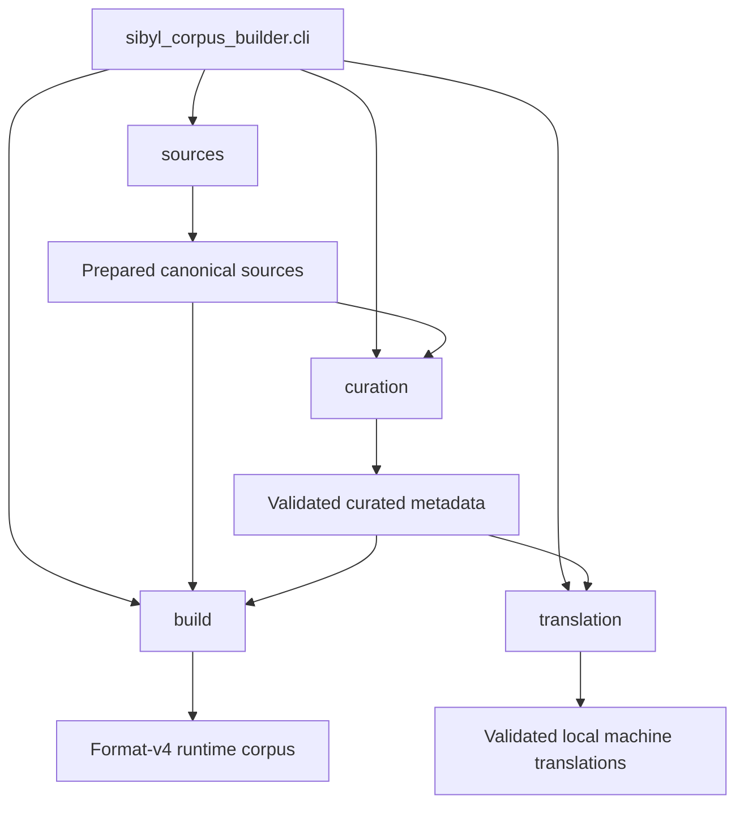
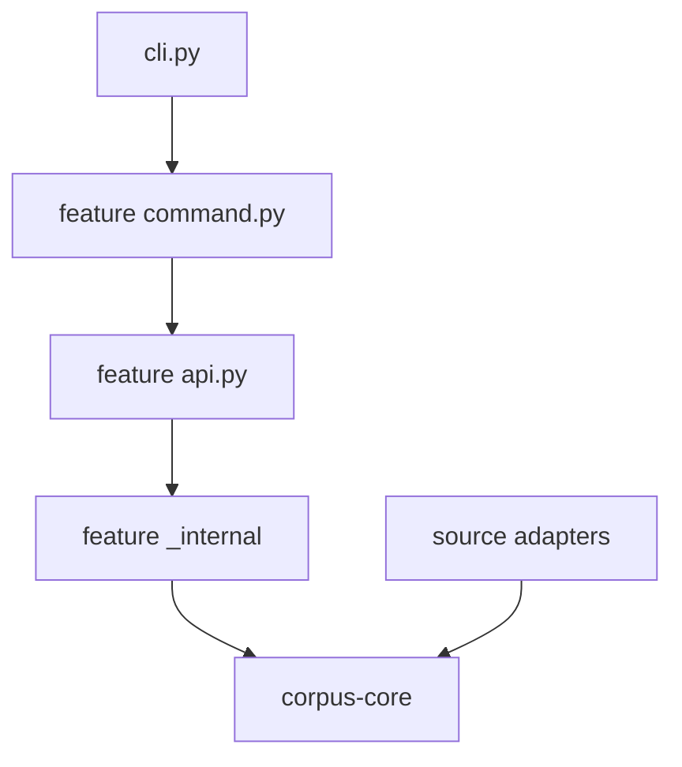
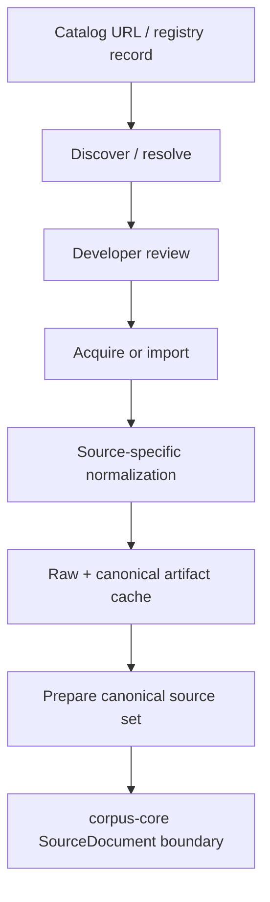
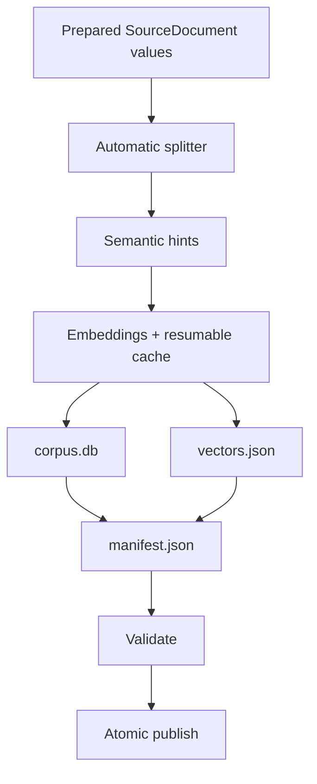
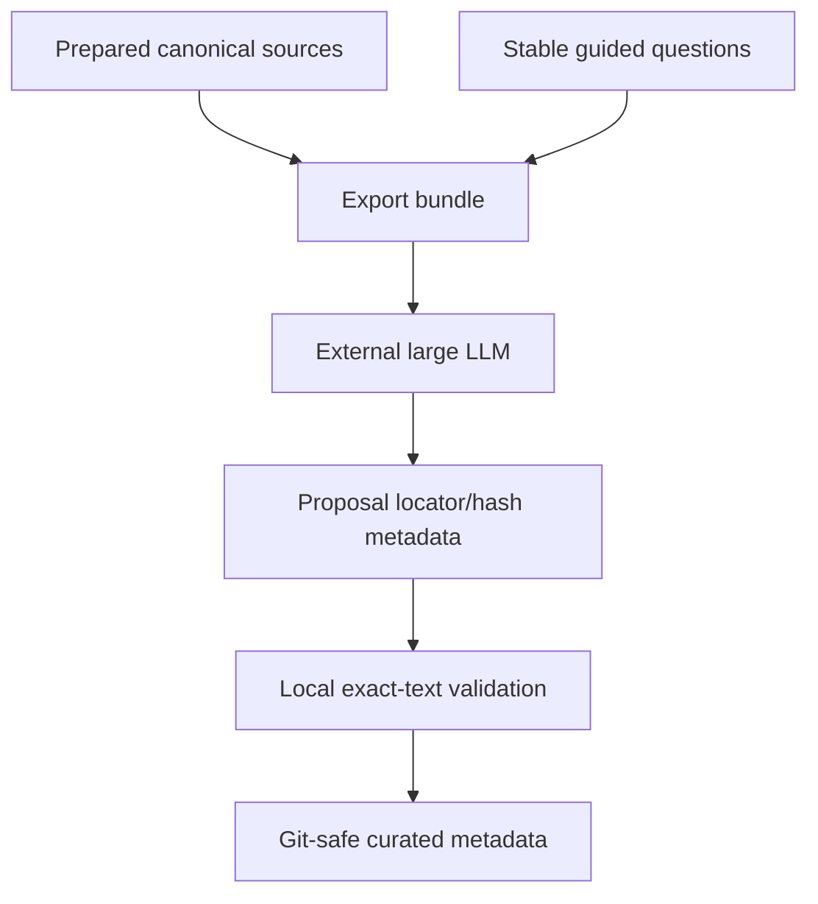
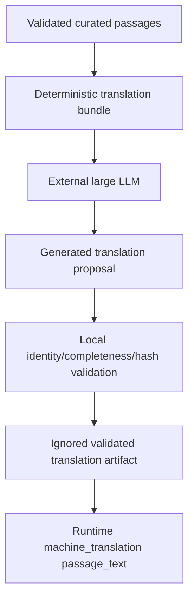

# Corpus builder implementation

## Scope and entry point

`corpus-builder/` is the build-time Python application that composes four explicit features around the shared contracts in [`../corpus-core/`](../corpus-core/):



The package root intentionally contains only:

```text
sibyl_corpus_builder/
  __init__.py
  cli.py
  sources/
  build/
  curation/
  translation/
```

`cli.py` is the composition root. It registers feature-owned command adapters and dispatches a parsed command to exactly one feature. It does not know source-site parsing, passage splitting, embeddings, SQLite details, or LLM proposal structure.

## Dependency rules

The implementation follows these boundaries:



- feature callers use `api.py`, not another feature's `_internal` package;
- `_internal` means implementation-private to one feature, not a generic dumping ground;
- source-specific behavior lives under `sources/adapters/<source>/`;
- feature-neutral shared code belongs in `corpus-core`, not `_internal`;
- architecture regression tests enforce the most important import directions.

## `sources`: external artifacts to prepared canonical sources

Public surface: `sibyl_corpus_builder.sources.api`.



### Command and API files

- `sources/command.py` — argparse definitions and user-facing result output for source commands;
- `sources/api.py` — public feature facade;
- `sources/models.py` — public `SelectionManifest` / `SelectionWork` review contracts.

### Source adapters

Adapters are grouped by **source**, so all code needed to understand one source family is close together:

```text
sources/adapters/
  libru/
    discovery.py
    fetch.py
    normalize.py
  gutenberg/
    fetch.py
    normalize.py
  formats/
    fb2.py
```

`libru/discovery.py` parses an author catalog and classifies entries into conservative `include` / `review` / `exclude` decisions. It does not acquire work bodies.

`libru/fetch.py` owns Lib.ru work-page artifact discovery and the resilient `TXT -> HTML -> FB2` fallback order.

`libru/normalize.py` owns Lib.ru-specific decoding/body-boundary/site-chrome logic. It preserves literary wording and keeps normalizer versions stable because exact canonical hashes and character locators depend on its output.

`gutenberg/fetch.py` locates/downloads a preferred UTF-8 plain-text artifact. `gutenberg/normalize.py` removes only the standard Project Gutenberg START/END transport wrapper.

`formats/fb2.py` is source-neutral FB2 parsing because FB2 is a document format rather than a source family.

### Source feature internals

- `_internal/adapters.py` — the single explicit mapping from source family to concrete discovery/fetch/normalization adapters;
- `_internal/http.py` — explicit build-time HTTP primitive used only by source adapters;
- `_internal/selection.py` — editable `selection.toml` persistence and validation;
- `_internal/registry.py` — typed access to permanent `corpus-sources` records and approval checks;
- `_internal/artifacts.py` — raw/canonical cache with hashes and normalizer identity;
- `_internal/acquisition.py` — candidate fallback/per-work isolation and registry/selection acquisition orchestration;
- `_internal/reports.py` — deterministic acquisition reports;
- `_internal/preparation.py` — the final source-ingestion stage that materializes deterministic canonical input shared by build and curation;
- `_internal/registration.py` — converts reviewed acquired Lib.ru selection items into disabled candidate registry records.

The important handoff is the prepared directory under `data/work/<name>/`. `corpus-core.prepared_sources.load_prepared_sources()` reads one directory, while `load_prepared_source_sets()` composes multiple independently prepared directories for corpus assembly and rejects ambiguous duplicate identities. Neither `build` nor `curation` reaches back into source `_internal` implementation.

## `build`: automatic retrieval plus format-v4 runtime corpus assembly

Public surface: `sibyl_corpus_builder.build.api`.



The automatic splitter/embedding branch remains the fallback/open-ended path for arbitrary user questions. Runtime publication can compose one or more prepared source sets, consume validated curated metadata through the public `curation` API, and materialize exact guided passages/mappings into the same format-v4 database; `build` never imports `curation._internal`. Curation validation receives the already composed canonical documents, so no temporary hand-merged prepared directory is required.

`build-available` is the normal incremental assembly entry point. It discovers immediate prepared children beneath a local work root, filters curated metadata by required `(work_id, text_version_id)` identities, selects validated translation artifacts by required curated `passage_id` values, skips entirely unavailable curation/translation sets, rejects partial availability, and then delegates to the same `build_corpus()` pipeline. The explicit repeatable `build --source ...` path remains for focused/manual selection and later filtering support.

### Main files

- `build/command.py` — CLI adapter for `inspect-passages`, explicit `build`, all-available `build-available`, `validate`, and runtime-model download;
- `build/api.py` — high-level automatic pipeline. Reading this file should show the processing order without requiring knowledge of implementation details;
- `build/config.py` — immutable build configuration models and eager validation.

### Build internals

- `_internal/available_inputs.py` — deterministic discovery of prepared `data/work/*` inputs plus curated/translation metadata selection based on locally available text-version/passage identities;
- `_internal/splitter.py` — paragraph/sentence-aware exact automatic ranges with deterministic IDs;
- `_internal/hints.py` — deterministic or exact-passage retrieval text;
- `_internal/embeddings.py` — hash fixture provider and opt-in Sentence Transformers provider;
- `_internal/embedding_pipeline.py` — provider selection, cache fingerprints, batching, progress, and cache reuse across all prepared source inputs; new vectors are written to the first source cache;
- `_internal/embedding_cache.py` — SQLite cache of completed embedding inputs;
- `_internal/database.py` — runtime SQLite writer for automatic passages, validated curated guided rows, and additional labelled machine-translation `text_version`/`passage_text` realizations; its `SCHEMA` must remain aligned with `corpus-format/schema.sql`;
- `_internal/manifest.py` — runtime artifact/embedding compatibility manifest plus guided question/mapping and machine-translation diagnostic counts;
- `_internal/validation.py` — final format-v4 metadata/foreign-key/guided-schema checks plus machine-translation provenance/original-pair checks before publication;
- `_internal/runtime_model/specs.py` / `download.py` — explicit recipes and download/publish logic for the Desktop ONNX/tokenizer bundle.

The automatic splitter is not considered a literary curator. Its module documentation explicitly identifies it as a mechanical fallback used for generic retrieval.

## `curation`: external large-LLM passage selection

Public surface: `sibyl_corpus_builder.curation.api`.



### Main files

- `curation/command.py` — CLI adapter for export/import/validate commands;
- `curation/api.py` — public feature facade for export/import/revalidation, curated source-identity inspection, and validated exact-slice loading used by corpus assembly;
- `curation/models.py` — public guided-question catalog models.

### Curation internals

- `_internal/questions.py` — guided-question catalog loading/ID validation;
- `_internal/bundle.py` — deterministic ZIP export containing pinned canonical texts and questions, with strict/approved-only/explicit-override rights modes;
- `_internal/proposal.py` — proposal import and normalized curated-mapping revalidation; it also constructs public validated exact-slice models after the same trust-boundary checks;
- `_internal/validation.py` — the trust boundary that resolves local canonical slices and verifies hashes/question links.

The external LLM decides literary relevance and natural boundaries. Local Python remains authoritative for exact text identity. Git-tracked curated metadata stores locators/hashes/matches rather than copied literary passages.

## `translation`: curated foreign passages to stored machine translations

Public surface: `sibyl_corpus_builder.translation.api`.



- `translation/command.py` — CLI adapter for export/import/revalidation;
- `translation/api.py` — public feature facade used by build assembly;
- `translation/models.py` — validated translation values consumed by the runtime writer;
- `_internal/source.py` — reuses the public curation trust boundary and derives deterministic translation input identities;
- `_internal/bundle.py` — deterministic local ZIP containing exact curated source text;
- `_internal/proposal.py` — validates complete external LLM output, provider/model/prompt metadata, source hashes, and stored target-text hashes;
- `_internal/validation.py` — compact ID/language/hash validation.

Generated target text is local build data under `corpus-builder/data/`; it is not Git-safe curation metadata. The build feature consumes translation public contracts only and persists the target text under format-v4 `machine_translation` text versions.

## `corpus-core` relationship

The builder depends on the separate local distribution `sibyl-corpus-core`. Shared code is intentionally small:

- `SourceDocument` and prepared-source loading;
- exact hashing;
- exact character locator parsing/slicing;
- newline/word-count primitives;
- atomic directory publication.

See [`../corpus-core/IMPLEMENTATION.md`](../corpus-core/IMPLEMENTATION.md). `corpus-core` must never import `corpus-builder`.

## Setup and validation

Install both local Python distributions from the repository root:

```bash
python -m pip install -e ./corpus-core -e './corpus-builder[dev]'
```

Focused validation:

```bash
make test-corpus-core
make test-corpus-builder
make check
```

`test_architecture.py` protects package dependency direction and requires meaningful package-level documentation in every `__init__.py`. `test_repository_hygiene.py` protects the refactored source layout from broad Git/archive exclusions, especially the architectural `sibyl_corpus_builder/build/` package.

## Generated directories

All paths under `corpus-builder/data/` are local/generated and ignored by Git and shareable archives. They may contain downloaded source artifacts, canonical/prepared texts, embedding caches, LLM curation/translation bundles, generated translation proposals/validated text, runtime models, and published development corpora.

Use [`../docs/WORKFLOW.md`](../docs/WORKFLOW.md) for the operational start/continue flow and [`README.md`](README.md) / [`../docs/USAGE.md`](../docs/USAGE.md) for command details.
