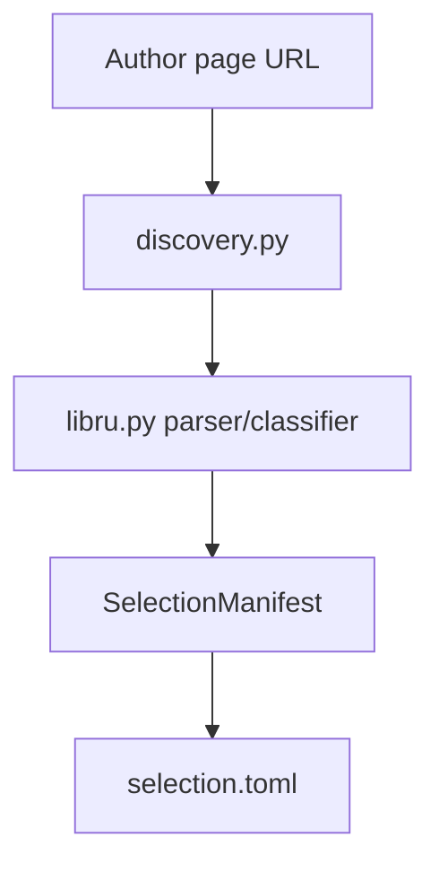
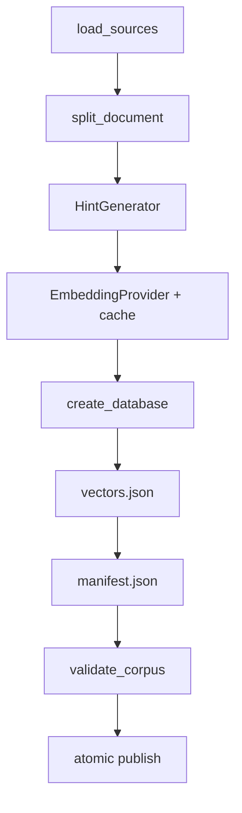

# Corpus builder implementation

## Scope

`corpus-builder/` is a build-time Python application. It discovers/acquires source material, creates deterministic canonical text and passages, produces retrieval metadata/embeddings, and publishes validated runtime artifacts. It is not a server and package import has no network or model side effects.

Stable boundaries and source policy are documented in [`../docs/ARCHITECTURE.md`](../docs/ARCHITECTURE.md) and [`../docs/SOURCES.md`](../docs/SOURCES.md).

## Entry point and configuration

The installed command is:

```text
sibyl-corpus -> sibyl_corpus_builder.cli:main
```

`cli.py` builds the `argparse` command surface and delegates to explicit stages. `config.py` loads TOML into immutable `PassageConfig`, `HintConfig`, `EmbeddingConfig`, and `BuilderConfig` models and validates incompatible settings before expensive work begins.

## Catalog discovery and review

For the current Lib.ru workflow:



`libru.py` parses catalog sections and links, assigns deterministic candidate IDs, and classifies entries into initial `include`, `exclude`, or `review` decisions. `selection.py` owns the editable TOML representation.

Discovery is intentionally separate from acquisition and permanent registration.

## Acquisition and canonical preparation

`preparation.py` orchestrates selected/registry acquisition. Important supporting modules are:

- `fetchers.py` — source-family candidate download logic, including Project Gutenberg;
- `libru.py` — Lib.ru artifact candidates in TXT → HTML → FB2 fallback order;
- `normalization.py` — versioned source-specific normalization;
- `source_artifacts.py` — raw/canonical artifact storage and SHA-256 metadata;
- `source_registry.py` — typed access to permanent registry records and approval checks.

Each selected work is isolated so one malformed artifact does not discard successful work from the same batch. `AcquisitionReport` records acquired, failed, and skipped items.

Prepared source documents are materialized under `data/work/` and later loaded by `source_loader.load_sources()`.

## Large-LLM curation handoff

`curation.py` implements the explicit external-curation boundary without making a remote LLM a package dependency.

`export_curation_bundle()` reads prepared canonical `SourceDocument` values plus `corpus-curation/questions.json`, verifies canonical hashes, and creates a deterministic local ZIP containing a manifest, normalized question catalog, and canonical work text files. The bundle is generated under ignored local data and is intended to be uploaded manually to a strong external model.

`import_curation()` treats returned model metadata as untrusted. It resolves `work_id`/`text_version_id`, checks the pinned canonical SHA-256, resolves the exact `chars:start:end` slice, verifies `text_sha256`, validates guided question IDs/strengths, derives deterministic `cp_...` IDs, and writes normalized Git-safe metadata without copied literary text. `validate_curated_curation()` repeats the same exact-source checks for already normalized files.

The command surface is `export-curation-bundle`, `import-curation`, and `validate-curation`. The current runtime does not consume curated mappings yet; this module establishes the reproducible build-time handoff first.

## Exact passage extraction

`splitter.py` converts each canonical `SourceDocument` to `PassageCandidate` values.

The splitter:

1. finds paragraph boundaries;
2. splits oversized paragraphs at sentence boundaries where possible;
3. falls back to word-bounded units rather than mid-character cuts;
4. groups units toward configured word targets;
5. stores exact `chars:start:end` locators;
6. derives deterministic passage IDs from source/version/offset/text identity.

The persisted text therefore remains a direct canonical-text slice.

## Semantic hints

`hints.py` defines the `HintGenerator` protocol. Current implementations are:

- `DeterministicHintGenerator` — model-free synthetic metadata for tests;
- `PassageTextHintGenerator` — uses the exact passage text itself as retrieval input for the current real-text baseline.

Hints are internal retrieval metadata and are never user quotations.

## Embeddings and resumable cache

`embeddings.py` defines `EmbeddingProvider`.

- `HashEmbeddingProvider` generates deterministic non-semantic vectors for fixture tests.
- `SentenceTransformerEmbeddingProvider` is an explicit optional ML adapter used by `config/real-text.toml`.

`builder._resolve_embeddings()` deduplicates exact embedding inputs by SHA-256, opens an `EmbeddingCache` scoped by an embedding-configuration fingerprint, reads existing vectors, and computes only missing batches. Every completed batch is committed immediately.

This means `Ctrl+C` can lose the current in-flight batch, but completed batches remain reusable on the next build. The cache lives under the prepared source directory, outside published output.

## Corpus publication

`builder.build_corpus()` is the main build orchestrator:



`database.py` materializes the current v3 SQLite tables. The persisted semantic contract is owned by `corpus-format/`; the builder's schema-writing assumptions must be kept synchronized with it.

Output is written to `.<output>.staging`. The requested output directory is replaced only after corpus validation succeeds. Failed or interrupted publication removes staging rather than publishing a partial corpus.

## Runtime model bundle

`runtime_model.py` implements the explicit `download-runtime-model` command. It downloads the ONNX model and tokenizer assets matching the configured build-time embedding model, calculates file hashes, writes `model-manifest.json`, and atomically publishes the completed bundle.

This command is networked by design, but it runs only when explicitly invoked.

## Permanent registration

`registration.py` converts reviewed acquired selection items into `corpus-sources/` TOML records. New records are disabled candidates and registration refuses to overwrite existing work records. Approval and publication remain separate human-controlled steps.

## Core dependencies

The normal builder intentionally uses the Python standard library where practical:

- `argparse`, `pathlib`, `tomllib`;
- `urllib`;
- `html.parser`;
- `xml.etree.ElementTree`;
- `sqlite3`;
- `hashlib`, `json`, and related utilities.

Optional extras:

- `pytest` and Ruff for development;
- NumPy, PyTorch, and Sentence Transformers for explicit ML builds.

## Generated directories

All paths under `corpus-builder/data/` are local/generated and ignored by Git and shareable archives. They may contain downloaded source artifacts, canonical/prepared text, embedding caches, runtime models, and published development corpora.

See [`README.md`](README.md) for commands and [`../docs/USAGE.md`](../docs/USAGE.md) for the operational workflow.
