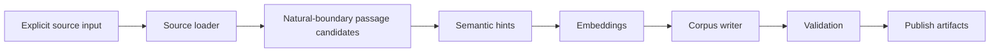

# Sibyl corpus builder

`corpus-builder/` is a local Python build-time application. It transforms approved source text into versioned Sibyl corpus artifacts and is never embedded in the mobile runtime.

## Pipeline



The current implementation uses deterministic local hints and hash-based development vectors so tests require no model downloads or external APIs.

## Quick start

```bash
python -m venv .venv
source .venv/bin/activate
python -m pip install -e '.[dev]'

sibyl-corpus build \
  --config config/example.toml \
  --source ../test-corpus/sources \
  --output data/output/demo

sibyl-corpus validate --corpus data/output/demo/corpus.db
```

From repository root, `make smoke-corpus` runs the same idea in a temporary directory.

## Current output

- `corpus.db` — SQLite corpus following `corpus-format`;
- `manifest.json` — format/build metadata;
- `vectors.json` — deterministic development vectors until the production ANN writer exists.

Production output will use a stable ANN artifact while preserving semantic-hint IDs and manifest compatibility metadata.

## Detailed docs

- [`../docs/ARCHITECTURE.md`](../docs/ARCHITECTURE.md)
- [`../docs/CONFIGURATION.md`](../docs/CONFIGURATION.md)
- [`../docs/SOURCES.md`](../docs/SOURCES.md)
- [`../docs/CORPUS_FORMAT.md`](../docs/CORPUS_FORMAT.md)
- [`../docs/TESTS.md`](../docs/TESTS.md)
- [`AGENTS.md`](AGENTS.md)
