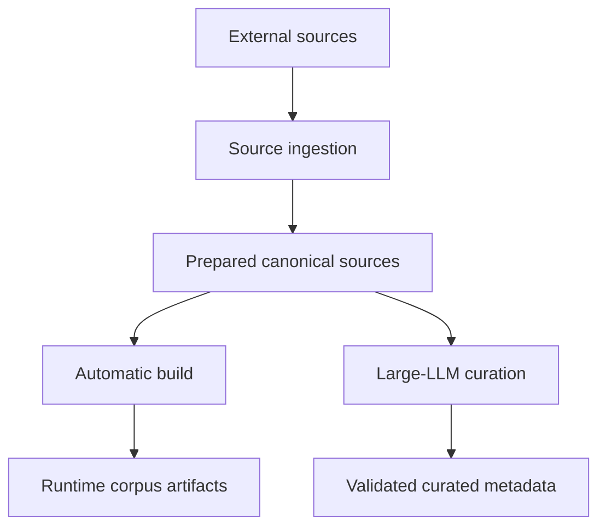

# Sibyl corpus builder

`corpus-builder/` is Sibyl's local build-time Python application. It turns reviewed literary sources into deterministic canonical input, builds the current automatic retrieval corpus, and supports external large-LLM curation. It is never part of runtime question answering.

## Pipeline



Importing the package performs no downloads, model loading, or generated-data writes. Network/model work happens only through explicit commands.

For the complete start/continue sequence, use [`../docs/WORKFLOW.md`](../docs/WORKFLOW.md). For command syntax and optional flags, use [`../docs/USAGE.md`](../docs/USAGE.md).

## Package map

```text
sibyl_corpus_builder/
  __init__.py
  cli.py
  sources/   # external sources -> prepared canonical sources
  build/     # splitter/embeddings -> current runtime corpus
  curation/  # canonical texts <-> large LLM -> validated metadata
```

`cli.py` is a thin composition root. Feature callers use each package's public API; implementation-private mechanics stay under that feature's `_internal/` package. Shared feature-neutral contracts live in [`../corpus-core/`](../corpus-core/).

See [`IMPLEMENTATION.md`](IMPLEMENTATION.md) for concrete modules and call paths.

## Setup

From `corpus-builder/`:

```bash
python -m venv .venv
source .venv/bin/activate
python -m pip install -e ../corpus-core -e '.[dev]'
```

The optional semantic embedding environment uses the `ml` extra and currently supports Python 3.11/3.12. Reproducible ML and Desktop-runtime setup is documented in [`../docs/INSTALLATION.md`](../docs/INSTALLATION.md).

## Main command groups

| Goal | Commands | Owning docs |
|---|---|---|
| Discover/acquire/prepare sources | `discover`, `acquire`, `prepare-selection`, `fetch`, `import-file`, `prepare` | [`WORKFLOW`](../docs/WORKFLOW.md), [`SOURCES`](../docs/SOURCES.md) |
| Persist reviewed source metadata | `register` | [`SOURCES`](../docs/SOURCES.md) |
| Curate guided-question passages | `export-curation-bundle`, `import-curation`, `validate-curation` | [`WORKFLOW`](../docs/WORKFLOW.md) |
| Inspect/build automatic corpus | `inspect-passages`, `build`, `validate` | [`WORKFLOW`](../docs/WORKFLOW.md) |
| Prepare Desktop query model | `download-runtime-model` | [`INSTALLATION`](../docs/INSTALLATION.md), [`USAGE`](../docs/USAGE.md) |

Run `sibyl-corpus --help` for the available command surface. [`../docs/USAGE.md`](../docs/USAGE.md) documents command arguments and development-only overrides without duplicating the end-to-end workflow.

## Important local-data boundary

Everything under `corpus-builder/data/` is local/generated: downloaded source artifacts, canonical prepared texts, acquisition reports, curation bundles, embedding caches, runtime models, and built corpora. It is ignored by Git and excluded from shareable repository archives.

Committed source/provenance metadata belongs in `corpus-sources/`; committed guided-question and locator/hash curation metadata belongs in `corpus-curation/`.

## Validation

From the repository root:

```bash
make test-corpus-builder
make check
```

Default tests are deterministic and do not download source texts or models.

## More detail

- [`IMPLEMENTATION.md`](IMPLEMENTATION.md) — builder feature/package implementation.
- [`AGENTS.md`](AGENTS.md) — protected builder change rules.
- [`../docs/WORKFLOW.md`](../docs/WORKFLOW.md) — canonical end-to-end operational sequence.
- [`../docs/USAGE.md`](../docs/USAGE.md) — command/option reference.
- [`../docs/SOURCES.md`](../docs/SOURCES.md) — provenance, rights, and normalization policy.
- [`../docs/CONFIGURATION.md`](../docs/CONFIGURATION.md) — build configuration ownership.
