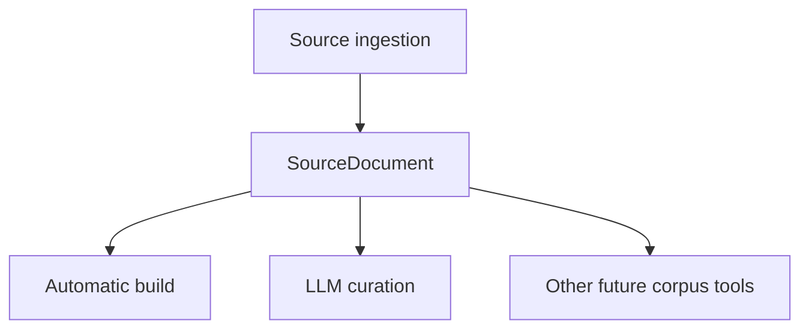
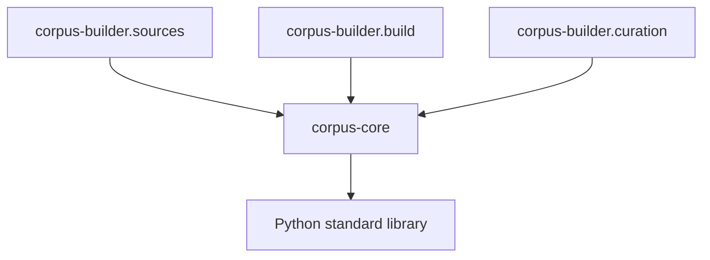

# Corpus core implementation

## Scope

`corpus-core/` is the shared Python boundary between source ingestion and downstream corpus-processing features. It contains no CLI, source adapters, embedding models, external LLM integration, or runtime corpus writer.

## Modules

| Module | Responsibility |
|---|---|
| `models.py` | `SourceDocument`, the canonical prepared-source contract |
| `prepared_sources.py` | reads prepared `manifest.json` + canonical text files and composes independent prepared sets with duplicate/identity validation |
| `hashing.py` | exact SHA-256 for bytes, UTF-8 text, and files |
| `locators.py` | validated half-open `chars:start:end` ranges and exact slicing |
| `text.py` | source-neutral newline, edge-line, and deterministic word-count primitives |
| `atomic.py` | staging-directory publication with cleanup on failure |

## Dependency direction

The reverse direction is forbidden and covered by architecture tests in `corpus-builder/tests/test_architecture.py`.

## Prepared-source contract

Source ingestion publishes local prepared directories containing canonical text files plus `manifest.json`. `load_prepared_sources()` validates one directory, while `load_prepared_source_sets()` composes several independent sets deterministically, rejects duplicate `(work_id, text_version_id)` entries, and rejects conflicting identity metadata for the same `work_id`. Both return immutable `SourceDocument` values and normalize only newline transport conventions.

Automatic corpus building may compose several prepared sets into one runtime release, while curation can still operate on each author/source set independently. The shared composition contract belongs in `corpus-core` because it is independent of embeddings, LLM proposal formats, and runtime persistence.
