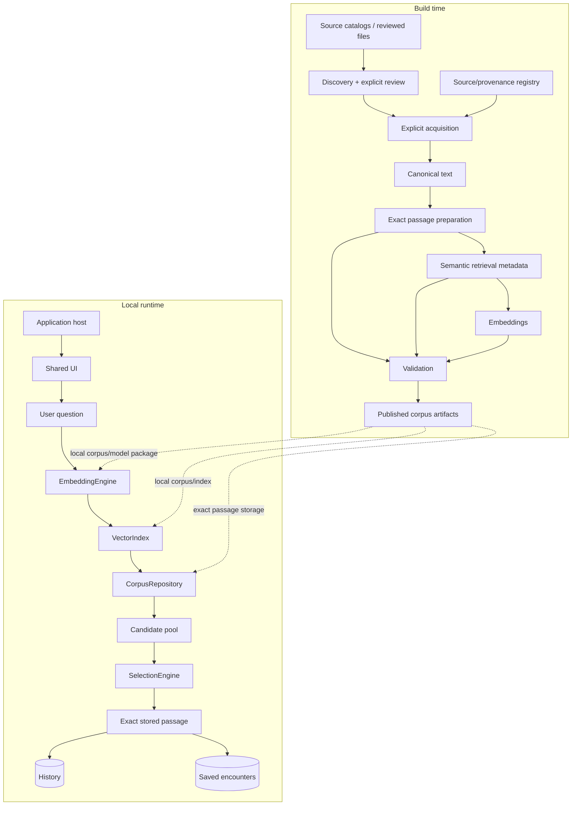
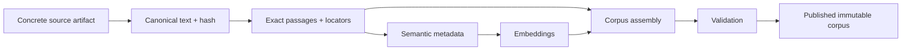

# Sibyl architecture

## Purpose

Sibyl separates expensive corpus preparation from lightweight local retrieval. Build-time tooling may explicitly use network sources and larger models; ordinary question-to-passage processing remains local by default.

This document describes **stable boundaries and responsibilities**. Concrete classes, libraries, filenames, and active development adapters are documented in [`IMPLEMENTATION.md`](IMPLEMENTATION.md).

## System context

## Architectural layers

### Product/application layer

Application hosts provide platform lifecycle, packaging, filesystem/storage integration, and platform-specific inference/index adapters. Shared UI and domain logic should be reused across hosts when practical.

The UI may ask for candidates and display selected exact text. It must not parse corpus files, execute vector ranking, or silently generate literary answers.

### Shared runtime layer

The reusable runtime owns:

- domain models used by retrieval and presentation;
- local embedding/index/repository contracts;
- candidate-pool orchestration and deduplication;
- controlled-random passage selection;
- response-length/content preferences;
- history and saved-encounter semantics.

Platform APIs, ONNX runtimes, native ANN implementations, and platform storage remain behind small interfaces.

### Corpus builder

The build-time pipeline owns:

- explicit source discovery and acquisition;
- canonicalization with reproducible provenance;
- exact passage boundary preparation;
- internal semantic metadata generation;
- embedding generation;
- optional build-time translation generation;
- quality/consistency checks;
- publication of runtime corpus artifacts only after validation.

Importing build-time code must not trigger downloads, remote APIs, or model loading.

### Corpus source registry

The source registry owns durable declarations about concrete text versions:

- work and text-version identity;
- source/provenance information;
- language and translation role;
- rights-review state;
- collection membership and publication eligibility.

It does not own passage extraction, embeddings, ranking, or runtime state.

### Corpus format

`corpus-format/` owns persisted semantics and compatibility. Builder writers and runtime readers must follow the same versioned contract. Incompatible changes require a format-version change rather than silent reinterpretation.

See [`CORPUS_FORMAT.md`](CORPUS_FORMAT.md).

## Runtime retrieval

Vector retrieval must return multiple plausible matches. Semantic relevance determines eligibility and weight but is not the sole decision rule. Repetition is allowed; recency may reduce probability without creating a permanent blacklist.

The final display path resolves to stored passage text. Internal semantic hints or generated metadata do not become quotations.

## Build-time publication

A published corpus is treated as generated immutable output. Expensive reusable preparation may be cached, but a corpus release should be assembled and validated as a coherent artifact instead of incrementally mutating a previously published database in place.

## Runtime data concepts

Core literary concepts are:

- `Work` — literary/philosophical/sacred work identity;
- `TextVersion` — original, human translation, or machine translation;
- `Passage` — semantic location in a work;
- `PassageText` — exact text for one text version and prepared length;
- `SemanticHint` — internal retrieval metadata linked to a passage.

Core user concepts include history and `SavedEncounter`, which preserves the user question together with the selected passage.

Text role and response length are independent dimensions.

## Exact-text boundary

Canonicalization and passage preparation must preserve a reproducible relationship to a concrete source version. Passage locators are created at build time, and runtime display reads stored passage text rather than reproducing text from model output.

Machine translations, when used, are persisted as separate text versions and must remain labelled in the UI.

## Offline and privacy boundary

The core architecture requires no backend. User questions, query embeddings, vector search, selection, history, and saved encounters remain local by default.

Optional future networking may distribute static corpus/model packages, perform entitlement checks, or support explicitly enabled sync. Such networking must remain separable from local question processing.

## Platform boundary

Android is the current product target. JVM Desktop is a development host used to exercise the same shared runtime/UI without adding a server boundary. iOS is deferred.

Platform-specific inference, indexing, filesystem, and database technologies may differ as long as they implement the shared contracts and consume the same corpus semantics.

## Architectural invariants

- displayed literary answers are exact stored text;
- retrieval produces a candidate pool, not only top-1;
- final selection retains controlled serendipity;
- randomness is injectable for deterministic tests;
- response length selects prepared variants and never truncates text arbitrarily;
- translation role is explicit and persisted;
- source provenance and rights belong to concrete text versions;
- build-time generated metadata is never presented as quotation;
- runtime question processing stays local unless explicitly redesigned.

## Concrete implementation

For the current modules, classes, libraries, call chains, and development limitations, continue with [`IMPLEMENTATION.md`](IMPLEMENTATION.md).
