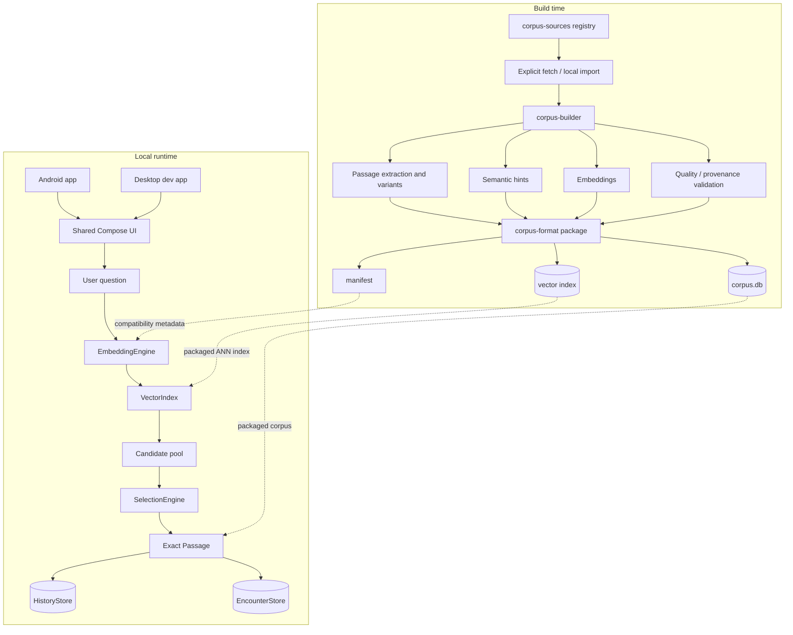

# Sibyl architecture

## Purpose

Sibyl separates expensive corpus preparation from lightweight on-device retrieval. Build-time tooling may use larger models and network adapters explicitly; runtime question processing must remain local by default.

## System context

## Component ownership

### Shared runtime and application hosts

`shared/` owns reusable runtime behavior and Compose UI. `androidApp/` is the product host; `desktopApp/` is a JVM development host for fast manual iteration. Both call the same shared UI/runtime code.

Runtime behavior includes:

- question input and shared UI;
- embedding/vector adapter contracts;
- candidate filtering and deduplication;
- controlled-random selection;
- response-length and content filters;
- history and saved encounters;
- corpus compatibility checks;
- local privacy behavior.

It does not own source ingestion, rights assessment, passage extraction, semantic-hint generation, or build-time translation generation.

### Corpus sources

Owns source/version declarations before preprocessing:

- candidate and approved concrete text-version identity;
- source provenance/acquisition locator;
- rights review metadata;
- work category (`literature`, `philosophy`, `sacred_text`);
- collection membership;
- approval state.

Candidate records may exist while review is incomplete. An enabled production record must pin a concrete source version.

### Corpus builder

Owns build-time transformation:

- explicit source loading/import;
- normalization that preserves literary content;
- passage boundary detection;
- prepared length variants;
- semantic-hint generation;
- embedding generation;
- optional build-time machine translation adapters;
- quality/deduplication checks;
- corpus database and vector-index materialization;
- staging + validation before publication.

Importing the Python package must not cause network/model side effects.

### Corpus format

Owns persisted compatibility: SQL schema, manifest schema, version, semantics, validation, and compatibility policy. Neither mobile nor builder may redefine it implicitly.

See [`CORPUS_FORMAT.md`](CORPUS_FORMAT.md).

## Runtime retrieval

Semantic relevance determines whether a candidate is plausible and influences weight, but it is not the sole decision rule. Repetition is allowed; recency may reduce probability without creating a permanent blacklist.

## Runtime data concepts

Core literary concepts:

- `Work`;
- `TextVersion`;
- `Passage`;
- `PassageText`;
- `SemanticHint`.

Core user concepts:

- `Conversation` / history;
- `SavedEncounter` preserving the user question and selected passage;
- `SelectionPreferences`.

Original/human/machine translation and short/standard/extended length are independent dimensions.

## Offline boundary

The core architecture requires no backend. Optional future networking may distribute static corpus/model packages, perform store entitlement checks, or support explicitly enabled sync. Those paths must remain separate from local question processing.

## Technology direction

Applications/runtime:

- Kotlin Multiplatform;
- Compose Multiplatform;
- Android product entry point separated from shared code;
- JVM Compose Desktop development entry point separated from shared code;
- SQLite/Room for local persistence;
- ONNX Runtime Mobile for Android query embeddings;
- desktop development adapters may use JVM-native implementations behind the same interfaces;
- USearch/HNSW for ANN retrieval.

Build time:

- Python;
- SQLite;
- optional Sentence Transformers/LLM/translation adapters;
- deterministic local adapters for default tests.

## Deferred decisions

- exact production embedding model and tokenizer packaging;
- read-only corpus database abstraction on mobile;
- production ANN serialization parameters;
- source fetcher implementation and source hashing;
- build-time translation provider/model policy;
- paid corpus package/entitlement design;
- optional static CDN distribution;
- optional device backup/sync.
