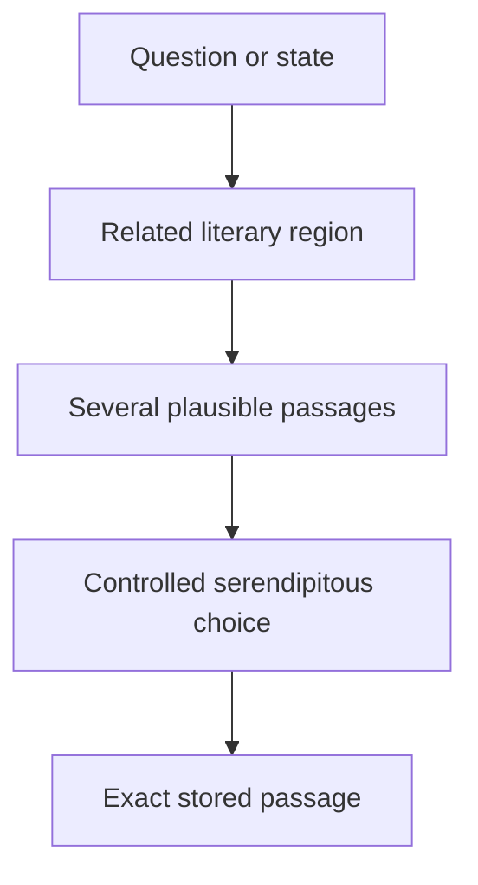
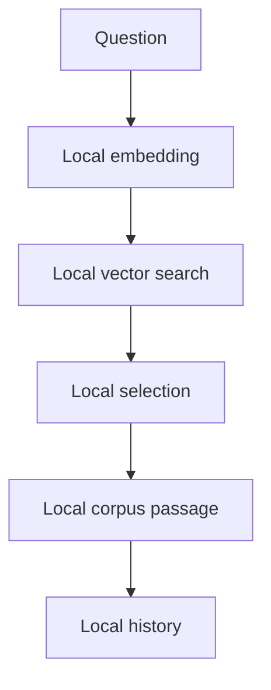

# Sibyl concept

## What Sibyl is

Sibyl is an offline-first literary discovery application. A person writes a question, describes a situation, or names an internal state. Sibyl searches a curated local literary corpus for passages that are semantically related and returns one **exact stored passage**.

The application is not intended to answer in the voice of an author. Its primary result is existing literature, not generated prose.

## The problem it addresses

Conventional search works best when the reader already knows what to search for: an author, title, phrase, or topic. Sibyl is aimed at a different situation. The reader may know only the question they are living with and may not know which work, scene, or author is relevant.

The application therefore acts more like a local literary index or librarian than a keyword search box. Semantic retrieval narrows a large corpus to a plausible region. The final choice remains deliberately non-deterministic so repeated questions can reveal different passages instead of repeatedly returning one mathematically nearest result.

## Extractive answers

The primary product invariant is simple:

> A displayed literary answer must exist verbatim in an approved stored text version.

Generated semantic hints, summaries, embeddings, classifications, and future LLM-assisted metadata may help retrieval, but they are internal metadata. They must never be presented as quotations.

This distinction is important for both product trust and corpus integrity. Sibyl may use machine learning to decide **where to look**, but not to silently rewrite what the author or translator wrote.

## Relevance and serendipity

Pure nearest-neighbor search would make the application predictable and would overstate the precision of an embedding score. Sibyl instead separates retrieval from selection:

1. local semantic search returns multiple plausible candidates;
2. weak candidates are rejected or down-weighted;
3. quality, history, diversity, filters, and length preferences may affect candidate weight;
4. `SelectionEngine` samples one eligible passage with controlled randomness.

Semantic relevance is therefore a gate and a weight, not the sole decision rule.

Repetition is allowed. Recent passages may receive a lower probability, but they are not permanently blacklisted by default. The goal is discovery, not exhaustive rotation.

## Questions, history, and saved encounters

Normal history records what the application showed. A saved encounter is more intentional: it preserves the **user question together with the selected passage**.

The question matters because the same passage can acquire a different personal meaning in a different context. Sibyl should preserve that encounter without turning the history into a psychological profile or remote analytics stream.

## Passage length

Sibyl does not arbitrarily truncate literary text to satisfy a UI size. If multiple response lengths are supported, they are prepared as explicit passage variants during corpus construction.

Runtime selection chooses among stored `short`, `standard`, or `extended` variants. It does not cut a literary passage at an arbitrary character boundary.

## Originals and translations

Text language, translation origin, and passage length are separate dimensions.

A passage may have:

- an original text;
- a human translation;
- a machine translation prepared at build time.

Machine translations must be persisted and visibly labelled as machine translations. A public-domain original does not imply that a modern human translation is also reusable.

## Sacred and philosophical texts

Sacred and philosophical works use the same retrieval pipeline as literature. They are represented as content categories and may be included or excluded by user or corpus policy.

They do not require a separate semantic engine.

## Offline-first behavior

The core question-to-passage flow is designed to stay on the device:

A backend is not required for the core product. Future networking may distribute static corpus/model packages, support explicitly enabled sync, or handle store entitlements, but it must remain separate from ordinary local question processing.

## Corpus philosophy

Sibyl treats a corpus as a set of concrete text versions, not just a list of famous titles. Provenance, language, translator, source artifact, normalization, hashes, and rights review belong to the corpus lifecycle.

Build-time tooling may perform expensive work such as source acquisition, normalization, embeddings, semantic metadata generation, or machine translation. Runtime should consume already prepared artifacts and remain comparatively small and deterministic.

## What Sibyl is not

The core product is not intended to be:

- a general-purpose chatbot;
- a generator of invented quotations;
- an imitation of a historical author or fictional character;
- a diagnosis or self-help scoring system;
- a cloud search service that requires sending private questions to a server;
- a top-1 semantic search engine disguised as literary discovery.

These non-goals protect the central experience: a private question leading to a real piece of literature that the reader may not have found by ordinary search.

## Where to read next

- [`ARCHITECTURE.md`](ARCHITECTURE.md) — stable system boundaries and data flow.
- [`IMPLEMENTATION.md`](IMPLEMENTATION.md) — how the current repository implements those boundaries.
- [`SOURCES.md`](SOURCES.md) — provenance, rights, and normalization policy.
- [`CORPUS_FORMAT.md`](CORPUS_FORMAT.md) — persisted corpus semantics.
- [`ROADMAP.md`](ROADMAP.md) — planned product and engineering work.
