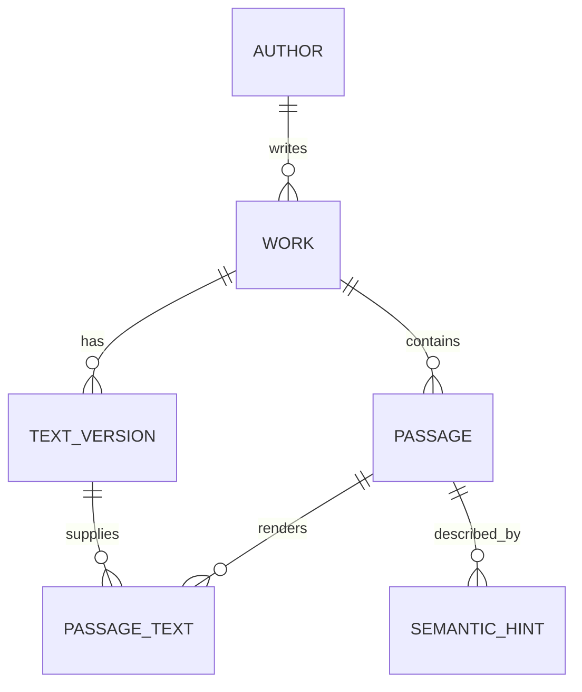

# Corpus format

## Current version

Current format: **v2**. The canonical files are:

- `corpus-format/VERSION`;
- `corpus-format/schema.sql`;
- `corpus-format/manifest.schema.json`;
- `corpus-format/tools/validate_schema.py`.

The format is the persisted compatibility boundary between build-time Python tooling and the shared application runtime.

## Data model



### Metadata

Required package metadata includes format version, primary target/display language, embedding provider/model identity, dimensions, and normalization assumptions.

### Work

A `work` is conceptual and independent from a particular edition or translation. `original_language` identifies the source tradition. `category` is `literature`, `philosophy`, or `sacred_text`.

### Text version

A `text_version` is a concrete displayable textual version:

- `original`;
- `human_translation`;
- `machine_translation`.

Translation provenance is separate from work provenance. Machine translations may record provider/model metadata and must never be presented as historical human translations.

### Passage

A `passage` identifies a stable conceptual location in a work. It is independent from display language and length.

### Passage text

`passage_text` combines:

1. one concrete `text_version`;
2. one natural length variant: `short`, `standard`, or `extended`.

Displayed text must be exactly the approved stored text for that text version. Runtime code must not create a shorter literary quotation by arbitrary character truncation.

### Semantic hint

A semantic hint is internal retrieval metadata describing situations/themes/resonance. It may be machine-generated and is the vector-index identity. Hint text is never a quotation. ANN results resolve hint IDs to passages and are deduplicated before selection.

## Vector artifact

Vectors intentionally remain outside the canonical SQLite schema. The manifest names the vector/index artifact and embedding compatibility metadata. The production direction is a USearch/HNSW index.

## Versioning

The shared runtime declares supported format versions and must reject unsupported newer versions before retrieval.

Changes that may remain compatible within v2 include optional nullable metadata or indexes old readers can safely ignore.

A new format version is required when removing/renaming required fields, changing `passage_text.text` semantics, changing hint/vector identity, or introducing required semantics old readers cannot safely interpret.

Never reuse a format version number for an incompatible schema.

## Validation

A publishable package should eventually validate:

- positive supported format version;
- required metadata;
- positive embedding dimensions;
- SQLite foreign keys;
- at least one text variant per passage;
- valid hint-to-passage references;
- vector IDs resolving to valid hints;
- manifest/database/index count agreement;
- encoder/index dimensions and normalization agreement;
- package checksums;
- production provenance/rights metadata.

Current lightweight validation focuses on schema creation and relational invariants. Run it from the repository root:

```bash
make validate-format
```
