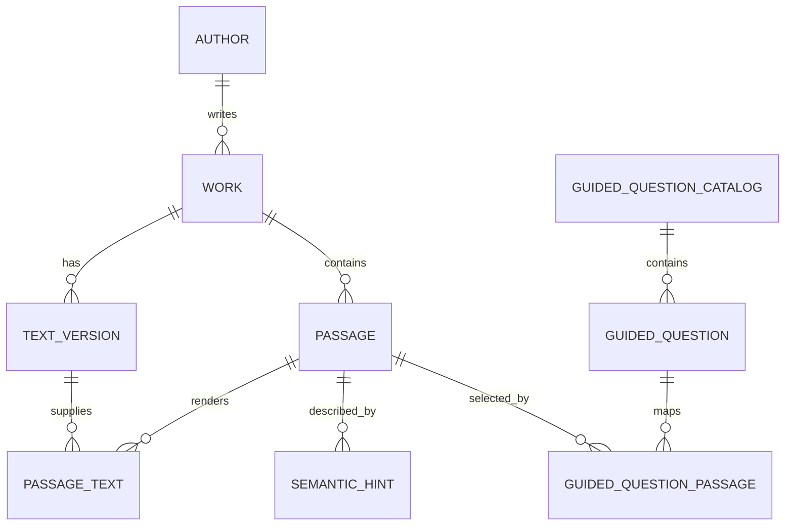

# Corpus format

## Current version

Current format: **v4**. The canonical files are:

- `corpus-format/VERSION`;
- `corpus-format/schema.sql`;
- `corpus-format/manifest.schema.json`;
- `corpus-format/tools/validate_schema.py`.

The format is the persisted compatibility boundary between build-time Python tooling and the shared application runtime.

## Data model



### Text version provenance

A `text_version` is one concrete original/human-translation/machine-translation realization associated with a work. The provenance fields introduced in v3 remain part of v4:

- `source_locator` — edition/revision/artifact locator from the source registry;
- `source_artifact_sha256` — SHA-256 of the acquired raw artifact;
- `canonical_text_sha256` — SHA-256 after the documented canonical-text normalization step.

These fields make a built corpus traceable to the exact local source artifact used during preparation. Candidate/review builds may contain incomplete rights metadata; publishable packages must not.

### Passage

A `passage` identifies a stable location in a work. The builder stores the authoritative original/source locator such as `chars:<start>:<end>` relative to the prepared canonical text. For an original/human source text version, `passage_text.text` must be the exact approved stored source realization. For a build-time machine translation, `passage_text.text` must be the exact validated generated text stored in the local translation artifact and must link to a `machine_translation` text version; runtime code must never regenerate or rewrite it.

Automatic splitter passages and curated guided passages share the same `passage` / `passage_text` representation. A curated passage may have multiple text realizations for the same `standard` variant, such as the exact English original plus a stored Russian machine translation. Translation coverage may be sparse: absence of a translated `passage_text` means no stored translation exists for that passage.

Length (`short` / `standard` / `extended`) and text role/language remain separate dimensions.

### Semantic hint

A semantic hint is internal retrieval metadata and the vector identity for free-form retrieval. The first real-text milestone may use the exact passage text itself as retrieval text (`hints.provider = "passage_text"`). Later LLM-generated semantic hints must remain internal and must never be shown as quotations.

Curated guided passages do not require semantic hints because guided lookup reaches them through `guided_question_passage`.

### Guided-question catalog and mappings

Format v4 adds runtime semantics for prepared guided questions:

- `guided_question_catalog` persists the stable catalog identity and language;
- `guided_question` persists stable ID, catalog ordinal, kind, theme, and display text;
- `guided_question_passage` maps a guided question to an exact stored passage with `strength` in `[0.0, 1.0]`.

The `(question_id, passage_id)` primary key rejects duplicate mappings. Foreign keys prevent dangling questions/passages. Catalog ordinal makes runtime question ordering deterministic rather than relying on SQLite row order.

`strength` is curated relevance. Runtime maps it to the existing candidate relevance weight, but final answer selection remains controlled-random rather than top-1.

## Vector artifact

Vectors remain outside SQLite. `manifest.json` records provider/model identity, dimensions, normalization assumptions, and optional passage/query prefixes. The current builder writes `vectors.json`; the production direction is an ANN artifact behind the same hint IDs.

## Manifest diagnostics

V4 manifests retain the existing artifact/embedding contract and add:

- `counts.guided_questions` — number of persisted catalog questions;
- `counts.guided_mappings` — number of persisted question/passage relationships;
- `counts.machine_translations` — optional diagnostic count of translated passage-text rows.

Desktop v3 compatibility treats these fields as zero when absent.

## Versioning and runtime compatibility

The runtime must reject unsupported newer format versions before retrieval. Never reuse a format number after an incompatible schema/semantic change.

- v3 introduced exact source-artifact/canonical hashes in text-version provenance;
- v4 adds guided-question catalog/mapping semantics while retaining the existing free-form embedding path.

New builder output is v4. During the current Desktop migration, format v3 remains readable for free-form retrieval only; guided mode is unavailable for v3 rather than inferred from sidecar files.

## Validation

From the repository root:

```bash
make validate-format
```

Validation covers schema creation, manifest/version consistency, guided foreign keys/uniqueness/strength bounds, and required relational structure. Builder validation additionally checks persisted corpus metadata and non-empty free-form retrieval content before atomic publication.

## Runtime embedding compatibility

For asymmetric embedding models, `embedding.passage_prefix` and `embedding.query_prefix` belong to the persisted manifest assumptions. Runtime adapters must reject incompatible model IDs, dimensions, normalization, or query prefixes.
