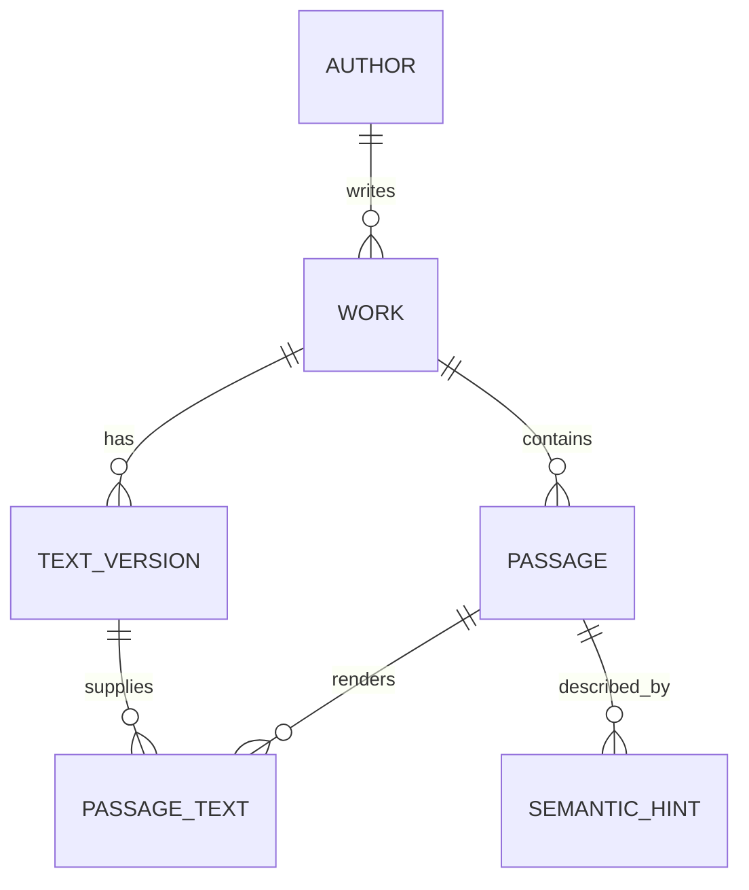

# Corpus format

## Current version

Current format: **v3**. The canonical files are:

- `corpus-format/VERSION`;
- `corpus-format/schema.sql`;
- `corpus-format/manifest.schema.json`;
- `corpus-format/tools/validate_schema.py`.

The format is the persisted compatibility boundary between build-time Python tooling and the shared application runtime.

## Data model



### Text version provenance

A `text_version` is one concrete original/human-translation/machine-translation text. Format v3 adds explicit preparation provenance:

- `source_locator` — edition/revision/artifact locator from the source registry;
- `source_artifact_sha256` — SHA-256 of the acquired raw artifact;
- `canonical_text_sha256` — SHA-256 after the documented canonical-text normalization step.

These fields make a built corpus traceable to the exact local source artifact used during preparation. Candidate/review builds may contain incomplete rights metadata; publishable packages must not.

### Passage

A `passage` identifies a stable location in a work. The builder stores a source locator such as `chars:<start>:<end>` relative to the canonical text. `passage_text.text` must be exactly that canonical-text slice; runtime code must not invent or arbitrarily truncate literary wording.

Length (`short` / `standard` / `extended`) and text role/language remain separate dimensions. The current preparation milestone writes `standard`; explicit prepared length variants remain a later corpus-quality step.

### Semantic hint

A semantic hint is internal retrieval metadata and the vector identity. The first real-text milestone may use the exact passage text itself as retrieval text (`hints.provider = "passage_text"`). Later LLM-generated semantic hints must remain internal and must never be shown as quotations.

## Vector artifact

Vectors remain outside SQLite. `manifest.json` records provider/model identity, dimensions, normalization assumptions, and optional passage prefix. The current builder writes `vectors.json`; the production direction is an ANN artifact behind the same hint IDs.

## Versioning

The runtime must reject unsupported newer format versions before retrieval. Never reuse a format number after an incompatible schema/semantic change.

Format v3 supersedes v2 because exact source-artifact/canonical hashes are now persisted as part of text-version provenance.

## Validation

From the repository root:

```bash
make validate-format
```

Validation covers schema creation, manifest/version consistency, SQLite foreign keys, and required relational structure. Production validation will later add index/package checksums and model/index compatibility checks.
