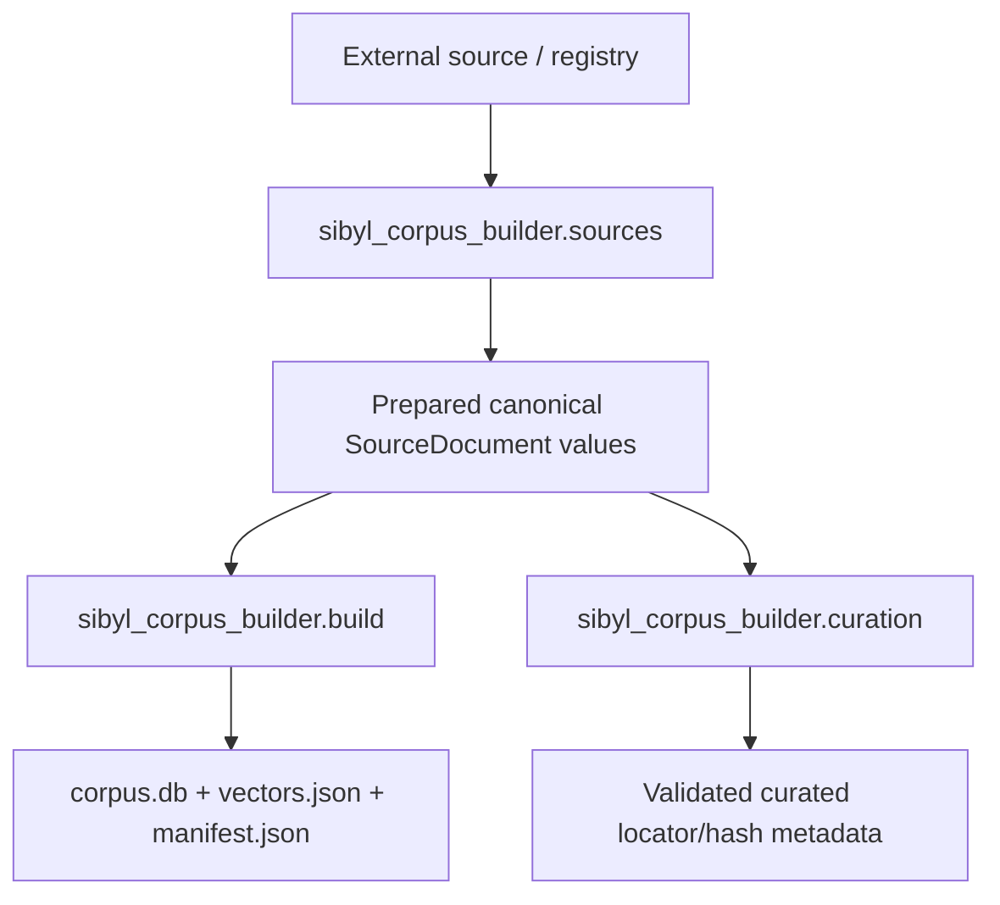
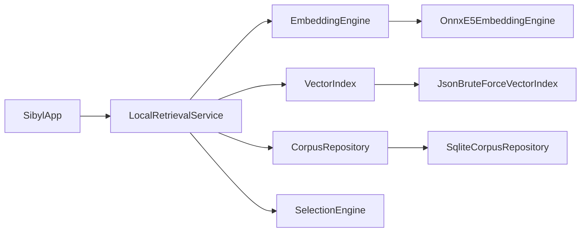

# Sibyl implementation guide

## Purpose

This document maps Sibyl's stable architecture to the **current repository implementation**. It identifies the active cross-project call paths and concrete technology choices without duplicating subproject internals.

- [`CONCEPT.md`](CONCEPT.md) owns product intent and behavior.
- [`ARCHITECTURE.md`](ARCHITECTURE.md) owns stable boundaries and responsibilities.
- This document owns the current cross-project realization.
- Subproject `IMPLEMENTATION.md` files own detailed classes, modules, and local call paths.

## Repository implementation map

| Area | Current responsibility | Detailed implementation |
|---|---|---|
| `mobile/` | Shared Kotlin runtime/UI plus Android and JVM Desktop hosts | [`../mobile/IMPLEMENTATION.md`](../mobile/IMPLEMENTATION.md) |
| `corpus-core/` | Feature-neutral canonical-source contracts, hashes, locators, atomic publication | [`../corpus-core/IMPLEMENTATION.md`](../corpus-core/IMPLEMENTATION.md) |
| `corpus-builder/` | Source ingestion, automatic corpus build, and large-LLM curation tooling | [`../corpus-builder/IMPLEMENTATION.md`](../corpus-builder/IMPLEMENTATION.md) |
| `corpus-format/` | Versioned SQLite/manifest persistence contract | [`../corpus-format/IMPLEMENTATION.md`](../corpus-format/IMPLEMENTATION.md) |
| `corpus-sources/` | Source/provenance/rights registry | [`../corpus-sources/IMPLEMENTATION.md`](../corpus-sources/IMPLEMENTATION.md) |
| `corpus-curation/` | Stable guided-question catalog and Git-safe curation metadata | [`../corpus-curation/README.md`](../corpus-curation/README.md) |
| `test-corpus/` | Synthetic deterministic build fixtures | [`../test-corpus/IMPLEMENTATION.md`](../test-corpus/IMPLEMENTATION.md) |

## Build-time wiring



`sibyl_corpus_builder.cli` is only the command composition root. `sources` owns discovery, acquisition, normalization, and prepared-source publication. `build` owns mechanical passage extraction, retrieval text, embeddings, runtime-artifact writing, validation, and publication. `curation` exports canonical texts plus the stable guided-question catalog and validates external LLM locator/hash proposals locally.

The shared `sibyl_corpus_core` package owns only feature-neutral prepared-source contracts and deterministic primitives. It does not own source adapters, embeddings, curation proposal semantics, or persisted runtime corpus format.

The current automatic real-text build uses `intfloat/multilingual-e5-small`. Exact passage text is indexed as retrieval text for the first real-corpus milestone; completed embeddings are cached beside prepared sources so interrupted builds can resume. LLM curation is independent of the automatic splitter: the external model chooses literary relevance and natural ranges, while local Python remains authoritative for exact canonical text, locators, and hashes.

## Runtime wiring



Shared Kotlin owns retrieval contracts, candidate resolution, selection, and UI-facing behavior. The current Desktop development host supplies JVM implementations for local ONNX query embedding, brute-force cosine search over `vectors.json`, and read-only SQLite passage lookup.

`LocalRetrievalService` retrieves a broader semantic pool, resolves hint matches to stored passages, deduplicates by passage ID while keeping the strongest score, and delegates final controlled-random choice to `SelectionEngine`. The displayed literary text is always resolved from stored corpus data.

The guided-question curation metadata is **not yet wired into Desktop or Android runtime**. Current real runtime retrieval still consumes the automatic corpus artifacts.

## Runtime artifacts and compatibility

A development corpus publishes:

```text
corpus.db
vectors.json
manifest.json
```

The Desktop embedding bundle is separate and contains the ONNX model, tokenizer data, and `model-manifest.json`. Corpus and model manifests are compared before retrieval so format version, model identity, vector dimensions, normalization, E5 query-prefix, and pooling assumptions cannot drift silently.

Generated corpus/model data remains under ignored `corpus-builder/data/` paths and is not committed or included in shareable archives.

## Current technology choices

| Scope | Current implementation |
|---|---|
| Shared application | Kotlin Multiplatform, Compose Multiplatform, coroutines |
| Desktop local inference | ONNX Runtime JVM + DJL Hugging Face Tokenizers |
| Desktop corpus access | Xerial SQLite JDBC + JSON vector loading |
| Current vector search | Exhaustive cosine search behind `VectorIndex` |
| Build-time ML | Sentence Transformers/PyTorch/NumPy in the optional `ml` extra |
| Core build tooling | Python standard library plus `corpus-core` contracts |

Host-specific setup and native-library workarounds belong in [`INSTALLATION.md`](INSTALLATION.md), not in this implementation overview.

## Temporary implementations versus stable boundaries

Several current choices are intentionally replaceable:

- `JsonBruteForceVectorIndex` is suitable for small development corpora and can later be replaced by ANN behind `VectorIndex`.
- Desktop uses SQLite JDBC directly; Android can provide a platform storage adapter behind shared contracts.
- Android still uses `DemoRetrievalService`; real Android embedding/index/storage adapters are not wired yet.
- richer generated semantic hints remain an optional build-time enhancement rather than a runtime requirement.

These are implementation choices, not architectural changes.

## Documentation maintenance

Update the document that owns the changed fact:

- product intent → `CONCEPT.md`;
- stable boundary/contract → `ARCHITECTURE.md`;
- cross-project current wiring → this file;
- detailed module/class wiring → the relevant subproject `IMPLEMENTATION.md`;
- operational sequence → `WORKFLOW.md`;
- command syntax/options → `USAGE.md`;
- setup/toolchain details → `INSTALLATION.md`.
