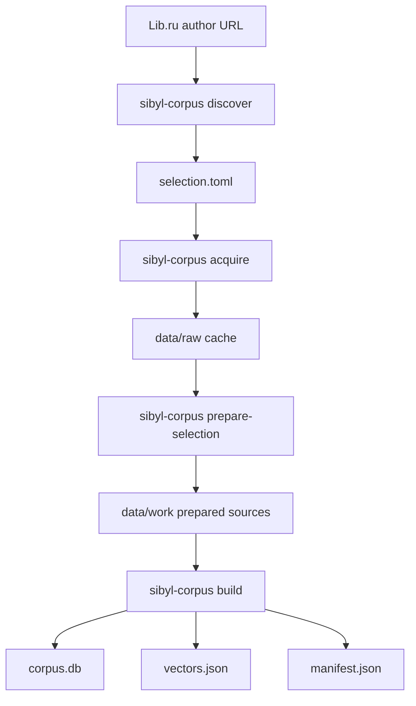
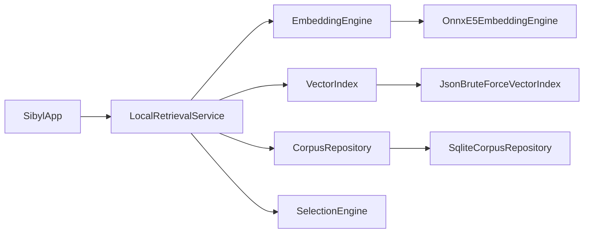

# Sibyl implementation guide

## Purpose

This document maps Sibyl's architecture to the **current codebase**. It answers questions such as which module owns a step, which concrete implementation is active today, and how calls cross project boundaries.

It intentionally does not redefine the product concept or architectural rules:

- [`CONCEPT.md`](CONCEPT.md) explains what Sibyl is and why it behaves this way;
- [`ARCHITECTURE.md`](ARCHITECTURE.md) defines stable boundaries and data flow;
- this document describes the concrete implementation currently checked into the repository.

Concrete class names, libraries, development adapters, and temporary implementation choices belong here and in the subproject implementation guides.

## Repository implementation map

| Area | Current responsibility | Detailed implementation |
|---|---|---|
| `mobile/` | Shared Kotlin runtime/UI plus Android and JVM Desktop hosts | [`../mobile/IMPLEMENTATION.md`](../mobile/IMPLEMENTATION.md) |
| `corpus-builder/` | Python source preparation, passage extraction, embeddings, publication | [`../corpus-builder/IMPLEMENTATION.md`](../corpus-builder/IMPLEMENTATION.md) |
| `corpus-format/` | Versioned SQLite/manifest persistence contract | [`../corpus-format/IMPLEMENTATION.md`](../corpus-format/IMPLEMENTATION.md) |
| `corpus-sources/` | Permanent source/provenance/rights registry | [`../corpus-sources/IMPLEMENTATION.md`](../corpus-sources/IMPLEMENTATION.md) |
| `test-corpus/` | Small synthetic input for deterministic end-to-end checks | [`../test-corpus/IMPLEMENTATION.md`](../test-corpus/IMPLEMENTATION.md) |

## End-to-end implementation

The current real-text development path has two phases.

### Build time



The command entry point is `sibyl_corpus_builder.cli:main`. The main build orchestration is `builder.build_corpus()`. Exact passage extraction is implemented by `splitter.split_document()`. Build-time embeddings use an `EmbeddingProvider`; the real-text configuration selects `SentenceTransformerEmbeddingProvider` with `intfloat/multilingual-e5-small`.

Completed embeddings are cached under the prepared source directory by `EmbeddingCache`, so an interrupted build can resume without recomputing successful batches. Publication uses a staging directory and replaces the requested output only after validation succeeds.

### Runtime



`shared` owns the interfaces and orchestration. The Desktop development host supplies JVM-specific implementations:

- `OnnxE5EmbeddingEngine` — local query tokenization and ONNX inference;
- `JsonBruteForceVectorIndex` — exhaustive cosine search over `vectors.json`;
- `SqliteCorpusRepository` — read-only resolution of hint IDs to exact `passage_text` rows;
- `DesktopRuntime` — manifest compatibility checks and resource wiring.

`LocalRetrievalService` deliberately retrieves a wider hint pool than the requested passage limit, resolves hints to passages, deduplicates by passage ID, and retains the strongest semantic score for each passage. `SelectionEngine` then applies the semantic threshold and independent weights before controlled-random sampling.

## Current runtime artifacts

A published development corpus contains:

```text
corpus.db
vectors.json
manifest.json
```

The Desktop query embedding bundle is downloaded separately and contains an ONNX model, `tokenizer.json`, and `model-manifest.json`. Generated corpus/model data lives under `corpus-builder/data/` and is intentionally excluded from Git and shareable archives.

The corpus and model manifests are compared before retrieval so model ID, dimensions, normalization, E5 query prefix, pooling assumptions, and corpus format cannot drift silently.

## Current major libraries

### Kotlin runtime

- Kotlin Multiplatform — shared domain/retrieval/selection/UI source sets;
- Compose Multiplatform — shared Compose UI and JVM Desktop harness;
- kotlinx.coroutines — asynchronous retrieval from Compose;
- kotlinx.serialization JSON — Desktop manifest/vector parsing;
- ONNX Runtime JVM — local E5 model inference in Desktop;
- DJL Hugging Face Tokenizers — local `tokenizer.json` execution;
- Xerial SQLite JDBC — read-only Desktop access to `corpus.db`.

The Desktop harness currently pins an ONNX Runtime version compatible with the Intel macOS development machine. DJL's tokenizer native library may require a locally built x86_64 macOS library exposed through `RUST_LIBRARY_PATH`; this is a development-host limitation, not a runtime architecture requirement.

### Python build time

The builder intentionally uses the Python standard library for most core stages (`sqlite3`, `urllib`, `html.parser`, `xml.etree.ElementTree`, `hashlib`, `tomllib`). Optional ML dependencies are isolated in the `ml` extra:

- NumPy;
- PyTorch;
- Sentence Transformers.

Default tests do not download models or use the network.

## Current development implementations versus intended scale

Some implementations exist specifically to validate the product loop before optimization:

- `JsonBruteForceVectorIndex` performs exhaustive search and is appropriate for the current small Desktop corpus; an ANN implementation can replace it behind `VectorIndex` later.
- Desktop uses SQLite JDBC directly; Android will use its own storage adapter behind shared contracts.
- real-text builds currently index exact passage text as the semantic hint; richer generated retrieval metadata remains a build-time extension.
- Android still uses `DemoRetrievalService`; real Android ONNX/index/storage adapters are not yet wired.

These are implementation choices, not changes to the architecture.

## Documentation maintenance rule

Use this rule when the repository changes:

- product meaning or user promise changed → update `CONCEPT.md`;
- system boundary, responsibility, or stable contract changed → update `ARCHITECTURE.md`;
- concrete class, library, file, command wiring, or active adapter changed → update the relevant `IMPLEMENTATION.md`;
- setup or operational command changed → update the owning installation/usage document and link to it rather than duplicating instructions.
