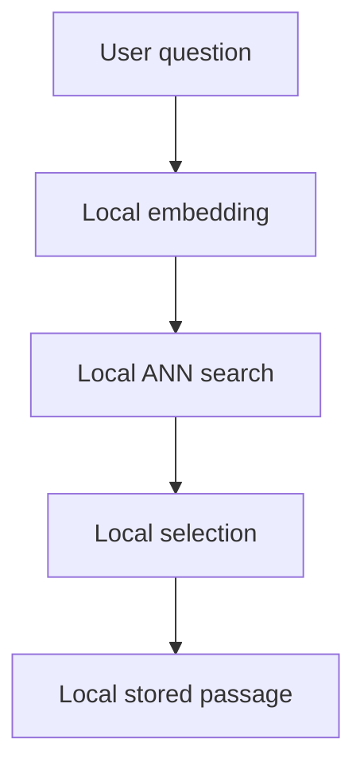

# Security and privacy

Sibyl is local-first. The core literary retrieval workflow must not require transmission of user questions, history, or saved encounters to a server.

## Runtime privacy boundary

Optional future network capabilities may distribute static corpus/model packages, verify purchases, or provide explicitly enabled sync. They must remain separate from question processing and documented before release.

## Sensitive local data

Questions and saved encounters may contain highly personal content. Production persistence should:

- use application-private storage;
- avoid production logs containing question/encounter text;
- provide explicit deletion controls;
- document platform backup behavior;
- evaluate encryption-at-rest for user-created data based on the platform threat model.

## Content integrity

Generated semantic hints are internal retrieval metadata. They must never be displayed as quotations. Displayed literary passages must resolve to stored text plus provenance metadata.

Machine translations must remain explicitly labelled in persisted metadata and UI.

## External build-time services

Optional LLM/translation APIs belong to corpus preparation, not core mobile runtime. API keys must stay out of committed configuration and mobile application source.

Large-LLM curation may intentionally export full canonical source texts into an ignored local bundle. Sending that bundle to an external model/service is a separate rights and confidentiality decision: do not upload restricted, private, or insufficiently reviewed text versions merely because local preparation succeeded. The curation exporter requires approved rights metadata by default and any override must be deliberate. User questions/history are never part of this build-time bundle.
