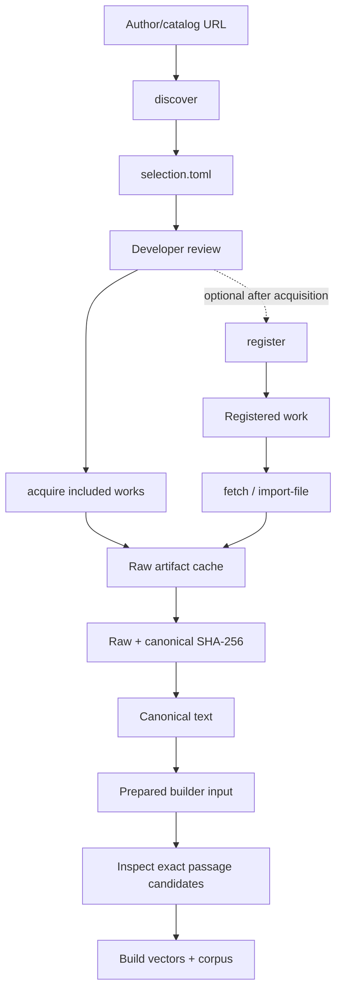

# Corpus sources

## Purpose

`corpus-sources/` is Sibyl's reviewed registry of literary candidates and concrete text versions. It stores metadata only; downloaded books, scans, model files, generated translations, discovery manifests, and built corpus artifacts stay outside Git.

A readable web page or public-domain author is not enough to approve a source. Approval belongs to a **concrete text version/artifact**, including translation and digital-edition provenance.

## Two source workflows

Sibyl supports two developer workflows:

1. **catalog discovery** — start from an author/catalog URL, review a generated selection, then acquire the included works;
2. **registered single source** — start from an existing `corpus-sources/works/*.toml` record and explicitly fetch/import it.

Both converge on the same raw/canonical artifact cache and prepared corpus input.



Network access occurs only through explicit CLI commands. Importing the builder package never discovers or downloads sources.

## Lib.ru author-page discovery

The first catalog adapter supports Lib.ru/Классика author pages such as:

```text
http://az.lib.ru/d/dostoewskij_f_m
```

From `corpus-builder/`:

```bash
sibyl-corpus discover \
  --url "http://az.lib.ru/d/dostoewskij_f_m" \
  --output data/work/dostoevsky-selection.toml
```

The generated TOML is a **developer review artifact**, not part of the permanent registry. Discovery performs no acquisition and grants no approval.

Each entry has one explicit decision:

- `include` — later batch commands process the work;
- `exclude` — later batch commands ignore it;
- `review` — the developer must decide before processing.

The Lib.ru adapter is deliberately conservative:

- correspondence/epistolary entries are automatically `exclude`;
- normal prose/poetry/drama categories are normally `include`;
- manuscripts, notes, criticism, journalism, memoirs, translations, diaries, and uncertain categories are `review`;
- links to work pages outside the supplied author's directory are ignored.

Developers may edit decisions, delete candidates, or set `registry_work_id` before continuing. Only `decision = "include"` is acquired.

## Lib.ru acquisition and source fallback

After review:

```bash
sibyl-corpus acquire \
  --selection data/work/dostoevsky-selection.toml \
  --cache data/raw
```

The default report is written next to the selection as `<selection-stem>-acquire-report.toml`. Batch failures are isolated per work; successful cache entries remain available for retry/preparation.

For each included work, the adapter:

1. opens the selected Lib.ru work page once;
2. tries an exposed or derivable TXT artifact first;
3. falls back to the already downloaded work-page HTML and extracts the literary body;
4. tries FB2/FB2 ZIP only if earlier candidates cannot be normalized safely;
5. stores the first usable raw artifact plus canonical literary text and raw/canonical SHA-256 values.

The fallback is lazy: FB2 is not downloaded when TXT or HTML has already succeeded. A malformed candidate does not invalidate other successfully acquired works. Normalizer IDs are `libru_txt_v1`, `libru_html_v1`, and `libru_fb2_v1`; any future change that can alter canonical text requires a new normalizer version and focused tests.

Lib.ru's own format documentation describes TXT files as the internal text storage and HTML as CGI-generated rendering. Sibyl therefore prefers TXT when available. The work-page HTML is a deliberate, source-specific fallback with a versioned literary-body extractor; FB2 remains a final fallback because some generated FB2 artifacts are malformed.

## Permanent registration

A discovery selection can be used locally without creating dozens of source records immediately. Once the concrete artifacts are acquired and reviewed, optionally persist the included works:

```bash
sibyl-corpus register \
  --selection data/work/dostoevsky-selection.toml \
  --cache data/raw \
  --registry ../corpus-sources \
  --collection dostoevsky-libru
```

Registration:

- creates disabled `candidate` work records;
- stores the resolved artifact URI and raw/canonical hashes;
- leaves `rights_status = "review_required"`;
- creates one source collection;
- never overwrites an existing work record;
- never sets `enabled = true` or `approved` automatically.

If the work already exists in `corpus-sources`, merge the new Lib.ru text version into that record manually instead of creating a duplicate conceptual work. `registry_work_id` in the selection lets a developer choose the permanent ID before registration.

## Project Gutenberg

For already registered Project Gutenberg sources, the automatic adapter opens the registered eBook page, discovers its plain-text download, stores the raw artifact, strips only the Project Gutenberg wrapper, normalizes line endings, and records raw/canonical hashes.

```bash
sibyl-corpus fetch \
  --registry ../corpus-sources \
  --work melville-moby-dick \
  --cache data/raw \
  --allow-unapproved
```

`--allow-unapproved` is a local-development/review override. Output built from such a source must not be published.

## Russian Wikisource and other sources

There is intentionally no generic HTML/wikitext-to-literature parser yet. For now, choose/export a concrete UTF-8 artifact manually and import it explicitly:

```bash
sibyl-corpus import-file \
  --registry ../corpus-sources \
  --work chekhov-lady-with-the-dog \
  --file /path/to/reviewed-source.txt \
  --cache data/raw \
  --allow-unapproved
```

This conservative path is preferable to silently rewriting literary text with an immature scraper.

## Pinning a source

After acquisition/review, a text-version record may pin:

- `download_uri` when a stable direct artifact URI exists;
- `artifact_sha256` for the raw artifact;
- `canonical_sha256` for canonical UTF-8 text;
- a concrete `source_locator` identifying edition/revision/artifact.

An `enabled = true` work must be approved and requires both hashes. The registry validator rejects enabled versions without pinned checksums.

## Canonical normalization

Allowed normalization is source-specific and deliberately narrow.

For plain UTF-8 sources:

- normalize CRLF/CR to LF;
- remove blank wrapper-edge lines.

For Project Gutenberg:

- apply the plain-text normalization above;
- remove only the repository wrapper outside its START/END markers.

For Lib.ru TXT/HTML/FB2:

- TXT: decode the supported Lib.ru Cyrillic encodings and preserve the text after source-wrapper/title boundary handling;
- HTML: ignore page chrome/forms, locate the reviewed work-title boundary, preserve block order, and remove known trailing navigation;
- FB2: extract text from the primary FB2 body, preserve block order, normalize XML-only whitespace, and exclude separate notes/comments bodies;
- all three paths use distinct versioned normalizer IDs and record the chosen artifact kind in cache metadata.

Do not modernize spelling, fix punctuation, replace quotation marks, rewrite wording, or silently correct source text.

## Local generated data

The intended local directories are:

- `corpus-builder/data/raw/` — acquired raw + canonical source artifacts and checksum metadata;
- `corpus-builder/data/work/` — discovery selections, deterministic prepared builder input, and review reports;
- `corpus-builder/data/curation/` — temporary external-LLM curation bundles containing canonical text;
- `corpus-builder/data/output/` — built corpus artifacts.

All are ignored by Git and excluded from shareable archives.

## Rights rule

A public-domain author/work does not automatically approve a particular electronic edition, editorial apparatus, translation, or source-site reuse terms. Lib.ru itself notes that texts were collected from various open Internet sources/readers and that rights holders can object to some hosted works. Sibyl therefore keeps discovered/acquired Lib.ru versions at `review_required` until the concrete artifact is reviewed for intended distribution.

Rights/status in this engineering registry are not legal advice; ambiguous commercial-distribution cases require appropriate review.

Large-LLM curation is an additional external-use decision. A source that is acceptable for local review is not automatically approved to be uploaded to an external model/service. `export-curation-bundle` therefore requires `rights_status = "approved"` by default; the explicit `--allow-unapproved` override should be used only after separately confirming that the concrete text may be sent to that service.

Useful source-site references:

- Lib.ru storage/rendering format: <https://lib.ru/WEBMASTER/libformat.txt>
- Lib.ru copyright/permissions notes: <https://lib.ru/COPYRIGHT/>
