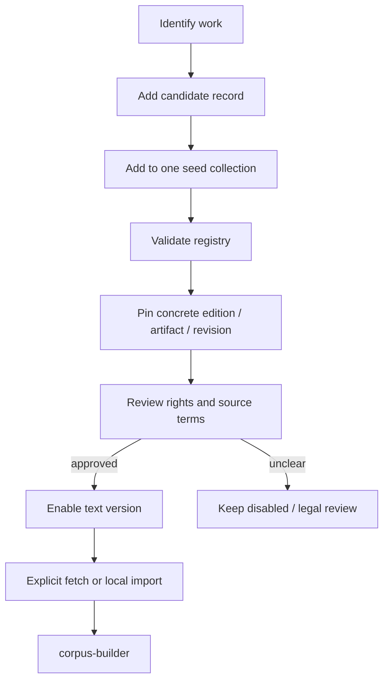

# Corpus sources

## Purpose

`corpus-sources/` is Sibyl's reviewed registry of literary text candidates and approved concrete text versions. It stores metadata only; downloaded books, scans, generated translations, and production indexes stay outside Git.

A readable website is not sufficient evidence that Sibyl may redistribute a specific digital text. Production approval is attached to a **concrete text version**, not merely an author or title.

## Current seed registry

The repository contains 40 disabled candidates across three collections:

- `russian-classics` — 24 Russian works in Russian, currently linked to candidate Russian Wikisource work pages;
- `foreign-classics-ru` — 12 English-language Project Gutenberg originals intended for Russian display through an approved human translation or explicitly labelled build-time machine translation;
- `sacred-and-philosophy` — 4 optional philosophy/sacred-text candidates.

Run from the repository root:

```bash
make validate-sources
```

The seed set is for engineering and review planning. Candidate records use `review_status = "candidate"`, `rights_status = "review_required"`, and `enabled = false`.

## Registry workflow



## Adding a work

Create `corpus-sources/works/<work-id>.toml`. Required registry concepts include:

- stable work ID;
- author/traditional attribution;
- title;
- category: `literature`, `philosophy`, or `sacred_text`;
- original language;
- Russian display policy;
- at least one source text version;
- source family/name/URI;
- text role: `original`, `human_translation`, or `machine_translation`;
- provenance;
- rights status and review jurisdiction.

Add the work ID to at least one collection under `corpus-sources/collections/`, then run `make validate-sources` from the repository root. Collections may overlap later (for example, a work may belong to both a period pack and a thematic pack).

## Candidate vs approved source

A candidate may point to a discovery/landing page while edition and rights review are pending. A production-enabled record must pin the concrete source used by the build: edition/revision/download artifact and preferably an integrity hash once download tooling exists.

Do not set `enabled = true` until:

- the exact text version is known;
- the original work's status is reviewed for intended distribution jurisdictions;
- a human translation is reviewed separately from the original;
- digital-edition/source terms are reviewed when relevant;
- provenance is sufficient to reproduce the source;
- all enabled text versions have `rights_status = "approved"`.

This engineering registry is not legal advice; ambiguous commercial-distribution cases need legal review.

## Initial source families

### Russian Wikisource

Use as a discovery/source family for Russian public-domain literature, but pin the concrete edition/revision before approval. Do not assume that every modern editorial layer or external source referenced by a page has the same rights status as the underlying literary work.

### Project Gutenberg

Use for reviewed foreign-language source versions. Preserve the eBook identifier and later pin the downloaded artifact/hash. Project Gutenberg's own jurisdiction/source terms must be considered separately from the age of the original work.

### Scans and other repositories

Use a scan or library source when a particular textual witness must be fixed. Record enough provenance to reproduce extraction without silently substituting another edition.

## Translation policy

Keep these dimensions separate:

- original source text;
- identified human translation;
- labelled machine translation;
- short/standard/extended passage length.

A public-domain original does not imply a modern translation is public domain.

For a foreign work without an approved reusable Russian translation, Sibyl may later generate a Russian machine translation **at corpus build time**, not during the core mobile query flow. Persist provider/model metadata and show the translation as machine-generated in the UI. The original source remains the provenance anchor.

## Sacred texts

Sacred texts use the same corpus/retrieval pipeline as literature and philosophy. `sacred_text` is a category/filter so users can include or exclude those sources. Distinguish translation/textual traditions when that distinction matters to provenance or user expectations.

## Text normalization

Allowed normalization is narrow and reproducible, for example:

- line-ending normalization;
- removal of clearly identified repository wrappers/headers that are not part of the work;
- structural extraction of explicit chapters/paragraphs.

Do not silently modernize spelling, rewrite punctuation, paraphrase, or improve a translation. Editorially changed text must become a separate identified text version.
