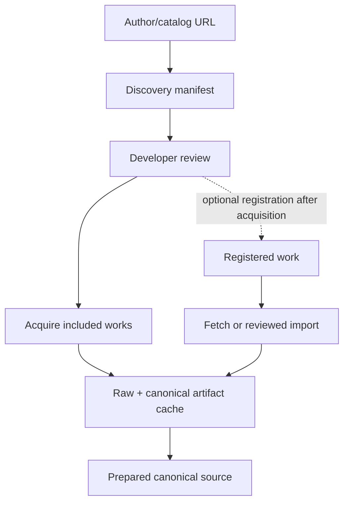

# Corpus sources

## Purpose

`corpus-sources/` is Sibyl's reviewed registry of literary candidates and concrete text versions. It stores metadata only; downloaded books, scans, model files, generated translations, discovery manifests, and built corpus artifacts stay outside Git.

A readable web page or public-domain author is not enough to approve a source. Approval belongs to a **concrete text version/artifact**, including translation and digital-edition provenance.

This document owns source/provenance/rights/normalization policy. [`WORKFLOW.md`](WORKFLOW.md) owns the end-to-end preparation sequence and [`USAGE.md`](USAGE.md) owns command syntax/options.

## Source workflows

Sibyl supports two source-ingestion entry points:

1. **catalog discovery** — start from a supported author/catalog URL, review a generated selection, then acquire the included works;
2. **registered source** — start from an existing `corpus-sources/works/*.toml` record and explicitly fetch or import its concrete artifact.

Both converge on the same raw/canonical cache and prepared-source contract.

Network access occurs only through explicit source commands. Importing corpus-builder never discovers or downloads sources.

## Lib.ru author-page discovery

The current catalog adapter supports Lib.ru/Классика author pages. `sibyl-corpus discover` creates a **developer review artifact**, not permanent registry state, and performs no acquisition or approval.

Each discovered work has one explicit decision:

- `include` — later batch acquisition processes the work;
- `exclude` — later batch acquisition ignores it;
- `review` — a developer must decide before processing.

The classifier is deliberately conservative:

- correspondence/epistolary entries are automatically `exclude`;
- ordinary prose/poetry/drama categories are normally `include`;
- manuscripts, notes, criticism, journalism, memoirs, translations, diaries, and uncertain categories are `review`;
- work links outside the supplied author's directory are ignored.

Developers may edit decisions, delete candidates, or assign `registry_work_id` before continuing. Only explicit `include` entries are acquired.

## Lib.ru acquisition and fallback

For every included work, acquisition:

1. opens the selected work page;
2. tries an exposed or derivable TXT artifact first;
3. falls back to the already downloaded work-page HTML and extracts the literary body;
4. tries FB2/FB2 ZIP only if earlier candidates cannot be normalized safely;
5. stores the first usable raw artifact plus canonical literary text and raw/canonical SHA-256 values.

The fallback is lazy: FB2 is not downloaded after TXT or HTML succeeds. Failures are isolated per work so successful cache entries remain reusable.

Normalizer IDs are `libru_txt_v1`, `libru_html_v1`, and `libru_fb2_v1`. Any change that can alter canonical text requires a new normalizer version and focused tests because downstream hashes and exact character locators depend on the canonical bytes.

Lib.ru's format documentation describes TXT as internal text storage and HTML as generated rendering. Sibyl therefore prefers TXT when available; the versioned HTML literary-body extractor is a deliberate fallback, and FB2 remains final because some generated FB2 artifacts are malformed.

## Permanent registration

Catalog discovery can be used locally without immediately creating many permanent records. After acquisition and review, `sibyl-corpus register` may persist included items as candidate source metadata.

Registration:

- creates disabled `candidate` work records;
- stores the resolved artifact URI and raw/canonical hashes;
- leaves rights review incomplete;
- creates a source collection;
- never overwrites an existing work;
- never approves or enables a record automatically.

If a conceptual work already exists in `corpus-sources/`, merge the additional concrete text version into that record instead of duplicating the work. `registry_work_id` allows a selection to pin the intended permanent work ID before registration.

## Project Gutenberg

For registered Project Gutenberg versions, the automatic adapter locates the preferred plain-text artifact, stores the raw file, removes only the recognized Gutenberg transport wrapper, normalizes line endings, and records raw/canonical hashes.

`--allow-unapproved` may be used explicitly for local review/preparation. Output based on such a source is not publishable.

## Russian Wikisource and other sources

There is intentionally no generic HTML/wikitext-to-literature parser. For unsupported source families, choose/export a concrete artifact manually, review it, and use `sibyl-corpus import-file` to enter the normal source cache.

This conservative path is preferable to silently rewriting literary text with an immature scraper.

## Pinning a source

A concrete text-version record may pin:

- `download_uri` when a stable direct artifact URI exists;
- `artifact_sha256` for the raw artifact;
- `canonical_sha256` for canonical UTF-8 text;
- a concrete `source_locator` identifying edition/revision/artifact.

An `enabled = true` work must be approved and requires the pinned hashes enforced by the registry validator.

## Canonical normalization

Allowed normalization is source-specific and deliberately narrow.

For plain UTF-8 sources:

- normalize CRLF/CR to LF;
- remove blank wrapper-edge lines.

For Project Gutenberg:

- apply the plain-text normalization above;
- remove only the repository wrapper outside recognized START/END markers.

For Lib.ru TXT/HTML/FB2:

- TXT: decode supported Lib.ru Cyrillic encodings and preserve literary text after source-wrapper/title boundary handling;
- HTML: ignore page chrome/forms, locate the reviewed work-title boundary, preserve block order, and remove known trailing navigation;
- FB2: extract text from the primary body, preserve block order, normalize XML-only whitespace, and exclude separate notes/comments bodies;
- each path records its artifact kind and distinct versioned normalizer ID.

Do not modernize spelling, fix punctuation, replace quotation marks, rewrite wording, or silently correct source text.

## Local generated data

Generated source/build state stays under `corpus-builder/data/`, including:

- `data/raw/` — acquired raw/canonical artifacts and checksum metadata;
- `data/work/` — discovery selections, acquisition reports, prepared canonical sources, and embedding caches;
- `data/curation/` — temporary curation bundles containing full canonical texts;
- `data/output/` — built runtime corpus artifacts;
- `data/runtime-models/` — local runtime model bundles.

These paths are ignored by Git and excluded from shareable repository archives. Permanent small metadata belongs in `corpus-sources/` or `corpus-curation/` as appropriate.

## Rights rule

A public-domain author/work does not automatically approve a particular electronic edition, editorial apparatus, translation, or source-site reuse terms. Lib.ru itself notes that hosted texts come from varied Internet/reader sources and that rights holders may object to particular works. Discovered/acquired versions therefore remain review material until the concrete artifact is approved for the intended distribution.

Rights/status metadata in this engineering registry is not legal advice; ambiguous distribution cases require appropriate review.

Large-LLM curation is an additional external-use decision. A text acceptable for local review is not automatically approved for upload to an external model/service. `export-curation-bundle` therefore requires approved rights metadata by default. `--approved-only` may safely filter a mixed prepared set down to approved versions; the explicit `--allow-unapproved` development override is appropriate only after separately confirming that the concrete text may be sent to that service.

Useful source-site references:

- Lib.ru storage/rendering format: <https://lib.ru/WEBMASTER/libformat.txt>
- Lib.ru copyright/permissions notes: <https://lib.ru/COPYRIGHT/>

## Build-time machine translations

Machine translation does not change the approval/provenance status of the foreign source version. The original concrete edition remains independently pinned and reviewed. Translation export sends exact curated source text to an external service, so approved source rights metadata is required by default; any override is a developer decision that must be justified separately.

Generated translation text is not source-registry metadata and must not be committed under `corpus-sources/` or `corpus-curation/`. It stays under ignored `corpus-builder/data/translations/` and is materialized into runtime artifacts only as an explicitly labelled `machine_translation` text version with provider/model/prompt provenance. A machine translation is generated content derived from the approved original; it must never be represented as an original or named human translation.
