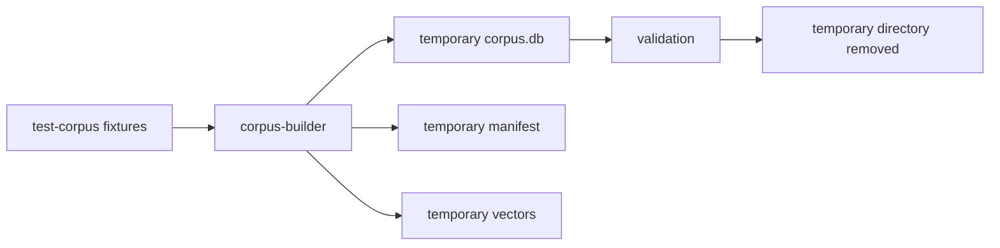

# Tests

## First checkout

After installing the corpus-builder development dependencies (see `INSTALLATION.md`), run the recommended first check from the repository root:

```bash
make check
```

`make check` is intentionally lightweight. It verifies repository contracts without requiring Android Studio, model downloads, production corpora, network APIs, or GPU tooling.

All `make ...` commands in this document are repository-root commands.

Current coverage:

| Command | Purpose | Prerequisites |
|---|---|---|
| `make check` | Builder tests + corpus-format validation + source-registry validation | Python 3.11+ and builder dev dependencies |
| `make check-all` | `make check` + Android host tests + desktop JVM shared tests | Python 3.11+, JDK 17+, Android SDK |
| `make test-corpus-builder` | Python unit/integration tests | Python 3.11+, `pytest` available |
| `make validate-format` | Validate corpus-format v2 schema/fixtures | Python 3.11+ |
| `make validate-sources` | Validate source TOML records and collection references | Python 3.11+ |
| `make smoke-corpus` | Build and validate a temporary synthetic corpus | Python 3.11+ |
| `make test-mobile` | Run Android shared host tests | JDK 17+, Android SDK |
| `make test-desktop` | Run shared tests on the desktop JVM target | JDK 17+ |
| `make run-desktop` | Run the interactive desktop development app | JDK 17+ |

The first Gradle invocation may need network access to obtain the configured Gradle distribution and dependencies if they are not cached.

## Test philosophy

Default tests must be deterministic and require no production model download, external API, or downloaded literary archive.

### Shared runtime and application hosts

The active Gradle targets are Android and JVM Desktop. iOS targets are intentionally not configured. `make check-all` runs the shared tests on both active targets; the desktop app itself is primarily a manual development harness.

Use deterministic injected randomness for selection behavior. When the corresponding behavior exists, cover:

- semantic thresholding;
- candidate deduplication;
- weighted selection;
- response-length fallback;
- repeat/recency weighting;
- author/work/semantic-cluster diversity;
- corpus-format compatibility;
- language and translation-role selection.

Platform inference/index adapters should have focused integration tests. Golden query embeddings should eventually verify that the mobile encoder matches the embedding model used by the corpus builder.

### Corpus builder

Use `pytest` with synthetic fixtures. Cover natural-boundary splitting, configuration validation, deterministic IDs, metadata population, staged publication, provenance retention, and failure on invalid artifacts.

### Corpus format

Validate SQL creation, foreign keys, required metadata, text-version roles, manifest/version consistency, hint/vector identity assumptions, and compatibility behavior.

### Source registry

Source records may exist as disabled candidates while review is incomplete. `enabled = true` is stricter: the record must be approved, have approved rights metadata, and identify a pinned source locator instead of a candidate landing page.

## Smoke corpus

`make smoke-corpus` exercises the build pipeline without leaving generated data in the repository:



## Heavy and future tests

The following must remain opt-in:

- production embedding-model downloads;
- ONNX device benchmarks;
- large ANN index benchmarks;
- source downloads;
- build-time translation API calls;
- LLM-assisted semantic-hint generation;
- corpus-quality evaluation over large real-text datasets.
