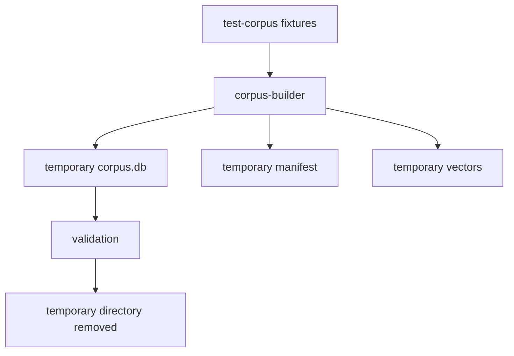

# Tests

## First checkout

After installing the corpus-builder development dependencies (see `INSTALLATION.md`), run the recommended first check from the repository root:

```bash
make check
```

`make check` is intentionally lightweight. It verifies repository contracts without requiring Android Studio, model downloads, production corpora, network APIs, or GPU tooling.

All `make ...` commands in this document are repository-root commands.

Current coverage:

| Command | Purpose | Prerequisites |
|---|---|---|
| `make check` | corpus-core + builder behavior/structural tests + corpus-format/source-registry validation | Python 3.11+ and Python corpus dev dependencies |
| `make check-all` | `make check` + Android host tests + shared/Desktop JVM tests | Python 3.11+, JDK 17+, Android SDK |
| `make test-corpus-core` | Shared Python contract/primitive tests | Python 3.11+, `pytest` available |
| `make test-corpus-builder` | Builder unit/integration + architecture, package-documentation, and repository-hygiene regression tests | Python 3.11+, `pytest` available |
| `make validate-format` | Validate corpus-format v4 schema/constraints | Python 3.11+ |
| `make validate-sources` | Validate source TOML records and collection references | Python 3.11+ |
| `make smoke-corpus` | Build and validate a temporary synthetic corpus | Python 3.11+ |
| `make test-mobile` | Run Android shared host tests | JDK 17+, Android SDK |
| `make test-desktop` | Run shared JVM tests plus Desktop runtime repository/manifest tests | JDK 17+ |
| `make run-desktop` | Run the interactive desktop development app | JDK 17+ |

The first Gradle invocation may need network access to obtain the configured Gradle distribution and dependencies if they are not cached.

## Test philosophy

Default tests must be deterministic and require no production model download, external API, or downloaded literary archive.

### Shared runtime and application hosts

The active Gradle targets are Android and JVM Desktop. iOS targets are intentionally not configured. `make check-all` runs shared tests on both active targets and the Desktop runtime JVM tests.

Use deterministic injected randomness for both free-form and guided selection behavior. When the corresponding behavior exists, cover:

- semantic thresholding;
- candidate deduplication;
- weighted selection;
- response-length fallback;
- repeat/recency weighting;
- author/work/semantic-cluster diversity;
- corpus-format compatibility, including v3 free-form fallback and v4 guided semantics;
- language and translation-role selection.

Platform inference/index adapters should have focused integration tests. Desktop currently tests v3/v4 manifest compatibility, brute-force cosine ranking, and guided SQLite question/candidate hydration without downloading models. A separate opt-in golden embedding test should later compare ONNX query output against the Python Sentence Transformers build stack; default tests must remain model/network-free.

### Corpus core and builder

`corpus-core` tests protect shared prepared-source/locator/text contracts. Builder regression tests protect both behavior and the refactored package structure:

- dependency direction: no `corpus-core -> corpus-builder`, root-CLI-to-internals, or cross-feature `_internal` imports;
- package documentation: every Python package must keep a meaningful `__init__.py` docstring describing its architectural role;
- repository hygiene: Git ignore rules, archive helpers, and source snapshots must preserve the architectural `sibyl_corpus_builder/build/` source package rather than confusing it with generated build output.

Use `pytest` with synthetic fixtures. Cover natural-boundary splitting, configuration validation, deterministic IDs, metadata population, staged publication, provenance retention, and failure on invalid artifacts. Catalog discovery/selection classification, Lib.ru TXT/HTML/FB2 fallback, HTML literary-body extraction, malformed-artifact handling, and per-work acquisition reporting must be covered with local fixtures; default tests never fetch Lib.ru or Gutenberg. LLM-curation tests must remain external-model-free: validate the guided-question catalog and stable IDs, deterministic export bundle construction, rights gating, exact locator/hash import, deterministic curated passage IDs, public exact-slice revalidation, and rejection of altered canonical slices. Builder integration tests cover v4 materialization, guided counts/mappings, duplicate curation inputs, and atomic failure on stale canonical hashes.

### Corpus format

Validate SQL creation, foreign keys, required metadata, text-version roles, guided catalog/mapping uniqueness and strength bounds, manifest/version consistency, hint/vector identity assumptions, and compatibility behavior.

### Source registry

Source records may exist as disabled candidates while review is incomplete. `enabled = true` is stricter: the record must be approved, have approved rights metadata, identify a pinned source locator, and pin both raw-artifact and canonical-text SHA-256 values.

## Smoke corpus

`make smoke-corpus` exercises the build pipeline without leaving generated data in the repository:



## Heavy and future tests

The following must remain opt-in:

- production embedding-model downloads;
- ONNX device benchmarks;
- large ANN index benchmarks;
- source downloads;
- build-time translation API calls;
- LLM-assisted semantic-hint generation;
- external large-LLM curation calls over real literary text;
- corpus-quality evaluation over large real-text datasets.


Corpus-builder tests also cover source-artifact normalization/hashing, prepared-source materialization, and exact source-slice passage extraction. Network fetches and ML model downloads remain outside the default test suite.

## Curated machine-translation coverage

`corpus-builder/tests/test_translation.py` uses synthetic foreign-language canonical text and validates deterministic translation bundles, complete source/hash/provenance import, rejection of incomplete proposals, all-available translation selection, and SQLite materialization of exact original plus stored `machine_translation`. Shared Kotlin tests cover parallel original/translation selection; Desktop SQLite tests verify translation metadata hydration. Default tests call no external translation service.
