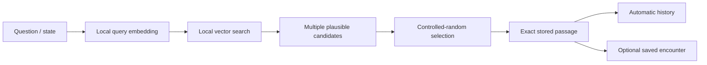

# Usage

## Interactive development

For day-to-day manual verification, run the JVM Desktop harness from the repository root:

```bash
make run-desktop
```

It opens the same shared Compose `SibylApp()` used by Android. No server or REST layer is involved. Use Android only when platform-specific behavior needs verification.

## Runtime workflow



The current Android and Desktop demo hosts substitute deterministic in-memory retrieval for the production embedding/vector adapters.

A saved encounter preserves the **question + selected passage**. Automatic history is separate and does not imply the user explicitly saved anything.

## Corpus-builder development workflow

```bash
cd /path/to/sibyl/corpus-builder
sibyl-corpus build \
  --config config/example.toml \
  --source ../test-corpus/sources \
  --output data/output/demo

sibyl-corpus validate --corpus data/output/demo/corpus.db
```

For a disposable end-to-end fixture build from the repository root:

```bash
make smoke-corpus
```

## Source-registry workflow

Before a real work enters a production corpus:

1. register a candidate in `corpus-sources/`;
2. validate metadata/collection references;
3. pin the concrete source edition/artifact/revision;
4. review rights/provenance;
5. explicitly enable the source;
6. fetch/import it through an explicit builder adapter;
7. build passages/hints/vectors;
8. validate and publish the corpus package.

See [`SOURCES.md`](SOURCES.md).

## Corpus contract

Builder and mobile communicate through the versioned contract in `corpus-format/`. Do not make an undocumented schema/semantic change in one side only. See [`CORPUS_FORMAT.md`](CORPUS_FORMAT.md).
