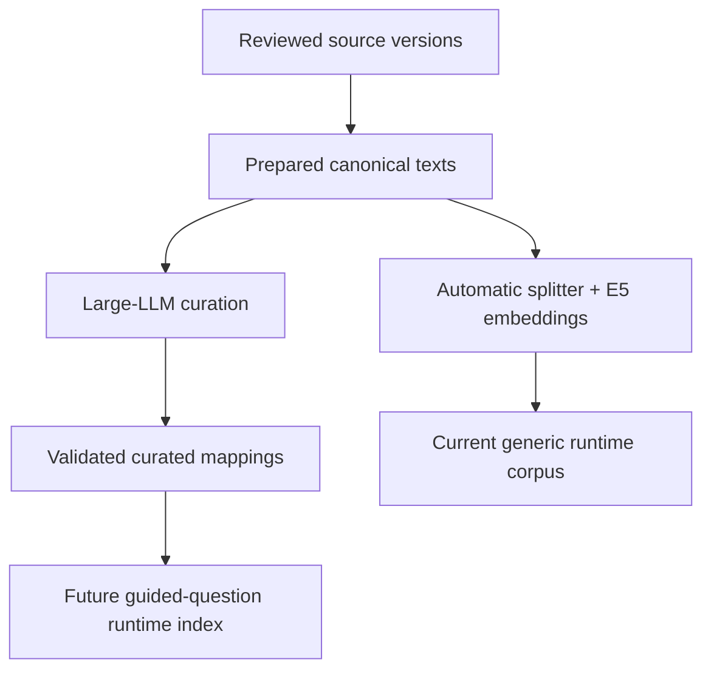
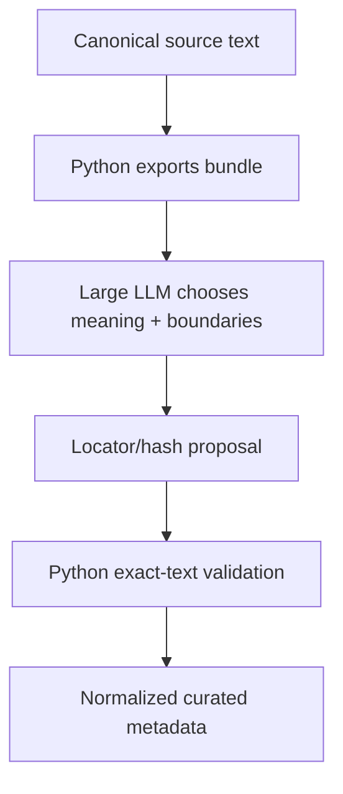

# Operational workflow

## Purpose

This is Sibyl's canonical **where do I start and what do I run next?** guide. It connects source preparation, optional large-LLM curation, the existing automatic embedding corpus, and the current Desktop real-corpus runtime.

Keep the happy-path sequence here. Use [`USAGE.md`](USAGE.md) for command syntax, optional flags, and alternate source inputs; [`SOURCES.md`](SOURCES.md) for provenance/rights/normalization policy; and implementation guides when you need code ownership.

## Start here

| Current state | Continue with |
|---|---|
| A new supported author/catalog URL | [Prepare canonical works](#1-prepare-canonical-works) |
| A reviewed `selection.toml` | Acquire the included works, then prepare canonical input |
| Cached source artifacts | Materialize prepared canonical input |
| A prepared `data/work/<author>/` directory | Choose [LLM curation](#2-large-llm-curation-path) and/or [automatic retrieval](#5-automatic-embedding-retrieval-path) |
| An LLM proposal patch | [Import and validate the proposal](#4-import-and-validate-the-llm-proposal) |
| A built corpus directory | [Run the real Desktop runtime](#6-run-the-current-real-desktop-runtime) |
| Only a clean checkout | Follow [`INSTALLATION.md`](INSTALLATION.md), then start with a source or `make smoke-corpus` |

When debugging implementation, follow the owning feature:

| Workflow stage | Owner |
|---|---|
| discover / acquire / normalize / prepare / register | `sibyl_corpus_builder.sources` |
| inspect passages / embeddings / build / validate | `sibyl_corpus_builder.build` |
| curation export / proposal import / validation | `sibyl_corpus_builder.curation` |
| prepared source contract / exact locators / hashes | `sibyl_corpus_core` |

The root `sibyl_corpus_builder.cli` only composes feature command surfaces. See [`../corpus-builder/IMPLEMENTATION.md`](../corpus-builder/IMPLEMENTATION.md) for concrete code paths.

The two passage-preparation paths intentionally branch from the same canonical source:



Current real Desktop retrieval consumes the **automatic** corpus; Android still uses demo retrieval. Curated guided-question mappings are build-time data until runtime integration is implemented.

## 1. Prepare canonical works

The commands below assume that the corpus-builder Python environment has already been installed and activated as described in [`INSTALLATION.md`](INSTALLATION.md). Installing the package exposes the `sibyl-corpus` CLI entry point.

For a new Lib.ru author, run the following from `corpus-builder/`.

### 1.1 Discover the author catalog

```bash
sibyl-corpus discover \
  --url "<reviewed-author-catalog-url>" \
  --output data/work/tolstoy-selection.toml
```

`discover` writes an editable review manifest. It neither downloads nor approves works.

### 1.2 Review the selection

Open `data/work/tolstoy-selection.toml`. Keep only intentional `decision = "include"` entries; leave uncertain material as `review` or mark it `exclude`. Set stable `registry_work_id` values before permanent registration when known.

### 1.3 Acquire included works

```bash
sibyl-corpus acquire \
  --selection data/work/tolstoy-selection.toml \
  --cache data/raw
```

Review the generated acquisition report. Successful works remain cached even if another included work fails. Source-specific fallback/normalization rules are owned by [`SOURCES.md`](SOURCES.md).

### 1.4 Materialize canonical input

```bash
sibyl-corpus prepare-selection \
  --selection data/work/tolstoy-selection.toml \
  --cache data/raw \
  --output data/work/tolstoy
```

`data/work/tolstoy/` is the important handoff boundary: both later paths consume the same pinned canonical text versions. `prepare-selection` has already materialized only works with `decision = "include"`; entries left as `review` or `exclude` do not appear in this prepared directory.

Selection decisions and source-version rights status are independent. `decision = "include"` controls which discovered works are prepared, while `rights_status = "approved"` or `"review_required"` controls whether a prepared text version may be exported to an external curation service without an explicit override. Curation export flags such as `--approved-only` do not revisit the selection decisions.

**For LLM curation, stop here. Do not run `inspect-passages` first.** The curator selects meaningful ranges directly from canonical text; the automatic splitter is a separate generic-retrieval path.

### 1.5 Optional permanent registration

When the acquired concrete versions are worth preserving as project metadata:

```bash
sibyl-corpus register \
  --selection data/work/tolstoy-selection.toml \
  --cache data/raw \
  --registry ../corpus-sources \
  --collection tolstoy-libru
```

Registration creates disabled candidate records and never approves/enables them automatically.

## 2. Large-LLM curation path

Use this path to map stable guided questions to literary passages with natural semantic boundaries.



The responsibility split is strict:

> **LLM decides meaning. Python decides validity.**

The external model may choose literary relevance and boundaries, but local canonical text remains authoritative for wording, locators, and hashes.

### 2.1 Guided-question catalog

The versioned product catalog is `corpus-curation/questions.json`. Curation metadata references stable question IDs rather than duplicating or rewriting prompt semantics.

Do not silently regenerate the catalog for each author. A semantic rewrite that changes the meaning of existing IDs requires a new `catalog_id`.

## 3. Export an LLM curation bundle

```bash
sibyl-corpus export-curation-bundle \
  --source data/work/tolstoy \
  --questions ../corpus-curation/questions.json \
  --output data/curation/tolstoy-curation-bundle.zip
```

The exporter is deterministic. The bundle contains the question catalog, a manifest that pins each included `work_id`/`text_version_id`/canonical SHA-256, and the canonical text files required for curation.

Export requires approved rights metadata by default. Use `--approved-only` when a mixed prepared set should silently exclude unapproved versions, or the explicit `--allow-unapproved` development override only after separately confirming external-service upload rights. Optional work filtering and full flag details are documented in [`USAGE.md`](USAGE.md). The bundle contains full literary text, so it belongs under ignored `corpus-builder/data/` and must not be committed or included in a shareable project archive.

### 3.1 Ask the large LLM for a curation patch

Upload the bundle with current Sibyl project context and ask the model to:

- choose strong, relatively self-contained passages with natural boundaries;
- map each passage only to guided questions it genuinely addresses;
- avoid forcing full catalog coverage for an author/work set;
- prefer multiple plausible candidates over one universal answer;
- preserve `work_id`, `text_version_id`, and canonical identity from the bundle;
- return locator/hash metadata, not copied literary passage text.

A useful request is conceptually:

```text
Curate the attached Tolstoy canonical works for Sibyl's guided question catalog.
Choose literarily strong passages with natural boundaries and map them to the
questions they genuinely address. Do not force full catalog coverage. Return a
project PATCH containing a curation proposal under corpus-curation/proposals/.
The proposal must use exact chars:start:end locators and text SHA-256 values,
without copying the passage text into the committed JSON file.
```

The proposal should be placed under a path such as `corpus-curation/proposals/tolstoy-v1.json` and follow the current curation schema:

```json
{
  "schema_version": 1,
  "proposal_id": "tolstoy-v1",
  "question_catalog_id": "sibyl-guided-questions-ru-v1",
  "curation_method": "large_llm",
  "source_bundle_id": "cb_...",
  "passages": [
    {
      "work_id": "tolstoy-example",
      "text_version_id": "tolstoy-example-libru",
      "canonical_sha256": "...",
      "source_locator": "chars:1200:1850",
      "text_sha256": "...",
      "matches": [
        {"question_id": "meaning_of_life", "strength": 0.96}
      ]
    }
  ]
}
```

`strength` is an editorial/semantic fit in `[0, 1]`, not cosine similarity.

## 4. Import and validate the LLM proposal

After applying the proposal patch:

```bash
sibyl-corpus import-curation \
  --source data/work/tolstoy \
  --questions ../corpus-curation/questions.json \
  --input ../corpus-curation/proposals/tolstoy-v1.json \
  --output ../corpus-curation/curated/tolstoy-v1.json
```

For every selected range, the importer resolves the prepared text version, verifies canonical SHA-256, parses the exact character locator, resolves the local slice, verifies selected-text SHA-256, validates question IDs/strengths, and derives deterministic curated metadata. It never repairs model text or stores the literary passage in the committed curated JSON.

Revalidate the normalized file whenever canonical preparation or curation metadata changes:

```bash
sibyl-corpus validate-curation \
  --source data/work/tolstoy \
  --questions ../corpus-curation/questions.json \
  --curation ../corpus-curation/curated/tolstoy-v1.json
```

Any stale locator/hash fails. Re-curate or deliberately migrate the mapping; never silently retarget an old locator.

## 5. Automatic embedding retrieval path

This remains the runtime path for arbitrary free-form questions.

Inspect mechanical passage boundaries from the same prepared canonical directory:

```bash
sibyl-corpus inspect-passages \
  --config config/real-text.toml \
  --source data/work/tolstoy \
  --output data/work/tolstoy-passages.jsonl
```

Then build and validate the runtime corpus:

```bash
sibyl-corpus build \
  --config config/real-text.toml \
  --source data/work/tolstoy \
  --output data/output/tolstoy

sibyl-corpus validate --corpus data/output/tolstoy/corpus.db
```

The current real-text configuration uses the deterministic splitter and local `multilingual-e5-small` embeddings. Completed embedding inputs are reusable through the local cache when their exact text/configuration identity has not changed.

## 6. Run the current real Desktop runtime

The real Desktop path consumes the automatic runtime artifacts, not curated mappings yet.

Prepare the matching local runtime model once if needed, then run from the repository root:

```bash
make download-runtime-model
make run-desktop-real CORPUS_DIR=corpus-builder/data/output/tolstoy
```

Use [`USAGE.md`](USAGE.md) for alternate corpus/model paths and [`INSTALLATION.md`](INSTALLATION.md) for host-specific native setup.

## 7. Current milestone boundary

Implemented now:

- a versioned stable guided-question catalog;
- deterministic canonical-text export for an explicit external large-LLM step;
- Git-safe proposal/curated metadata with no copied passage text;
- exact local locator/hash validation and deterministic curated passage IDs;
- automatic splitter + E5 runtime corpus for free-form retrieval;
- deterministic offline tests for both corpus paths.

Not implemented yet:

- Desktop/Android loading of curated mappings;
- guided-question UI;
- `question_id -> curated candidates -> SelectionEngine` runtime routing;
- assembly of curated mappings across authors into a runtime index.

## 8. Repository/data boundaries

| Data | Location | Git/shareable archive |
|---|---|---|
| Guided-question catalog | `corpus-curation/questions.json` | yes |
| LLM proposal locator/hash metadata | `corpus-curation/proposals/*.json` | yes, after review |
| Validated curated locator/hash metadata | `corpus-curation/curated/*.json` | yes |
| Downloaded/cached source artifacts | `corpus-builder/data/raw/` | no |
| Prepared canonical texts | `corpus-builder/data/work/` | no |
| Curation bundle with full canonical texts | `corpus-builder/data/curation/` | no |
| Embedding caches, model bundles, corpus output | `corpus-builder/data/` | no |

If you are unsure where to continue, identify the last durable/local artifact you produced and return to the table at the top of this document.
