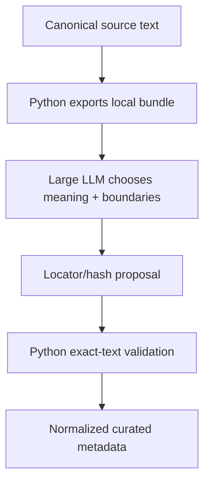

# Development workflow

## Purpose

This is the primary **where do I start and what do I run next?** document for Sibyl. It connects source preparation, optional large-LLM curation, the existing embedding-based corpus build, and Desktop runtime development.

Use this document to choose a path and find the next step. Use [`USAGE.md`](USAGE.md) for command-level operational details, [`SOURCES.md`](SOURCES.md) for provenance/rights policy, and the implementation guides for code ownership.

## Start here

Choose the row that matches what you currently have.

| Current state | Continue with |
|---|---|
| A new author/catalog URL | [Prepare canonical works](#1-prepare-canonical-works) |
| A reviewed `selection.toml` | Acquire the included works, then `prepare-selection` |
| Downloaded/cached source artifacts | `prepare-selection` or `prepare` to materialize canonical builder input |
| A prepared `data/work/<author>/` directory | Choose [LLM curation](#2a-large-llm-curation-path) and/or [generic embedding retrieval](#5-generic-embedding-retrieval-path) |
| An LLM curation proposal patch | [Import and validate the proposal](#4-import-and-validate-the-llm-proposal) |
| A built `corpus.db` + `vectors.json` + `manifest.json` | [Run the real Desktop runtime](#6-run-the-current-real-desktop-runtime) |
| Only a clean repository checkout | Install the builder environment, then start with a source catalog or `make smoke-corpus` |

The two passage-preparation paths are deliberately independent for now:


The current application runtime consumes the **automatic splitter + E5** corpus. The new LLM-curation infrastructure is build-time data preparation only in this milestone; runtime wiring for guided questions is a later step.

## 1. Prepare canonical works

For a new author on Lib.ru, run commands from `corpus-builder/`.

### 1.1 Discover the author catalog

```bash
sibyl-corpus discover \
  --url "<reviewed-author-catalog-url>" \
  --output data/work/tolstoy-selection.toml
```

The exact catalog URL is source-specific. `discover` creates an editable review manifest and does not download or approve works.

### 1.2 Review the selection

Open:

```text
data/work/tolstoy-selection.toml
```

Keep only intentional `decision = "include"` entries. Leave ambiguous material as `review` or mark it `exclude`. Set stable `registry_work_id` values before permanent registration when known.

### 1.3 Acquire included works

```bash
sibyl-corpus acquire \
  --selection data/work/tolstoy-selection.toml \
  --cache data/raw
```

Review the generated acquisition report. Successful works remain cached even when another work fails.

### 1.4 Materialize canonical input

```bash
sibyl-corpus prepare-selection \
  --selection data/work/tolstoy-selection.toml \
  --cache data/raw \
  --output data/work/tolstoy
```

At this point `data/work/tolstoy/` is the important handoff boundary. It contains the prepared manifest and canonical source text versions used by both later paths.

**For LLM curation, stop here. Do not run `inspect-passages` first.** The large model is allowed to choose its own meaningful passage boundaries from canonical text. The existing splitter remains available independently for generic free-form retrieval.

### 1.5 Optional permanent source registration

When concrete versions are worth keeping in the source registry:

```bash
sibyl-corpus register \
  --selection data/work/tolstoy-selection.toml \
  --cache data/raw \
  --registry ../corpus-sources \
  --collection tolstoy-libru
```

Registration creates candidate records and does not approve or enable sources automatically.

## 2A. Large-LLM curation path

Use this path to create high-quality mappings from the stable guided-question catalog to naturally bounded literary passages.

The important responsibility split is:



The large LLM decides **literary relevance and natural passage boundaries**. Python decides **whether the selected passage really exists exactly in the pinned canonical text**.

### 2A.1 Guided question catalog

The Git-tracked product catalog lives at:

```text
corpus-curation/questions.json
```

The initial catalog contains 48 Russian questions/states with stable IDs and themes. Curation mappings reference IDs rather than copying or rewriting prompt semantics.

Do not silently regenerate this file for each author. A semantic catalog rewrite requires a new `catalog_id` so older curation mappings cannot silently change meaning.

## 3. Export an LLM curation bundle

From `corpus-builder/`:

```bash
sibyl-corpus export-curation-bundle \
  --source data/work/tolstoy \
  --questions ../corpus-curation/questions.json \
  --output data/curation/tolstoy-curation-bundle.zip
```

To curate only selected prepared work IDs, repeat `--work`:

```bash
sibyl-corpus export-curation-bundle \
  --source data/work/tolstoy \
  --questions ../corpus-curation/questions.json \
  --work tolstoy-war-and-peace \
  --work tolstoy-death-of-ivan-ilyich \
  --output data/curation/tolstoy-selected-bundle.zip
```

By default the exporter rejects prepared text versions whose `rights_status` is not `approved`. For development experiments with candidate/review-required source metadata, `--allow-unapproved` is an explicit override, but use it only after separately confirming that the concrete source text may be sent to the external model/service:

```bash
sibyl-corpus export-curation-bundle \
  --source data/work/tolstoy \
  --questions ../corpus-curation/questions.json \
  --output data/curation/tolstoy-curation-bundle.zip \
  --allow-unapproved
```

The bundle is deterministic and local. It contains:

```text
manifest.json
questions.json
works/0001.txt
works/0002.txt
...
```

`manifest.json` pins every included `work_id`, `text_version_id`, and canonical SHA-256. The `works/*.txt` files contain canonical text only for the external curation step.

The bundle belongs under `corpus-builder/data/` and must **not** be committed or included in a shareable project archive.

## 3.1 Ask the large LLM for a curation patch

Upload the curation bundle together with the current Sibyl project context. The request should tell the model to:

- read the concrete canonical works in the bundle;
- choose strong, relatively self-contained passages with natural boundaries;
- associate each passage with one or more guided question IDs;
- avoid forcing coverage for questions that have no strong match in this author/work set;
- prefer several plausible passages per question over a single gold answer;
- output only locator/hash metadata in the project patch, not copied literary text;
- preserve the bundle's `work_id`, `text_version_id`, and `canonical_sha256` identities.

A useful request is conceptually:

```text
Curate the attached Tolstoy canonical works for Sibyl's guided question catalog.
Choose literarily strong passages with natural boundaries and map them to the
questions they genuinely address. Do not force full catalog coverage. Return a
project PATCH containing a curation proposal under corpus-curation/proposals/.
The proposal must use exact chars:start:end locators and text SHA-256 values,
without copying the passage text into the committed JSON file.
```

The LLM proposal is expected under a path such as:

```text
corpus-curation/proposals/tolstoy-v1.json
```

A proposal has this shape:

```json
{
  "schema_version": 1,
  "proposal_id": "tolstoy-v1",
  "question_catalog_id": "sibyl-guided-questions-ru-v1",
  "curation_method": "large_llm",
  "source_bundle_id": "cb_...",
  "passages": [
    {
      "work_id": "tolstoy-example",
      "text_version_id": "tolstoy-example-libru",
      "canonical_sha256": "...",
      "source_locator": "chars:1200:1850",
      "text_sha256": "...",
      "matches": [
        {"question_id": "meaning_of_life", "strength": 0.96},
        {"question_id": "mortality_and_values", "strength": 0.91}
      ]
    }
  ]
}
```

`strength` is an editorial/semantic curation score in `[0, 1]`; it is not cosine similarity.

## 4. Import and validate the LLM proposal

After applying the LLM-generated project patch, run from `corpus-builder/`:

```bash
sibyl-corpus import-curation \
  --source data/work/tolstoy \
  --questions ../corpus-curation/questions.json \
  --input ../corpus-curation/proposals/tolstoy-v1.json \
  --output ../corpus-curation/curated/tolstoy-v1.json
```

The importer does not trust model output as literary text. For every passage it:

1. resolves `work_id` + `text_version_id` against the prepared source;
2. recalculates and verifies `canonical_sha256`;
3. parses the exact `chars:start:end` locator;
4. resolves that slice from canonical text;
5. recalculates and verifies `text_sha256`;
6. validates all guided question IDs and strengths;
7. derives a deterministic `cp_...` curated passage ID;
8. records word count and normalized question mappings;
9. writes no literary passage text into the Git-tracked curated JSON.

Any mismatch fails the import instead of silently adjusting model output.

## 4.1 Revalidate an existing curated file

Whenever canonical preparation or curation metadata changes:

```bash
sibyl-corpus validate-curation \
  --source data/work/tolstoy \
  --questions ../corpus-curation/questions.json \
  --curation ../corpus-curation/curated/tolstoy-v1.json
```

A canonical source change naturally invalidates old hashes/locators. Re-curate or deliberately migrate the mapping; never retarget old locators silently.

## 5. Generic embedding retrieval path

This path remains required for arbitrary user questions that do not correspond to one of the prepared guided prompts.

From the same prepared canonical directory:

```bash
sibyl-corpus inspect-passages \
  --config config/real-text.toml \
  --source data/work/tolstoy \
  --output data/work/tolstoy-passages.jsonl
```

Then build the current runtime corpus:

```bash
sibyl-corpus build \
  --config config/real-text.toml \
  --source data/work/tolstoy \
  --output data/output/tolstoy

sibyl-corpus validate --corpus data/output/tolstoy/corpus.db
```

This uses the current deterministic splitter and local `multilingual-e5-small` passage embeddings. It is intentionally retained as the fallback for free-form questions while curated guided-question runtime support is developed separately.

## 6. Run the current real Desktop runtime

The current Desktop real-corpus path still consumes the generic runtime artifacts, not `corpus-curation/curated/*.json` yet.

Download the matching ONNX/tokenizer bundle once if needed:

```bash
sibyl-corpus download-runtime-model \
  --config config/real-text.toml \
  --output data/runtime-models/multilingual-e5-small
```

Then from the repository root:

```bash
make run-desktop-real \
  CORPUS_DIR=corpus-builder/data/output/tolstoy \
  MODEL_DIR=corpus-builder/data/runtime-models/multilingual-e5-small
```

## 7. What is implemented now versus next

Implemented in the current curation milestone:

- a stable 48-item guided question/state catalog;
- deterministic export of prepared canonical texts for an explicit external large-LLM step;
- Git-safe LLM proposal metadata with no copied passage text;
- exact local locator/hash validation and deterministic curated passage IDs;
- normalized curated mappings under `corpus-curation/curated/`;
- offline deterministic tests for the curation contracts.

Not implemented yet:

- Desktop/Android loading of curated mappings;
- guided-question cards in the UI;
- direct `question_id -> curated candidate pool -> SelectionEngine` runtime routing;
- merging curated mappings across multiple authors into a runtime index;
- using curated passages as the generic free-form retrieval corpus.

Those are the next runtime integration stage after at least one real author curation has been produced and reviewed successfully.

## 8. Repository/data boundaries

Keep these boundaries explicit:

| Data | Location | Git/shareable archive |
|---|---|---|
| Guided question catalog | `corpus-curation/questions.json` | yes |
| LLM proposal locator/hash metadata | `corpus-curation/proposals/*.json` | yes, after review |
| Validated curated locator/hash metadata | `corpus-curation/curated/*.json` | yes |
| Downloaded raw source artifacts | `corpus-builder/data/raw/` | no |
| Prepared canonical texts | `corpus-builder/data/work/` | no |
| LLM curation bundle with full canonical texts | `corpus-builder/data/curation/` | no |
| Embedding cache/runtime model/corpus output | `corpus-builder/data/` | no |

The project archive must never gain downloaded books merely because LLM curation uses them as temporary local input.

## 9. Fast orientation checklist

For a **new author**:

```text
discover -> review -> acquire -> prepare-selection
```

Then choose one or both:

```text
LLM quality path: export-curation-bundle -> LLM patch -> import-curation -> validate-curation
Generic fallback: inspect-passages -> build -> validate -> run-desktop-real
```

If you are unsure where to continue, identify the last artifact you successfully produced and use the table at the top of this document.
