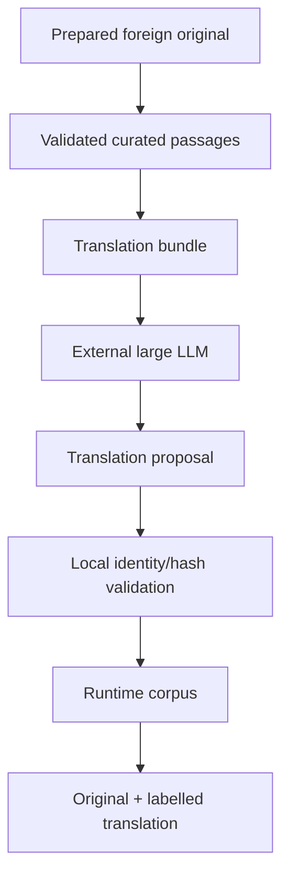

# Curated machine translation

**Status:** implementation complete; pending acceptance and archival  
**Roadmap:** `S-09`, `P-07`  
**Target slice:** build-time translation of validated curated foreign-language passages plus parallel original/translation display in shared UI

## Goal

Allow Sibyl to ingest approved foreign-language originals, curate exact passages with the existing large-LLM workflow, translate those validated passages to Russian at build time with a large LLM, and publish both the exact original and a labelled stored machine translation in the same runtime passage.

Runtime question answering remains fully local. The LLM is used only during corpus preparation.



## Current state

- prepared sources already persist language, original language, and text role;
- Project Gutenberg, reviewed local import, and language-aware Lib.ru direct-TXT catalogs can provide foreign originals;
- guided curation resolves exact canonical source ranges and persists locator/hash metadata;
- corpus format v4 already supports `original`, `human_translation`, and `machine_translation` text versions and multiple `passage_text` rows for one logical passage;
- Desktop repository hydration already reads all stored text versions, but shared UI currently selects only one preferred text;
- generated translations are explicitly excluded from Git/shareable archives by repository policy;
- there is no translation-bundle/import workflow and the runtime builder cannot yet materialize generated curated-passage translations.

## Requirements

### R1. Preserve original-text authority

A machine translation must never replace or mutate the approved source original. Translation input is identified by an already validated curated `passage_id` plus its exact original text SHA-256.

The original `passage_text` remains an exact canonical source slice. A machine translation is a separate stored `passage_text` under an explicitly identified `machine_translation` text version.

### R2. Build-time-only large-LLM translation

Translation generation must be an explicit corpus-builder workflow. Package import, runtime startup, guided retrieval, and free-form retrieval must perform no translation API/network calls.

### R3. Deterministic translation bundle

The builder must export a deterministic local ZIP from:

- prepared canonical source documents;
- one validated curation file;
- the guided-question catalog required to revalidate that curation;
- an explicit target language.

The bundle contains only curated source passages that require translation to the target language. It must pin `passage_id`, work/text-version identity, exact source SHA-256, source language, target language, and source text. Full/generated text remains under ignored `corpus-builder/data/`.

### R4. Validate translation proposals locally

Import must reject:

- unknown/missing/duplicate curated passage IDs;
- source hashes that do not match the revalidated curated source text;
- mismatched source bundle/curation identity;
- blank translations;
- mismatched target language;
- missing provider/model/prompt provenance.

The importer derives translation SHA-256 locally and writes a deterministic validated translation artifact. It does not claim to validate literary quality; human review remains possible before runtime publication.

### R5. Keep generated translation text out of Git

Validated machine translations contain generated literary text and therefore belong under ignored local `corpus-builder/data/`, not under `corpus-curation/` or `corpus-sources/`.

### R6. Materialize translations in format v4 without a version bump

No new persisted entity is required. The existing v4 `text_version` / `passage_text` representation already models machine translation.

For every translated work the builder creates an explicit `machine_translation` text version with target language and provider/model provenance. Each translated curated passage receives a `standard` `passage_text` linked to that text version while retaining the original text row.

The capability is additive and existing v4 readers can safely ignore or consume the additional text-version rows.

### R7. All-available assembly discovers validated translations

The normal `build-available` / `make build-runtime-corpus` workflow must optionally discover validated translation artifacts. A translation is included only when every source curated passage it requires is present in the selected curation set.

A translation whose complete source curation is unavailable is skipped. Partial availability must fail rather than silently publish a truncated translation set.

### R8. Parallel display and labelling

When a selected passage has an original plus a preferred-language translation, shared UI must show the original and translation together. Machine translation must be visibly labelled. A same-language original must not be duplicated.

Human translations retain preference over machine translations for the same requested language.

### R9. Preserve free-form/guided retrieval behavior

Translation metadata must not alter vector identity, guided curation strength, candidate ranking, or `SelectionEngine` behavior. It only adds stored display realizations to existing passages.

## Scenarios

### S1. Shakespeare curated passage translated to Russian

Given an English prepared original and validated Shakespeare curation, export a Russian translation bundle, import a complete large-LLM proposal, build the runtime corpus, and obtain one passage containing the exact English original plus a persisted Russian `machine_translation` text.

Covers R1-R6, R8-R9.

### S2. Stale source curation

If canonical source text or curation hashes change after translation generation, translation revalidation/build fails before publication.

Covers R1, R4.

### S3. Missing translation entry

If the proposal omits one passage required by the translation bundle, import fails rather than producing partial output.

Covers R4.

### S4. Translation for unavailable author

`build-available` skips a validated translation whose curated source passages are entirely unavailable locally.

Covers R7.

### S5. Partially available translation source

If only some source curated passage IDs required by a validated translation are available, all-available assembly fails.

Covers R7.

### S6. Parallel UI

For an English original with Russian machine translation, UI renders both and labels the Russian text as machine translation. A Russian original remains single-text display.

Covers R8.

## Non-goals

- runtime/on-device translation;
- translating every automatic splitter passage in the first slice;
- automatic literary-quality judging or rewriting of LLM translation output;
- adding a human-translation acquisition workflow;
- author/library filtering for all-available assembly;
- translating complete works solely to establish passage alignment.

## Design

Add a separate `translation` feature to `corpus-builder` because generated translation has a distinct trust/provenance boundary from literary curation:

```text
curation
  canonical source -> validated exact curated ranges

translation
  validated curated ranges -> external LLM -> validated generated text

build
  automatic passages + curated ranges + validated translations -> runtime corpus
```

The translation feature exposes only public API/command adapters; private bundle/proposal validation stays under `translation/_internal`. Other features must not import its private implementation.

Translation text versions may cover only the curated passages translated by a translation artifact. Absence of a `passage_text` row for other passages means that translation is unavailable for those passages; it does not imply runtime synthesis.

## Compatibility / migration

Corpus format remains v4. Existing v4 SQLite schema already permits multiple text versions and machine-translation roles. Existing corpora remain readable unchanged.

`build` gains repeatable optional `--translation`; `build-available` gains optional `--translation-root`. The normal Make target points that root at ignored local validated translation data.

## Validation

- R1-R5: Python translation export/import/revalidation tests with synthetic exact passages;
- R6-R7: builder tests inspect persisted machine-translation `text_version` / `passage_text`, foreign keys, auto-discovery, skip, and partial-failure behavior;
- R8: common Kotlin model/display-selection tests plus Desktop SQLite hydration test for original + machine translation;
- R9: existing retrieval/selection tests remain unchanged and pass;
- repository checks: `make check`, `make smoke-corpus`, focused Desktop/shared tests where the Gradle toolchain is available.

## Implementation tasks

1. Add `translation` feature API/CLI/models and architecture guards.
2. Add deterministic translation bundle export and strict proposal import/revalidation.
3. Extend explicit/all-available build inputs with validated translations.
4. Materialize machine-translation text versions and passage texts in v4 SQLite.
5. Add shared parallel-display selection helpers/UI and focused Kotlin tests.
6. Update `WORKFLOW`, `USAGE`, source/format/implementation documentation and roadmap/history.
