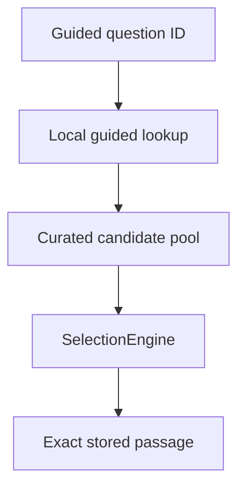
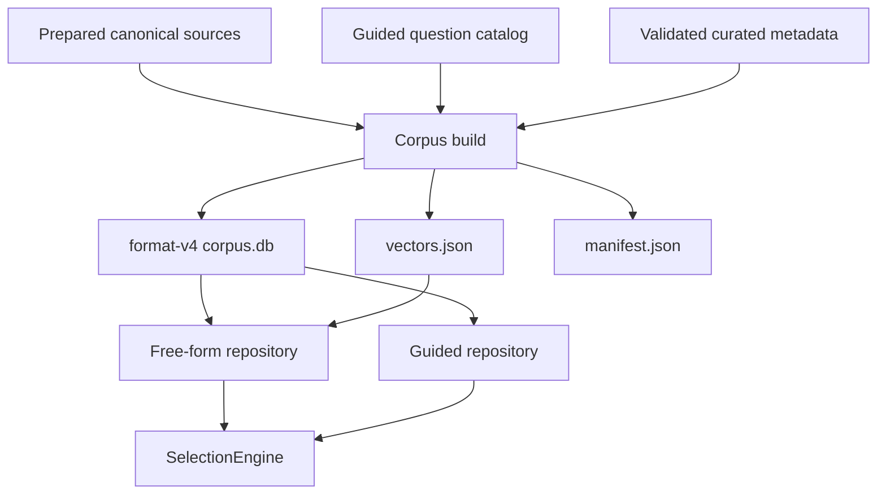

# Guided-question runtime

**Status:** active specification; implementation not yet present  
**Roadmap:** `C-12`, `P-13`  
**Target slice:** Desktop real-corpus runtime first; shared KMP contracts/UI where practical

## Goal

Make validated build-time guided-question curation usable by the local runtime. A user must be able to choose a prepared guided question, obtain multiple curated literary candidates from the installed corpus, and receive one exact stored passage through the existing controlled-random `SelectionEngine`.

The feature must coexist with the current free-form path. Free-form questions continue to use local E5 embedding and vector retrieval; guided questions use precomputed curated mappings and require no query embedding.



## Current state

- `corpus-format` is version 3 and persists works, text versions, automatic passages, passage texts, semantic hints, and embedding compatibility metadata. It has no guided-question tables.
- `corpus-curation/questions.json` owns stable guided-question IDs and prompt metadata.
- validated files under `corpus-curation/curated/` contain exact canonical locators/hashes and many-to-many question matches with `strength`, but they are not runtime artifacts.
- the automatic builder writes `corpus.db`, `vectors.json`, and `manifest.json`; curated ranges are not materialized into that database.
- shared runtime has `RetrievalService` for free-form semantic retrieval and `SelectionEngine` for the final controlled-random choice.
- Desktop real mode reads format v3 SQLite/vector artifacts, embeds free-form text locally with E5, and injects only `RetrievalService` into `SibylApp`.
- Android remains on the synthetic/demo retrieval path and is not part of the first real guided-runtime slice.

## Requirements

### R1. Preserve two independent retrieval modes

Sibyl must support both:

- free-form text: `question text -> local E5 -> vector retrieval -> candidates -> SelectionEngine`;
- guided question: `stable question_id -> curated mapping lookup -> candidates -> SelectionEngine`.

Guided retrieval must not invoke the embedding engine or vector index. Adding guided retrieval must not change the observable free-form retrieval behavior except for format-compatibility plumbing required by the new corpus version.

### R2. Publish guided semantics in corpus format v4

The runtime corpus contract must advance from format v3 to **format v4** because guided questions and their passage mappings are new persisted runtime semantics.

Format v4 must add normalized persisted entities equivalent to:

```text
guided_question_catalog
  id
  language

guided_question
  id
  catalog_id -> guided_question_catalog.id
  kind
  theme
  text

guided_question_passage
  question_id -> guided_question.id
  passage_id -> passage.id
  strength [0.0, 1.0]
```

The mapping primary key must prevent duplicate `(question_id, passage_id)` relationships. Foreign keys and strength bounds must be validated by the format/schema tests.

Curated passages themselves must use the existing `passage` + `passage_text` persisted representation. The runtime must not read literary wording from curation proposal/metadata files.

### R3. Materialize validated curation during corpus build

The automatic `build` command must accept optional guided-curation inputs in addition to the prepared canonical source directory. The intended CLI shape is:

```bash
sibyl-corpus build \
  --config config/real-text.toml \
  --source data/work/tolstoy \
  --questions ../corpus-curation/questions.json \
  --curation ../corpus-curation/curated/tolstoy-v1.json \
  --output data/output/tolstoy
```

`--curation` should be repeatable so later corpus assembly can combine independently curated sets that reference texts present in the prepared source input. If any `--curation` is supplied, `--questions` is required. A build without curation remains valid and publishes a v4 corpus with no guided mappings.

The build feature must consume curation only through a public curation API/model boundary; it must not import `curation._internal` or duplicate the curation trust-boundary logic.

### R4. Revalidate exact literary text at assembly time

For every curated passage included in a build, local Python must:

1. resolve `work_id` + `text_version_id` against the prepared canonical source;
2. verify `canonical_sha256`;
3. resolve `chars:start:end` against the canonical text;
4. verify `text_sha256`;
5. insert exactly that canonical slice into `passage_text` without rewriting or truncation.

The persisted curated passage ID must remain the deterministic `cp_...` identity already produced by curation validation. Automatic and curated passages may coexist in the same `passage` table.

A stale/mismatched curation file must fail the build before publication. No partial runtime corpus may be published.

### R5. Persist catalog data but expose only usable guided questions

A v4 corpus may persist the selected guided-question catalog even when only some questions have curated mappings in that corpus.

The runtime guided API must return only questions that have at least one valid persisted `guided_question_passage` mapping. This prevents the Desktop dropdown from offering questions that cannot produce a candidate in the installed corpus.

Question ordering must be deterministic. For the first slice, preserve catalog order when practical; if the persisted representation does not carry explicit ordinal metadata, use a documented deterministic order rather than database row order.

### R6. Use curation strength as selection relevance, not as a top-1 answer

Guided lookup must return multiple distinct `Candidate` values where available. The persisted mapping `strength` is mapped to the candidate relevance/`semanticScore` used by the current `SelectionEngine` weighting.

Because curated membership is already the relevance gate, guided selection must not silently discard curated mappings by applying the free-form embedding threshold. The guided call must use a selection policy whose minimum semantic score permits the full validated curated pool while retaining the existing weighting exponent, quality/history/diversity weights, prepared-length selection, and injected randomness.

The highest-strength mapping must therefore be more likely when other weights are equal, but it must not be deterministically selected as top-1.

### R7. Add a separate shared guided-retrieval contract

Do not overload `RetrievalService.candidates(question: String, ...)` with question-ID semantics.

Shared KMP code must introduce a small immutable guided-question model and a separate contract conceptually equivalent to:

```kotlin
interface GuidedRetrievalService {
    suspend fun availableQuestions(): List<GuidedQuestion>
    suspend fun candidates(questionId: String, limit: Int): List<Candidate>
}
```

`GuidedQuestion` must expose at least stable `id` and display `text`; `kind` and `theme` may also be retained when they can be represented without coupling UI to corpus parsing.

A local implementation may sit over a small `GuidedCorpusRepository` abstraction, analogous to the existing free-form repository boundary. Platform-specific SQLite remains outside common code.

### R8. Wire guided retrieval into Desktop without requiring E5 for guided actions

Desktop format-v4 real mode must expose both free-form and guided retrieval services from the same read-only `corpus.db`.

Guided question listing/candidate lookup must use SQLite only. Selecting or requesting another guided answer must not call `OnnxE5EmbeddingEngine` or `JsonBruteForceVectorIndex`.

The existing Desktop resource lifecycle must remain explicit: SQLite and ONNX resources are opened once for the window lifetime and closed on shutdown/error.

### R9. Provide a minimal shared UI for choosing guided questions

When a guided service is available, `SibylApp` must expose two explicit input modes:

- **Guided question** — choose an available question from a simple dropdown/list and request a passage;
- **Own question** — preserve the existing free-form text field and local semantic retrieval.

The first Desktop slice should favor a simple functional UI over a richer question-browser design.

For a guided answer:

- the text passed into `SelectionEngine`/`Answer.question` is the selected guided prompt text, not the opaque ID;
- `Another answer` keeps the same guided question and performs another controlled-random choice from its curated candidates;
- the displayed literary text still comes only from stored `PassageVariant` data;
- history/saved-encounter behavior remains the current in-memory behavior for this slice.

If no guided questions are available (for example a format-v3 corpus or a v4 corpus built without curation), the guided mode must be hidden/disabled clearly and free-form mode must remain usable.

### R10. Provide explicit v3-to-v4 runtime migration behavior

The current builder configurations and newly published corpora must advance to format v4.

Desktop should retain read compatibility with existing format-v3 development corpora for free-form retrieval during the transition. In format v3, guided retrieval is unavailable rather than simulated. Format v4 enables guided retrieval when mappings exist.

Desktop must continue to reject unknown newer corpus formats clearly. No runtime code may infer guided semantics from sidecar builder files when the persisted format does not provide them.

### R11. Keep runtime answers offline and extractive

All guided-question runtime operations must stay on-device. No network/LLM call is permitted after the corpus is built.

Generated curation metadata may determine which canonical passage is eligible and its match strength, but it must never become quotation text. The runtime displays only exact `passage_text.text` stored in the published corpus.

## Scenarios

### S1. Guided question resolves multiple candidates — R1, R5, R6, R7

**Given** a v4 corpus containing one guided question mapped to several curated passages  
**When** the guided service requests candidates for that question ID  
**Then** it returns multiple distinct stored passage candidates ordered deterministically by relevance before selection  
**And** it does not choose the final answer itself.

### S2. Controlled randomness chooses among curated candidates — R6

**Given** two eligible curated candidates with different strengths  
**When** `SelectionEngine` is invoked with deterministic injected random values  
**Then** tests can deterministically select each candidate for suitable random cursors  
**And** higher strength changes probability rather than forcing top-1 selection.

### S3. Low-strength curated mapping remains eligible — R6

**Given** a curated mapping whose validated strength is below the free-form default semantic threshold  
**When** guided selection runs  
**Then** the mapping remains eligible because curated membership is already the relevance gate.

### S4. Guided lookup performs no embedding — R1, R8, R11

**Given** a loaded v4 Desktop corpus with guided mappings  
**When** the user selects a guided question and asks for a passage  
**Then** SQLite guided lookup and `SelectionEngine` are used  
**And** the embedding engine/vector index are not invoked.

### S5. Free-form retrieval remains unchanged — R1, R9, R10

**Given** a compatible corpus and runtime model  
**When** the user selects **Own question** and submits text  
**Then** the current E5/vector/corpus hydration pipeline is used  
**And** final choice still belongs to `SelectionEngine`.

### S6. Only questions with candidates appear — R5, R9

**Given** a catalog with questions A, B, and C but mappings only for A and C  
**When** Desktop loads available guided questions  
**Then** only A and C are offered in the guided UI.

### S7. Another guided answer preserves the prompt — R6, R9

**Given** a selected guided question with several candidates and one displayed answer  
**When** the user requests **Another answer**  
**Then** the same guided prompt remains selected  
**And** another controlled-random selection is performed without converting the prompt to free-form E5 retrieval.

### S8. Exact-text mismatch blocks publication — R3, R4, R11

**Given** curated metadata whose locator/hash no longer matches the prepared canonical source  
**When** the corpus build consumes that curation  
**Then** the build fails before atomic publication  
**And** no corrected/generated literary wording is substituted.

### S9. V4 build without curation remains usable — R3, R5, R10

**Given** no `--curation` inputs  
**When** a runtime corpus is built  
**Then** it is a valid v4 corpus for free-form retrieval  
**And** it contains no available guided questions.

### S10. Existing v3 corpus remains free-form compatible — R10

**Given** an existing valid format-v3 development corpus  
**When** current Desktop code loads it after this feature is implemented  
**Then** free-form retrieval remains available  
**And** guided mode is unavailable.

### S11. Unknown/newer format is rejected — R10

**Given** a corpus whose format version is newer than Desktop supports  
**When** Desktop validates runtime compatibility  
**Then** startup fails with an explicit unsupported-format error before retrieval resources are used.

### S12. Duplicate/dangling guided mappings are rejected — R2, R3

**Given** format/build input containing duplicate question-passage relationships, unknown question IDs, unknown passage references, or strength outside `[0, 1]`  
**When** validation runs  
**Then** the corpus is rejected rather than published/loaded as valid guided data.

## Non-goals

This first guided-runtime slice does **not** include:

- Android real-corpus guided integration; shared contracts/UI should remain reusable, but Desktop is the first real host;
- a rich thematic question browser, search, favorites, or recommendation UI;
- runtime LLM inference or remote question processing;
- replacing the automatic splitter/E5 path for arbitrary user questions;
- LLM-generated semantic hints for automatic passages;
- persistent history/saved encounters;
- new recency/diversity policy beyond reusing existing `Candidate` weights and `SelectionEngine` behavior;
- short/extended curated passage generation; curated passages may initially publish only the exact `standard` variant selected during curation;
- automatic approval of source rights/provenance;
- reading `corpus-curation/` or `corpus-builder/data/` directly from runtime code.

## Design

### Persisted data flow



Automatic and curated passage creation remain separate build-time mechanisms but converge on the same persisted `passage` / `passage_text` runtime representation. A curated passage does not need a `semantic_hint` because guided lookup reaches it through `guided_question_passage`.

The manifest should expose guided diagnostics in a backward-readable way, for example `counts.guided_questions` and `counts.guided_mappings`. Desktop reader fields for these counts should default to zero when reading old v3 manifests.

### Builder/cross-feature boundary

Curation remains responsible for validating external LLM proposals against canonical source text. The build feature should request already validated/normalized curation through a **public** curation API or public immutable models, then materialize it into format-owned runtime structures.

`build -> curation._internal` is forbidden. If current curation API only provides `validate_curated_curation(): Unit`, implementation should add a public validated-loading function rather than reimplementing hash/locator rules in `build`.

When multiple curation files are supplied, their question catalog ID must match the selected catalog. Duplicate curated `passage_id` or duplicate question-passage mappings across inputs must be rejected unless the implementation defines and tests one deterministic merge rule; the first slice should prefer rejection over hidden conflict resolution.

### Shared runtime contracts

The free-form `RetrievalService` stays unchanged. Guided retrieval receives stable IDs and therefore has a separate contract. UI gets already parsed domain models and candidates; it never queries SQLite or interprets curation metadata.

The first implementation may map curation `strength` into existing `Candidate.semanticScore` instead of renaming the domain field. This is an intentional pragmatic reuse for this slice; the value represents curated relevance rather than vector cosine similarity on the guided path.

### Desktop compatibility

Desktop runtime loading should distinguish:

- v3: supported for existing free-form development corpora; guided service unavailable;
- v4: current build output; free-form supported and guided service exposed when mappings exist;
- newer/unknown: rejected explicitly.

A v4 corpus still requires the compatible runtime E5 model bundle because the same Desktop session must preserve free-form questions. Guided actions themselves do not use the model.

## Compatibility / migration

- increment `corpus-format/VERSION` from `3` to `4`;
- update `corpus-format/schema.sql`, format fixtures/tools, builder database schema, builder configs, manifest semantics, and owning docs together;
- newly built corpora use v4;
- keep Desktop read support for existing v3 artifacts during this development transition;
- do not mutate existing generated v3 corpora in place; rebuild to obtain guided data;
- v4 guided tables are additive to existing literary/retrieval tables, but the semantic addition still requires the version bump;
- runtime must not require a backend, account, network request, or curation source files.

## Validation

Implementation is complete only when the requirements are represented by executable tests/validation. Expected mapping:

| Requirement / scenario | Expected validation |
|---|---|
| R2, S12 | corpus-format schema/fixture validation for new tables, foreign keys, uniqueness, and strength bounds |
| R3, R4, S8, S9, S12 | Python builder tests using synthetic prepared canonical sources + synthetic curated metadata |
| R3 cross-feature boundary | architecture test preventing `build` imports from `curation._internal` |
| R5, S6 | repository/service tests showing only mapped questions are exposed |
| R6, S1-S3, S7 | deterministic common Kotlin tests using injected `RandomSource` and multiple curated candidates |
| R7 | common KMP contract/service tests with no platform API dependency |
| R8, S4 | Desktop repository/runtime tests with fake/guarded embedding dependencies where practical, proving guided lookup does not require vector search |
| R9, S5-S7 | shared Compose state/UI-focused tests where practical; at minimum compile coverage plus service-level tests for mode behavior |
| R10, S10-S11 | Desktop manifest compatibility tests for v3, v4, and unsupported newer versions |
| R11 | exact-text Python tests plus runtime repository assertions that displayed text comes from persisted `passage_text` |
| overall | `make check`, `make test-desktop`, and `make check-all` where the Android toolchain is available |

Tests should be written from these requirements/scenarios and then maintained as normal source code. The spec is not a test-code generator and tests must not merely mirror implementation details.

## Implementation tasks

1. Advance corpus format/schema/fixtures/validators to v4 with guided catalog/mapping tables.
2. Expose a public curation loading/validation contract suitable for corpus assembly without leaking `_internal` dependencies.
3. Extend builder configuration/CLI/API to accept optional question catalog + repeatable curated metadata inputs.
4. Materialize curated exact ranges into `passage`/`passage_text` and guided mapping tables; extend manifest counts and validation.
5. Add focused Python/format/architecture tests for exact text, mappings, conflicts, and v4 publication.
6. Add common `GuidedQuestion`, guided repository/service contracts, and local guided retrieval implementation while leaving free-form `RetrievalService` unchanged.
7. Extend Desktop SQLite/runtime compatibility to v4 guided lookup while retaining v3 free-form read support.
8. Add deterministic Kotlin/Desktop tests for candidate retrieval, weighting/selection, no-embedding guided behavior, and compatibility.
9. Add the minimal guided/free-form mode selector and guided-question dropdown to shared UI; wire real Desktop runtime to both services.
10. Update current-state owning docs (`CORPUS_FORMAT`, `ARCHITECTURE` if stable boundaries changed, root/local `IMPLEMENTATION`, `WORKFLOW`, `USAGE`, `TESTS`, `ROADMAP`) and history according to documentation ownership.
11. After implementation acceptance, move this file to `docs/specs/archive/guided-question-runtime.md`; archived specs must stay out of the normal concatenated LLM snapshot.
