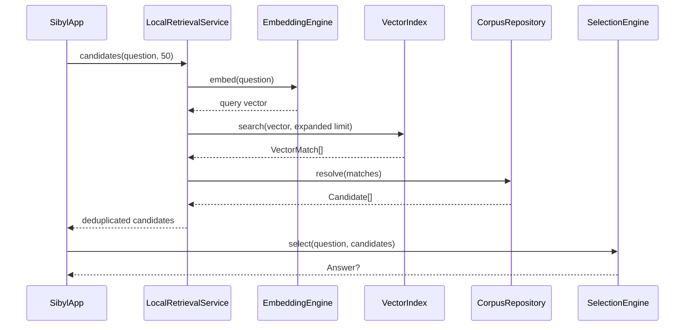

# Mobile/runtime implementation

## Scope

This document describes the current Kotlin Multiplatform implementation under `mobile/`. Stable system boundaries remain in [`../docs/ARCHITECTURE.md`](../docs/ARCHITECTURE.md).

## Module layout

```text
mobile/
├── shared/       reusable domain, retrieval, selection, and Compose UI
├── androidApp/   Android product host
└── desktopApp/   JVM development host and real-corpus adapters
```

`shared` contains no Android- or Desktop-specific API calls. Platform dependencies stay in their hosts and implement small shared interfaces.

## Shared domain model

`shared/src/commonMain/.../domain/Models.kt` defines the runtime data model:

- `PassageLength` — prepared short/standard/extended variants;
- `WorkCategory` — literature, philosophy, or sacred text;
- `PassageTextRole` — original, human translation, or machine translation;
- `PassageText` — exact display text plus translation metadata;
- `PassageVariant` — texts available for one prepared length;
- `Passage` — literary metadata and variants;
- `Candidate` — a passage plus selection weights;
- `Answer` — the user question, selected passage, and chosen variant;
- `SavedEncounter` — persistence-oriented question/passage reference.

`PassageVariant.preferredText()` chooses among already stored text versions. It does not modify literary text.

## Retrieval contracts and orchestration

`retrieval/RetrievalContracts.kt` defines the platform boundaries:

```kotlin
EmbeddingEngine
VectorIndex
RetrievalService
```

`retrieval/LocalRetrievalService.kt` adds `CorpusRepository` and implements the shared query flow:



The retrieval multiplier intentionally asks the vector index for more hint matches than final passages. Multiple hints can point to one passage; `LocalRetrievalService` deduplicates them and keeps the strongest semantic score before truncating the candidate pool.

## Controlled selection

`selection/SelectionEngine.kt` owns final choice. `SelectionPolicy` currently contains:

- minimum semantic score;
- semantic exponent;
- preferred prepared length.

Candidate semantic relevance is multiplied by independent quality/history/diversity weights. `RandomSource` is injected so tests can make the sampling deterministic. If no eligible candidate exists, selection returns `null`; it never silently falls back to generated text.

## Shared Compose UI

`ui/SibylApp.kt` is the common UI entry point. The zero-argument overload creates `DemoRetrievalService`; the injected overload accepts any `RetrievalService` and is used by real Desktop mode.

The UI owns presentation state and in-memory development history only. It does not parse corpus files or implement ranking. Machine-translated text is visibly labelled.

## Android host

`androidApp/src/main/.../MainActivity.kt` currently hosts the default `SibylApp()` and therefore still uses synthetic demo retrieval. Android-specific real-corpus storage, ONNX, and vector-index adapters remain future work.

## Desktop real-corpus host

`desktopApp/src/jvmMain/.../Main.kt` chooses its mode from environment configuration:

- no corpus/model paths → demo mode;
- both `SIBYL_CORPUS_DIR` and `SIBYL_MODEL_DIR` → real local runtime.

`DesktopRuntime.load()` wires and owns the real runtime resources after manifest validation.

### `RuntimeManifests.kt`

Parses the subset of `manifest.json` and `model-manifest.json` required by Desktop. `validateRuntimeCompatibility()` rejects unsupported corpus versions and mismatches in model ID, dimensions, normalization, E5 query prefix, or pooling.

### `OnnxE5EmbeddingEngine`

Uses:

- ONNX Runtime JVM for model execution;
- DJL Hugging Face Tokenizers for local `tokenizer.json` processing.

The engine prepends the configured E5 `query: ` prefix, creates ONNX input tensors, runs inference, mean-pools token embeddings selected by the attention mask, and L2-normalizes when required by the manifest.

On the current Intel macOS development host, ONNX Runtime is pinned to a compatible JVM package. DJL does not currently provide every Intel macOS tokenizer native in its normal artifact, so local development may expose a locally built `libtokenizers.dylib` through `RUST_LIBRARY_PATH`. This workaround is platform packaging only; query text still stays local.

### `JsonBruteForceVectorIndex`

Loads `vectors.json` once, validates vector dimensions, precomputes stored vector norms, and performs exhaustive cosine similarity for each query. This is deliberately a development implementation for a small corpus. Replacing it with USearch/HNSW should require only another `VectorIndex` implementation.

### `SqliteCorpusRepository`

Opens `corpus.db` read-only through Xerial SQLite JDBC. Retrieved semantic-hint IDs are joined to passages, works, authors, text versions, and `passage_text` rows. Exact persisted `passage_text.text` values are copied into immutable runtime models; the repository never synthesizes display text.

## Main dependencies

Dependency versions are centralized in `gradle/libs.versions.toml`.

- Kotlin Multiplatform / Kotlin compiler;
- Compose Multiplatform + Material 3;
- kotlinx.coroutines;
- kotlinx.serialization JSON;
- ONNX Runtime JVM;
- DJL Hugging Face Tokenizers;
- Xerial SQLite JDBC.

## Tests

- `shared/commonTest` covers retrieval deduplication and deterministic selection behavior;
- `desktopApp/jvmTest` covers manifest compatibility and brute-force vector behavior;
- Android host compilation is checked separately through the Android Gradle task.

See [`../docs/TESTS.md`](../docs/TESTS.md) for the command matrix.
