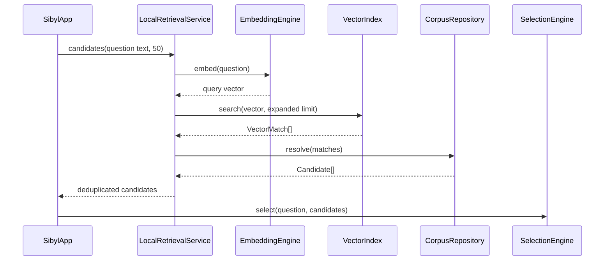
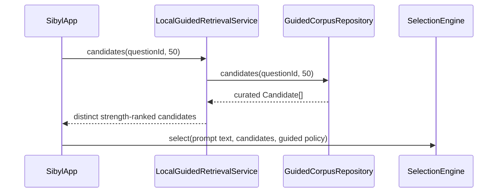

# Mobile/runtime implementation

## Scope

This document describes the current Kotlin Multiplatform implementation under `mobile/`. Stable system boundaries remain in [`../docs/ARCHITECTURE.md`](../docs/ARCHITECTURE.md).

## Module layout

```text
mobile/
├── shared/       reusable domain, retrieval, selection, and Compose UI
├── androidApp/   Android product host
└── desktopApp/   JVM development host and real-corpus adapters
```

`shared` contains no Android- or Desktop-specific API calls. Platform dependencies stay in their hosts and implement small shared interfaces.

## Shared domain model

`shared/src/commonMain/.../domain/Models.kt` defines the runtime data model:

- `PassageLength` — prepared short/standard/extended variants;
- `WorkCategory` — literature, philosophy, or sacred text;
- `PassageTextRole` — original, human translation, or machine translation;
- `PassageText` — exact display text plus translation metadata;
- `PassageVariant` — texts available for one prepared length;
- `Passage` — literary metadata and variants;
- `GuidedQuestion` — stable persisted prompt ID/text plus optional kind/theme metadata;
- `Candidate` — a passage plus selection weights;
- `Answer` — the user question, selected passage, and chosen variant;
- `SavedEncounter` — persistence-oriented question/passage reference.

`PassageVariant.preferredText()` chooses among already stored text versions. It does not modify literary text.

## Retrieval contracts and orchestration

`retrieval/RetrievalContracts.kt` keeps the two lookup modes separate. Free-form retrieval uses:

```kotlin
EmbeddingEngine
VectorIndex
RetrievalService
```

Guided retrieval uses:

```kotlin
GuidedCorpusRepository
GuidedRetrievalService
```

`LocalRetrievalService.kt` implements the free-form flow:



`LocalGuidedRetrievalService.kt` implements the guided flow without `EmbeddingEngine` or `VectorIndex`:



The free-form retrieval multiplier intentionally asks the vector index for more hint matches than final passages. Multiple hints can point to one passage; `LocalRetrievalService` deduplicates them and keeps the strongest semantic score. Guided membership is already curated, so `LocalGuidedRetrievalService` preserves low-strength candidates rather than applying the free-form threshold.

## Controlled selection

`selection/SelectionEngine.kt` owns final choice for both modes. `SelectionPolicy` currently contains:

- minimum semantic score;
- semantic exponent;
- preferred prepared length.

Candidate relevance (vector similarity for free-form, curation strength for guided) is multiplied by independent quality/history/diversity weights. `SelectionPolicy.guidedDefaults()` sets only the minimum semantic gate to zero so the full validated curated pool remains eligible while preserving the same exponent/weights/length fallback. `RandomSource` is injected so tests can make the sampling deterministic. If no eligible candidate exists, selection returns `null`; it never silently falls back to generated text.

## Shared Compose UI

`ui/SibylApp.kt` is the common UI entry point. The zero-argument overload creates `DemoRetrievalService`; the injected overload accepts free-form `RetrievalService` plus an optional `GuidedRetrievalService`.

When mapped guided questions are available, the UI shows explicit **Guided question** and **Own question** modes. Guided mode loads the available prompt list from the service, uses a simple dropdown, sends the stable ID to guided retrieval, and passes the selected prompt text to `SelectionEngine`/`Answer`. **Another passage** keeps the same mode/prompt and performs a new controlled-random selection. If no guided questions exist (including v3 corpora), the guided selector stays hidden and free-form remains usable.

The UI owns presentation state and in-memory development history only. It does not parse corpus files, perform vector ranking, or read curation metadata. Machine-translated text is visibly labelled.

## Android host

`androidApp/src/main/.../MainActivity.kt` currently hosts the default `SibylApp()` and therefore still uses synthetic demo retrieval. Android-specific real-corpus storage, ONNX, and vector-index adapters remain future work.

## Desktop real-corpus host

`desktopApp/src/jvmMain/.../Main.kt` chooses its mode from environment configuration:

- no corpus/model paths → demo mode;
- both `SIBYL_CORPUS_DIR` and `SIBYL_MODEL_DIR` → real local runtime.

`DesktopRuntime.load()` wires and owns the real runtime resources after manifest validation.

### `RuntimeManifests.kt`

Parses the subset of `manifest.json` and `model-manifest.json` required by Desktop. `validateRuntimeCompatibility()` accepts format v3/v4 during migration, rejects unknown versions, and validates model ID, dimensions, normalization, E5 query prefix, and pooling. V3 manifests default guided counts to zero.

### `OnnxE5EmbeddingEngine`

Uses:

- ONNX Runtime JVM for model execution;
- DJL Hugging Face Tokenizers for local `tokenizer.json` processing.

The engine prepends the configured E5 `query: ` prefix, creates ONNX input tensors, runs inference, mean-pools token embeddings selected by the attention mask, and L2-normalizes when required by the manifest.

On the current Intel macOS development host, ONNX Runtime is pinned to a compatible JVM package. DJL does not currently provide every Intel macOS tokenizer native in its normal artifact, so local development may expose a locally built `libtokenizers.dylib` through `RUST_LIBRARY_PATH`. This workaround is platform packaging only; query text still stays local.

### `JsonBruteForceVectorIndex`

Loads `vectors.json` once, validates vector dimensions, precomputes stored vector norms, and performs exhaustive cosine similarity for each query. This is deliberately a development implementation for a small corpus. Replacing it with USearch/HNSW should require only another `VectorIndex` implementation.

### `SqliteCorpusRepository`

Opens `corpus.db` read-only through Xerial SQLite JDBC and implements both `CorpusRepository` and `GuidedCorpusRepository`. Free-form semantic-hint IDs are joined to passages as before. Format-v4 guided queries list only questions with mappings and hydrate strength-ranked passage candidates directly from `guided_question_passage`. Both paths copy exact persisted `passage_text.text` into immutable runtime models; the repository never synthesizes display text. Format v3 guided methods return empty without querying absent tables.

## Main dependencies

Dependency versions are centralized in `gradle/libs.versions.toml`.

- Kotlin Multiplatform / Kotlin compiler;
- Compose Multiplatform + Material 3;
- kotlinx.coroutines;
- kotlinx.serialization JSON;
- ONNX Runtime JVM;
- DJL Hugging Face Tokenizers;
- Xerial SQLite JDBC.

## Tests

- `shared/commonTest` covers free-form deduplication, guided candidate normalization, and deterministic free-form/guided selection behavior;
- `desktopApp/jvmTest` covers v3/v4 manifest compatibility, brute-force vector behavior, and guided SQLite question/candidate hydration;
- Android host compilation is checked separately through the Android Gradle task.

See [`../docs/TESTS.md`](../docs/TESTS.md) for the command matrix.
