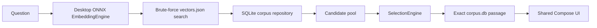

# Sibyl applications

`mobile/` contains the shared Kotlin Multiplatform runtime/UI plus the current application entry points:

- `androidApp/` — Android product application;
- `desktopApp/` — JVM Compose Desktop development harness;
- `shared/` — domain models, retrieval contracts, selection logic, demo data, shared Compose UI, and common tests.

The desktop app exists to make daily development fast. It runs the same `SibylApp()` as Android and does not introduce a server, REST API, or separate browser client.

## Current status

The repository supports both a deterministic demo and a real local Desktop retrieval slice:



Android still uses demo retrieval until the same runtime contracts receive Android ONNX/index/storage adapters. USearch/HNSW remains a later scale optimization; the Desktop development corpus intentionally uses brute-force cosine search first.

The demo also separates automatic in-memory history from explicitly saved question/passage encounters.

## Fast development loop

Requirements: JDK 17+. From the repository root, demo mode remains:

```bash
make run-desktop
```

For a generated real corpus and downloaded runtime model bundle:

```bash
make run-desktop-real
```

Override the defaults with `CORPUS_DIR=... MODEL_DIR=...`. Real mode validates corpus/model compatibility before opening the UI and performs all query embedding/search locally.

Equivalent direct command from `mobile/`:

```bash
cd /path/to/sibyl/mobile
./gradlew :desktopApp:run
```

The first Gradle invocation may need network access when the configured distribution/dependencies are not cached.

On Intel macOS, treat the Desktop harness as development-only/best-effort: the project uses JVM Desktop (not Kotlin/Native), but the current Compose Multiplatform 1.11.1 support matrix officially lists macOS arm64. Re-run `make run-desktop` after Compose/Skiko upgrades to catch host compatibility changes.

Compose Desktop is currently a **development harness**, not a shipping product target. Android remains the platform used for final platform-specific verification.

## Tests

From `mobile/`:

```bash
cd /path/to/sibyl/mobile
./gradlew :shared:testAndroidHostTest
./gradlew :shared:desktopTest
```

From the repository root, `make check-all` runs both shared target test tasks after the lightweight repository checks.

## Android validation

Requirements: JDK 17+, Android Studio, Android SDK 36.

```bash
cd /path/to/sibyl/mobile
./gradlew :androidApp:assembleDebug
```

Or open `mobile/` in Android Studio and run `androidApp`.

## Current configuration

`SelectionPolicy.defaults()` currently defines the semantic relevance gate, semantic exponent, and preferred passage length. Planned recency/diversity/close-lateral-strange policies are tracked in the root roadmap.

The domain model keeps passage length separate from text role (`ORIGINAL`, `HUMAN_TRANSLATION`, `MACHINE_TRANSLATION`). Sacred texts use the same retrieval pipeline and differ only through content category/filtering.

## Detailed docs

- [`../docs/ARCHITECTURE.md`](../docs/ARCHITECTURE.md)
- [`../docs/CONFIGURATION.md`](../docs/CONFIGURATION.md)
- [`../docs/TESTS.md`](../docs/TESTS.md)
- [`../docs/ROADMAP.md`](../docs/ROADMAP.md)
- [`AGENTS.md`](AGENTS.md)
